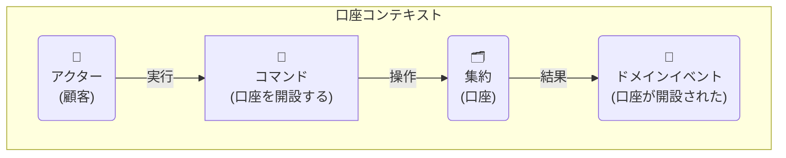
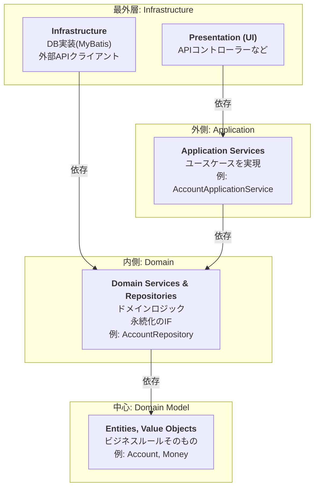
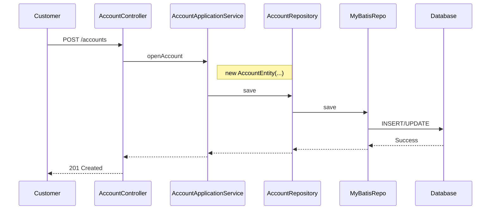
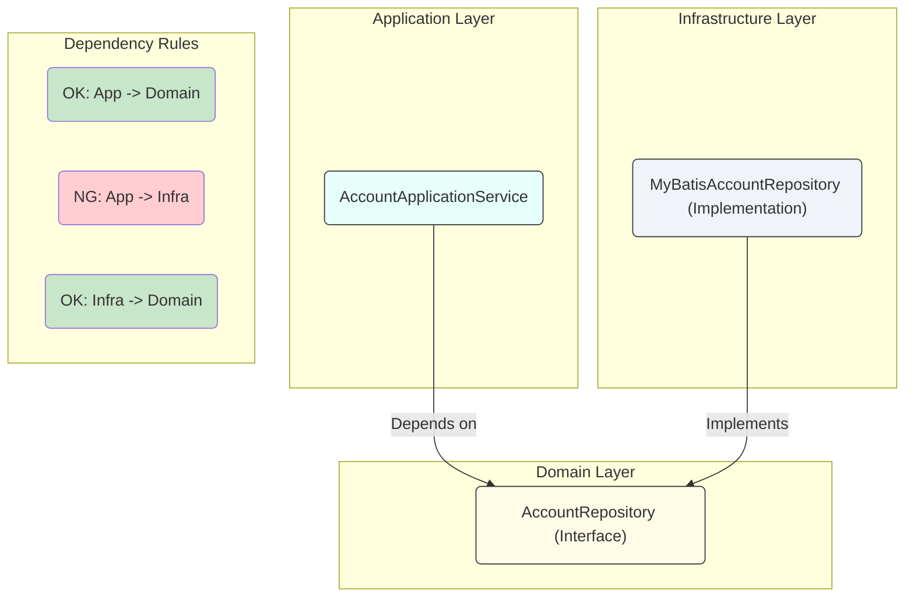
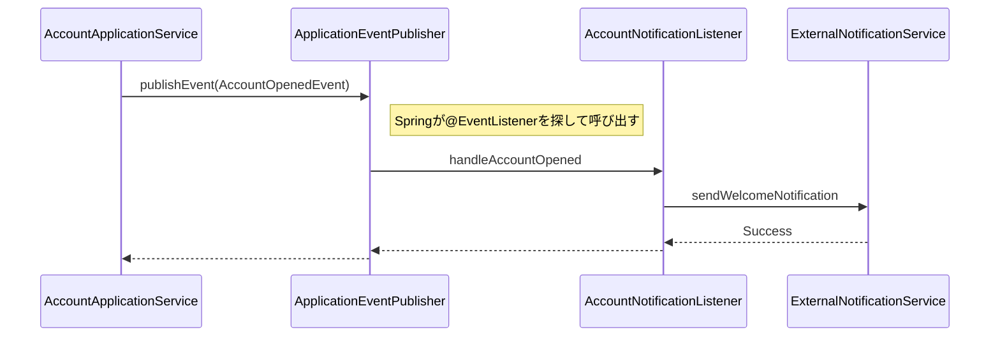

# DDD (ドメイン駆動設計) 開発ガイドライン

**目次**
1. [はじめに](#1-はじめに)
2. [DDDの基本概念](#2-dddの基本概念)
3. [モデリング](#3-モデリング)
4. [アーキテクチャ](#4-アーキテクチャ)
5. [実装パターン (Java 17 & Spring Boot & MyBatis)](#5-実装パターン-java-17--spring-boot--mybatis)
6. [テスト方針](#6-テスト方針)
7. [よくある質問 (FAQ) とアンチパターン](#7-よくある質問-faq-とアンチパターン)
8. [付録](#8-付録)

---

## 1. はじめに

### 1.1. 本ガイドラインの目的

このドキュメントは、我々のチームがドメイン駆動設計（DDD）に基づいた開発を円滑かつ一貫性を持って進めることを目的とします。
DDDの基本概念、アーキテクチャ、実装パターンなどを定義し、チームメンバー間の共通理解を形成します。

### 1.2. 対象読者

本ガイドラインは、当プロジェクトに参加するすべての開発者を対象とします。DDDの経験レベルに関わらず、参照できる内容を目指します。

---

## 2. DDDの基本概念

この章では、DDDを実践する上で欠かせない基本的な考え方や用語を学びます。これらは、チームで会話する際の「共通言語」の土台となります。

### 2.1. ユビキタス言語 (Ubiquitous Language)

プロジェクトに関わる全員（開発者、ドメイン専門家、ステークホルダー）が使用する共通言語です。
この言語は、ドメインモデルとコードに直接反映される必要があります。

- **目的**: 認識の齟齬を防ぎ、コミュニケーションを円滑にする。
- **実践**:
    - プロジェクトの初期段階で、ドメイン専門家と共にユビキタス言語の辞書を作成・維持します。
    - コード（クラス名、メソッド名、変数名）にもユビキタス言語を徹底して使用します。

> **比喩: 「チームの共通辞書」**
> ユビキタス言語は、海外旅行に行く前にチーム全員で同じ旅行ガイドブックを読み込むようなものです。同じ「ホテル」という言葉でも、全員が同じ場所とサービスを思い浮かべるようになり、現地で「どのホテルだっけ？」と迷うことがなくなります。

### 2.2. ドメインとサブドメイン (Domain and Subdomains)

- **コアドメイン**: ビジネスにとって最も価値が高く、競争優位性の源泉となる部分。最も力を入れて開発します。(例: 勘定系システムにおける取引処理)
- **支援サブドメイン**: ビジネスを支援するが、独自性は低い部分。(例: 顧客管理)
- **汎用サブドメイン**: 認証や通知など、既製のソリューションで解決できる一般的な問題領域。

### 2.3. 境界づけられたコンテキスト (Bounded Context)

言語的な境界であり、モデルの適用範囲を明確にするためのものです。各コンテキスト内では、ユビキタス言語が一貫性を保ちます。

- **コンテキストマップ**: 複数の境界づけられたコンテキスト間の関係性を図示します。
    - 例: 共有カーネル (Shared Kernel), 顧客/供給者 (Customer/Supplier), 腐敗防止層 (Anti-Corruption Layer) など。

> **比喩: 「会社の部署」**
> 境界づけられたコンテキストは、会社の中の「融資審査部」や「預金管理部」のようなものです。
> 同じ「顧客」という言葉でも、融資審査部では「与信情報」が重要ですが、預金管理部では「口座残高」が重要です。
> このように、各部署（コンテキスト）の中では言葉の意味が明確に定義され、一貫性が保たれます。部署間で連携する際には、どの部署の言葉で話すか、あるいは通訳（腐敗防止層）を挟むかを意識する必要があります。

---

## 3. モデリング

ドメインモデリングは、ドメインの専門家と開発者が協力し、ビジネスの構造とプロセスを深く理解するための活動です。ここでは、そのための具体的な手法と、成果を実装に結びつける方法を定義します。

### 3.1. ユビキタス言語の辞書作成

モデリングの過程で明らかになったユビキタス言語は、誰でも参照できる辞書としてドキュメント化します。この辞書は、プロジェクトの成長と共に常に更新される「生きたドキュメント」です。

**フォーマット例（Markdown）:**
| 用語 (Term) | 意味・文脈 (Meaning/Context) | 振る舞い・ルール (Behavior/Rule) | 関連語 |
| :--- | :--- | :--- | :--- |
| **口座 (Account)** | 当行の金融サービスを利用する顧客の資産を管理する単位。 | - 口座番号で一意に識別される。<br>- 残高は0円以上でなければならない。 | 顧客, 取引, 残高 |
| **取引 (Transaction)** | 口座間の資金移動。入金、出金、振込など。 | - 一度成立した取引は変更できない（取消取引で補正する）。<br>- 取引金額は0より大きい。 | 口座, 金額 |


### 3.2. イベントストーミング (Event Storming) の実践

ビジネスプロセスを可視化し、集約やコンテキストの境界を発見するために、イベントストーミングを積極的に実施します。

**参加者:**
- ドメインエキスパート、プロダクトオーナー、開発者、QAなど、プロジェクトに関わる多様なメンバー。

**使用する付箋の色分け（推奨）:**
- **オレンジ**: **ドメインイベント (Domain Event)** - `〜された` という過去形の事実。
- **青**: **コマンド (Command)** - イベントを発生させる原因となった操作。
- **黄 (小)**: **アクター (Actor)** - コマンドを実行する人や外部システム。
- **黄 (大)**: **集約 (Aggregate)** - コマンドが実行される対象。一貫性の境界。
- **ピンク**: **外部システム (External System)** - 連携する外部のサービス（例: 外部決済システム）。
- **緑**: **ビュー (View) / Read Model** - アクターが判断するために参照する情報。

**具体的な進め方:**
1.  **ドメインイベントの洗い出し**: ホワイトボードやMiroなどの無限キャンバスに、時間軸に沿ってオレンジ色の付箋（ドメインイベント）を右に向かって貼り出していきます。
    - 例: `口座が開設された`, `資金が入金された`, `口座が解約された`

2.  **コマンドとアクターの特定**: 各ドメインイベントの左側に、それを引き起こしたコマンド（青）とアクター（黄）を置きます。
    - 例: `口座を開設する` (コマンド) → `口座が開設された` (イベント)

3.  **集約の発見**: 関連するコマンドとイベントのグループを見つけ、それらがどの「塊」に対する操作かを考え、集約（黄色の大きな付箋）を定義します。多くの場合、名詞が候補となります。
    - 例: `入金する` `出金する` といったコマンド群は **`口座`** 集約に対する操作。

4.  **境界づけられたコンテキストの特定**: 言語の揺れや関心事の境界を見つけ、コンテキストの境界線を引きます。これがマイクロサービスやパッケージを分割する際の重要なヒントになります。

**モデリング例: 「口座開設」**
- **課題**: 顧客が口座を開設する、というビジネスプロセスを可視化したい。
- **プロセス**:
    1. **イベント**: まず、ビジネス上重要な事実である「口座が開設された」というイベント（オレンジ）を置く。
    2. **コマンド**: 次に、そのイベントを引き起こした操作「口座を開設する」（青）をその左に置く。
    3. **アクター**: 誰がその操作をしたのか？「顧客」（黄・小）を特定する。
    4. **集約**: この一連の操作は、何というデータの塊に対して行われたか？「口座」（黄・大）という集約を定義する。

この視覚的なプロセスを通じて、コマンドがどの集約を操作し、結果としてどのイベントが生まれるか、というドメインの核心的な振る舞いが明確になります。



### 3.3. モデリングから実装へ

イベントストーミングで発見した要素は、オニオンアーキテクチャの各レイヤーに直接マッピングできます。

- **集約 (Aggregate)**
  - `domain/model` パッケージ内の **エンティティ** (`Account.java`) や関連する**値オブジェクト**になります。集約ルートがエンティティの中心です。
- **コマンド (Command)**
  - `application/service` の **アプリケーションサービス** のメソッド名（例: `openAccount`) や、そのメソッドが受け取る入力オブジェクト（例: `OpenAccountCommand.java`) に対応します。
- **ドメインイベント (Domain Event)**
  - 必要に応じて、ドメインイベントを表現するクラスを作成し、コンテキスト間の連携（非同期処理など）に利用できます。
- **ビュー (View)**
  - クエリ責務に対応し、`application/dto` や、CQRSパターンを採用する場合は専用のRead Modelとして実装されます。

このプロセスを通じて、ビジネスの要求とコードの構造が一致し、メンテナンス性が高く、変化に強いソフトウェアを構築します。

---

## 4. アーキテクチャ

本プロジェクトでは、**オニオンアーキテクチャ** を採用します。
このアーキテクチャは、ヘキサゴナルアーキテクチャと同様に、アプリケーションの中心にドメインモデルを据え、依存関係を常に中心方向に向かわせることで、ビジネスロジックを外部の技術的関心事から隔離します。これにより、システムの保守性、適応性、テスト容易性を高めます。


> **依存性のルール: 外側の円は内側の円にしか依存できない。**
> 例えば、`Application`層は`Domain`層に依存できますが、その逆はできません。
> このルールにより、「データベースをMySQLからPostgreSQLに変える」といったインフラの変更が、ビジネスルールを記述した`Domain Model`に一切影響を与えなくなります。

### 4.1. レイヤー構造

依存性のルール: **外側のレイヤーは内側のレイヤーにのみ依存でき、内側のレイヤーは外側のレイヤーについて一切関知しません。**

- **中心: Domain Model**
    - エンティティ、値オブジェクト、集約など、ドメインの核となるオブジェクト群。
    - アプリケーションで最も安定した、ビジネスの本質的なルールを表現します。
- **内側: Domain Services / Repositories (Interfaces)**
    - 個別のエンティティに属さないドメインロジック（ドメインサービス）。
    - データの永続化と再構築のためのインターフェース（リポジトリインターフェース）。
- **外側: Application Services**
    - アプリケーションのユースケースを実装する層。
    - ドメインサービスやリポジトリを呼び出し、一連のワークフローを実行します。DTO（Data Transfer Object）の定義もここに含まれることがあります。
- **最外層: Infrastructure, Presentation, etc.**
    - **Presentation (UI)**: ユーザーとのインターフェース（Web APIエンドポイント、CLIなど）。
    - **Infrastructure**: データベースの実装、外部APIクライアント、メッセージングなど、技術的な詳細をすべて担当します。リポジトリインターフェースの具象クラスはここに配置されます。
    - **Tests**: 各種テストコード。

#### 4.1.1. リクエストの処理フロー

顧客からのリクエストが、どのように各レイヤーを渡って処理されるかを示します。


  
- **Presentation (AccountController)** はリクエストを受け付け、**Application (AccountApplicationService)** に処理を依頼します。
- **Application**はユースケースを実行します。**DomainのEntityを生成**し、**Repository**を呼び出して永続化を依頼します。
- **Infrastructure**にある**Repositoryの実装 (MyBatisRepo)** が、実際にデータベースとやり取りします。

#### 4.1.2. 依存性逆転の原則（DIP）

このアーキテクチャの核心は「依存性逆転の原則」です。具象（実装詳細）に依存するのではなく、抽象（インターフェース）に依存します。


- `AccountApplicationService`は、具体的な`MyBatisAccountRepository`を知りません。知っているのは、`AccountRepository`という**インターフェース（抽象）**だけです。(`Depends on` = 依存する)
- `MyBatisAccountRepository`は`AccountRepository`というインターフェースを**実装します**。(`Implements` = 実装する)
- これにより、`MyBatisAccountRepository`を`JPAAccountRepository`に差し替えても、`AccountApplicationService`のコードは一切変更する必要がありません。
- この「疎結合」な関係性が、システムの保守性とテスト容易性を劇的に向上させます。

### 4.2. ディレクトリ構成（例）

ディレクトリ構成も、この依存性のルールに従います。内側のレイヤーは外側のレイヤーのコードを `import` してはいけません。
Spring Boot（Maven/Gradle）の標準的なプロジェクト構造に沿ってパッケージを配置します。

```
src/main/java/com/example/yourproject/
├── domain/
│   ├── model/
│   │   ├── user/
│   │   │   ├── User.java           // 集約ルート, エンティティ
│   │   │   ├── UserId.java         // 値オブジェクト
│   │   │   └── FullName.java       // 値オブジェクト
│   │   └── ...
│   ├── repository/
│   │   └── UserRepository.java     // リポジトリのインターフェース
│   └── service/
│       └── UserDomainService.java  // ドメインサービス
├── application/
│   ├── service/
│   │   └── UserApplicationService.java // アプリケーションサービス
│   └── dto/
│       ├── UserDto.java            // データの転送用オブジェクト
│       └── CreateUserCommand.java  // ユースケースの入力
└── infrastructure/
    ├── persistence/
    │   ├── MyBatisUserRepository.java  // ドメインリポジトリの実装
    │   ├── handler/
    │   │   └── UserIdTypeHandler.java    // 値オブジェクトのType Handler
    │   └── mapper/
    │       └── UserMapper.java         // MyBatis Mapperインターフェース
    └── web/
        └── UserController.java
```

---

## 5. 実装パターン (Java 17 & Spring Boot & MyBatis)

この章では、オニオンアーキテクチャの各レイヤーを、具体的なコードでどのように実装するかを示します。

### 5.1. ドメインモデル (Entities & Value Objects)

ドメインモデルは、ビジネスルールと状態をカプセル化する責務を持ちます。

#### 5.1.1. 値オブジェクト (Value Object)

プロパティ（属性）によって識別され、不変（Immutable）であるべきオブジェクトです。
Java 17の`record`を使用することで、`equals()`, `hashCode()`, `toString()`などを自動生成でき、簡潔に不変な値オブジェクトを表現できます。

**例: `Money` 値オブジェクト**
金額計算は、浮動小数点数による誤差を避けるため`BigDecimal`を使用することが鉄則です。`Money`オブジェクトとしてカプセル化することで、通貨の概念や、不正な金額（マイナスなど）の生成を防ぐロジックをクラスの責務として集約できます。

```java
// package com.example.domain.model.account;

import java.math.BigDecimal;
import java.util.Objects;

public record Money(
    BigDecimal amount,
    String currency
) {
    public static final String DEFAULT_CURRENCY = "JPY";

    public Money {
        Objects.requireNonNull(amount);
        Objects.requireNonNull(currency);
        if (amount.compareTo(BigDecimal.ZERO) < 0) {
            throw new IllegalArgumentException("Amount cannot be negative.");
        }
    }

    public Money(BigDecimal amount) {
        this(amount, DEFAULT_CURRENCY);
    }

    public Money add(Money other) {
        if (!this.currency.equals(other.currency)) {
            throw new IllegalArgumentException("Cannot add money with different currencies.");
        }
        return new Money(this.amount.add(other.amount), this.currency);
    }

    public Money subtract(Money other) {
        if (!this.currency.equals(other.currency)) {
            throw new IllegalArgumentException("Cannot subtract money with different currencies.");
        }
        if (this.amount.compareTo(other.amount) < 0) {
            throw new IllegalStateException("Insufficient funds.");
        }
        return new Money(this.amount.subtract(other.amount), this.currency);
    }
}
```

> **なぜ`record`？**
> `record`は、`final`なフィールドと、それらを取得するためのメソッド、そして`equals()` `hashCode()` `toString()`の実装を自動的に提供します。これにより、開発者はビジネスロジックに集中でき、ボイラープレートコードを削減できます。

#### 5.1.2. エンティティ (Entity)

可変（Mutable）な状態を持ち、IDによって一意に識別されるオブジェクトです。ライフサイクルを通じて状態が変化します。
エンティティは、自身の状態を不正な状態から保護するロジック（不変条件）を内包すべきです。

**例: `Account` エンティティ**
口座エンティティは、IDで識別され、残高 (`Money` 値オブジェクト) を持ちます。「入金」「出金」といったビジネスロジックもメソッドとして持ち、自身の状態（残高）を更新します。

```java
// package com.example.domain.model.account;

import java.math.BigDecimal;

// 集約ルート
public class Account {

    private final String accountId;
    private final String customerId;
    private Money balance;
    private long version; // 排他制御用バージョン

    // コンストラクタ (新規作成時)
    public Account(String accountId, String customerId) {
        this.accountId = accountId;
        this.customerId = customerId;
        this.balance = new Money(BigDecimal.ZERO);
        this.version = 1L; // 初期バージョン
    }

    // コンストラクタ (リポジトリからの再構築時)
    public Account(String accountId, String customerId, Money balance, long version) {
        this.accountId = accountId;
        this.customerId = customerId;
        this.balance = balance;
        this.version = version;
    }

    // ビジネスロジック
    public void deposit(Money amountToDeposit) {
        if (amountToDeposit.amount().compareTo(BigDecimal.ZERO) <= 0) {
            throw new IllegalArgumentException("Deposit amount must be positive.");
        }
        this.balance = this.balance.add(amountToDeposit);
    }

    public void withdraw(Money amountToWithdraw) {
        if (amountToWithdraw.amount().compareTo(BigDecimal.ZERO) <= 0) {
            throw new IllegalArgumentException("Withdrawal amount must be positive.");
        }
        // Moneyオブジェクト内のsubtractメソッドが残高不足をチェック
        this.balance = this.balance.subtract(amountToWithdraw);
    }

    // ゲッター (状態を公開するが、外部から変更はさせない)
    public String getAccountId() {
        return accountId;
    }

    public String getCustomerId() {
        return customerId;
    }

    public Money getBalance() {
        return balance;
    }
    
    public long getVersion() {
        return version;
    }
}
```

#### 5.1.3. 排他制御（楽観的ロック）について

複数のユーザーが同時に同じデータを更新しようとした際に、データの不整合を防ぐ仕組みが排他制御です。
本ガイドラインでは、**楽観的ロック (Optimistic Locking)** を標準的な戦略として採用します。

- **楽観的ロックとは？**: 更新の衝突は滅多に起こらないだろう、という楽観的な前提に立ちます。更新時に「自分が取得した時からデータが変更されていないか」をチェックし、もし変更されていればエラーとします。
- **実装方法**:
    1.  テーブルに`version`のようなバージョン管理用カラム（数値型）を追加します。
    2.  データを取得する際に`version`も取得します。
    3.  データを更新する際、`WHERE`句に「取得した時と同じ`version`であること」という条件を加えます。
    4.  更新が成功したら、`version`の値をインクリメントします。
    5.  もし`WHERE`句の条件に一致せず更新件数が0件だった場合、他の誰かが先に更新したと判断し、エラー（`OptimisticLockingFailureException`など）をスローします。

この仕組みにより、リポジトリ層でデータの一貫性を保証し、ドメイン層やアプリケーション層はよりビジネスロジックに集中できます。詳細はリポジトリの実装例で後述します。

### 5.2. ドメインサービス (Domain Service)

個別のエンティティだけでは完結しない、複数のエンティティをまたがるようなドメイン固有のロジックを配置する場所です。

- **例**: `TransferService`（振込サービス）
  - ある口座（`Account`集約）から別の口座（別の`Account`集約）へ送金する、という操作は、片方の`Account`だけでは完結できません。
  - このような複数の集約を操作するロジックは、ドメインサービスが担当します。
  - `TransferService`は、2つの`Account`集約をリポジトリから取得し、片方から`withdraw`、もう片方で`deposit`を呼び出し、両者をリポジトリで保存する、という一連の処理を受け持ちます。

```java
// package com.example.domain.service;

import com.example.domain.model.account.Account;
import com.example.domain.model.account.Money;
import com.example.domain.repository.AccountRepository;
import org.springframework.stereotype.Service;

@Service
public class TransferService {

    private final AccountRepository accountRepository;

    public TransferService(AccountRepository accountRepository) {
        this.accountRepository = accountRepository;
    }

    public void transfer(String fromAccountId, String toAccountId, Money amount) {
        // IDからAccount集約を再構築
        Account fromAccount = accountRepository.findById(fromAccountId)
            .orElseThrow(() -> new AccountNotFoundException(fromAccountId));
        Account toAccount = accountRepository.findById(toAccountId)
            .orElseThrow(() -> new AccountNotFoundException(toAccountId));

        // ドメインロジックの実行
        fromAccount.withdraw(amount);
        toAccount.deposit(amount);

        // 状態の変更を永続化
        accountRepository.save(fromAccount);
        accountRepository.save(toAccount);
    }
}
```

### 5.3. リポジトリ (Repository) と TypeHandler

ドメインオブジェクトの永続化と再構築を担当します。ドメイン層にインターフェースを定義し、インフラ層で実装します。

#### 5.3.1. Type Handler (MyBatis)

`record`で定義した値オブジェクトを、MyBatisがDBのデータ型と相互に変換できるようにするためのコンポーネントです。

> **なぜType Handlerが必要？**
> ドメイン層では `Money` のように意味のある型として扱いたい一方、データベースが理解できるのは `DECIMAL` や `VARCHAR` といった単純な型です。`TypeHandler` は、この「ドメインの言葉」と「データベースの言葉」を双方向に翻訳してくれる通訳のような役割を果たします。

**例: `MoneyTypeHandler`**
`Money`オブジェクトは`amount`と`currency`の2つのフィールドを持つため、単純なハンドラでは対応できません。MyBatisの`XML`マッピングを利用して、複数のカラムを1つのオブジェクトにマッピングします。この場合、個別のTypeHandlerは不要になることが多いですが、もし`Money`を単一カラム（例: `1000 JPY`という文字列）で保存したい場合は、以下のようなTypeHandlerが有効です。

#### 5.3.2. リポジトリインターフェース (Domain Layer)

ドメイン層には、永続化のIF（どういう操作ができるか）だけを定義します。

```java
// package com.example.domain.repository;

import com.example.domain.model.account.Account;
import java.util.Optional;

public interface AccountRepository {
    Optional<Account> findById(String accountId);
    void save(Account account);
}
```

#### 5.3.3. MapperインターフェースとXML (Infrastructure Layer)

**Mapperインターフェース**
`@Mapper`アノテーションを付与したインターフェースです。

```java
// package com.example.infrastructure.persistence.mapper;

import com.example.domain.model.account.Account;
import org.apache.ibatis.annotations.Mapper;
import java.util.Optional;

@Mapper
public interface AccountMapper {
    Optional<Account> findById(String accountId);
    int insert(Account account);
    int update(Account account);
    boolean existsById(String accountId);
}
```

**リポジトリ実装**
Mapperを呼び出し、永続化のロジック（新規作成か更新か）を実装します。

```java
// package com.example.infrastructure.persistence;

import com.example.domain.model.account.Account;
import com.example.domain.repository.AccountRepository;
import com.example.infrastructure.persistence.mapper.AccountMapper;
import org.springframework.dao.OptimisticLockingFailureException;
import org.springframework.stereotype.Repository;

import java.util.Optional;

@Repository
public class MyBatisAccountRepository implements AccountRepository {

    private final AccountMapper accountMapper;

    public MyBatisAccountRepository(AccountMapper accountMapper) {
        this.accountMapper = accountMapper;
    }

    @Override
    public Optional<Account> findById(String accountId) {
        return accountMapper.findById(accountId);
    }

    @Override
    public void save(Account account) {
        if (accountMapper.existsById(account.getAccountId())) {
            int updatedCount = accountMapper.update(account);
            if (updatedCount == 0) {
                // 更新件数が0件の場合、楽観的ロックエラーと判断
                throw new OptimisticLockingFailureException(
                    "Failed to update account due to optimistic lock. Account ID: " + account.getAccountId()
                );
            }
        } else {
            accountMapper.insert(account);
        }
    }
}
```

**Mapper XML (`AccountMapper.xml`)**
SQLを記述するXMLファイルです。`ResultMap`を使って、DBのカラムとドメインオブジェクトのマッピングを定義します。

```xml
<?xml version="1.0" encoding="UTF-8" ?>
<!DOCTYPE mapper PUBLIC "-//mybatis.org//DTD Mapper 3.0//EN" "http://mybatis.org/dtd/mybatis-3-mapper.dtd">
<mapper namespace="com.example.infrastructure.persistence.mapper.AccountMapper">

    <!-- Accountオブジェクトとテーブルカラムのマッピング定義 -->
    <resultMap id="accountResultMap" type="com.example.domain.model.account.Account">
        <constructor>
            <idArg column="account_id" javaType="java.lang.String"/>
            <arg column="customer_id" javaType="java.lang.String"/>
            <!-- Moneyオブジェクトのコンストラクタを呼び出す -->
            <arg column="balance_amount" javaType="java.math.BigDecimal"/>
            <arg column="version" javaType="long"/>
        </constructor>
        <!-- Moneyオブジェクトのマッピング -->
        <association property="balance" javaType="com.example.domain.model.account.Money">
            <constructor>
                <arg column="balance_amount" javaType="java.math.BigDecimal"/>
                <arg column="balance_currency" javaType="java.lang.String"/>
            </constructor>
        </association>
    </resultMap>
    
    <select id="findById" resultMap="accountResultMap">
        SELECT account_id, customer_id, balance_amount, balance_currency, version
        FROM accounts
        WHERE account_id = #{accountId}
    </select>
    
    <select id="existsById" resultType="boolean">
        SELECT COUNT(*) > 0 FROM accounts WHERE account_id = #{accountId}
    </select>
    
    <insert id="insert">
        INSERT INTO accounts (account_id, customer_id, balance_amount, balance_currency, version)
        VALUES (
            #{accountId},
            #{customerId},
            #{balance.amount},
            #{balance.currency},
            1  -- 新規作成時のバージョンは1
        )
    </insert>
    
    <update id="update">
        UPDATE accounts
        SET 
            balance_amount = #{balance.amount},
            balance_currency = #{balance.currency},
            version = version + 1 -- バージョンをインクリメント
        WHERE 
            account_id = #{accountId} AND version = #{version} -- 取得時のバージョンと一致するかチェック
    </update>

</mapper>
```

### 5.4. アプリケーションサービス (Application Service)

アプリケーションの具体的なユースケースを実装する層です。ドメインオブジェクトを直接扱わず、リポジトリを通じてドメインの振る舞いを呼び出し、ワークフローを調整します。トランザクションの境界もこの層で管理します。

- **責務**:
    - ユースケースの実現（例: 口座を開設する）
    - リポジトリから集約を取得し、集約のメソッドを実行する
    - 変更された集約をリポジトリで永続化する
    - トランザクション管理
    - DTOとドメインオブジェクトの相互変換

**例: `AccountApplicationService`**
「口座開設」というユースケースを考えます。

```java
// package com.example.application.service;

import com.example.application.dto.OpenAccountCommand;
import com.example.domain.model.account.Account;
import com.example.domain.repository.AccountRepository;
import org.springframework.stereotype.Service;
import org.springframework.transaction.annotation.Transactional;
import java.util.UUID;

@Service
public class AccountApplicationService {

    private final AccountRepository accountRepository;

    public AccountApplicationService(AccountRepository accountRepository) {
        this.accountRepository = accountRepository;
    }

    @Transactional
    public String openAccount(OpenAccountCommand command) {
        // 1. 口座番号を生成
        String accountId = UUID.randomUUID().toString();

        // 2. ドメインオブジェクト（エンティティ）を生成
        Account account = new Account(accountId, command.customerId());

        // 3. リポジトリに永続化を依頼
        accountRepository.save(account);

        // 4. 作成された口座のIDを返す
        return accountId;
    }
}
```

### 5.5. プレゼンテーション (Presentation)

ユーザー（または外部システム）とのインターフェースを担当します。本ガイドラインでは、主にREST APIのコントローラーを指します。

- **責務**:
    - HTTPリクエストの受付とレスポンスの返却
    - リクエストボディのDTOへの変換とバリデーション
    - アプリケーションサービスの呼び出し
    - アプリケーションサービスの実行結果に基づいたHTTPステータスコードの設定

**例: `AccountController`**
DTO (`OpenAccountCommand`) をリクエストボディとして受け取り、アプリケーションサービスを呼び出します。

**DTO (`OpenAccountCommand`)**
`record`で定義すると簡潔です。

```java
// package com.example.application.dto;

import jakarta.validation.constraints.NotBlank;

public record OpenAccountCommand(
    @NotBlank String customerId
) {}
```

**Controller**
```java
// package com.example.presentation.controller;

import com.example.application.dto.OpenAccountCommand;
import com.example.application.service.AccountApplicationService;
import jakarta.validation.Valid;
import org.springframework.http.ResponseEntity;
import org.springframework.web.bind.annotation.PostMapping;
import org.springframework.web.bind.annotation.RequestBody;
import org.springframework.web.bind.annotation.RequestMapping;
import org.springframework.web.bind.annotation.RestController;
import org.springframework.web.servlet.support.ServletUriComponentsBuilder;

import java.net.URI;

@RestController
@RequestMapping("/accounts")
public class AccountController {

    private final AccountApplicationService accountService;

    public AccountController(AccountApplicationService accountService) {
        this.accountService = accountService;
    }


    @PostMapping
    public ResponseEntity<Void> openAccount(@Valid @RequestBody OpenAccountCommand command) {
        String accountId = accountService.openAccount(command);

        URI location = ServletUriComponentsBuilder.fromCurrentRequest()
                .path("/{id}")
                .buildAndExpand(accountId)
                .toUri();

        return ResponseEntity.created(location).build();
    }
}
```
### 5.6. ドメインイベントの実装 (オプション)

ドメインイベントは、あるコンテキストで起きた重要な出来事を、他のコンテキストに通知するための強力な仕組みです。例えば「口座が開設されたら、ウェルカム通知を送る」といった関心の分離に役立ちます。

#### 5.6.1. イベント処理のフロー

ドメインイベントを発行すると、コアなビジネスロジック（口座開設）と、その後の付随的な処理（通知）を分離できます。これにより、システムは変更に強く、拡張しやすくなります。



- `AccountApplicationService`の責務は「口座を開設し、開設イベントを発行すること」だけに集中できます。
- 通知処理が成功しようが失敗しようが、口座開設のトランザクションには影響しません（非同期の場合）。

#### 5.6.2. 実装コード

**1. イベントクラスの定義 (Domain Layer)**
イベントの内容を保持する不変のクラス（`record`が最適）を定義します。

```java
// package com.example.domain.model.account;

// イベントの内容（どの口座が開設されたか）を保持
public record AccountOpenedEvent(String accountId, String customerId) {
}
```

**2. イベントの発行 (Application Layer)**
アプリケーションサービス内で、ビジネスロジックの完了後にイベントを発行します。Springの `ApplicationEventPublisher` を使います。

```java
// AccountApplicationService.java の修正
@Service
public class AccountApplicationService {

    private final AccountRepository accountRepository;
    private final ApplicationEventPublisher eventPublisher; // PublisherをDI

    public AccountApplicationService(AccountRepository accountRepository, ApplicationEventPublisher eventPublisher) {
        this.accountRepository = accountRepository;
        this.eventPublisher = eventPublisher;
    }

    @Transactional
    public String openAccount(OpenAccountCommand command) {
        String accountId = UUID.randomUUID().toString();
        Account account = new Account(accountId, command.customerId());
        accountRepository.save(account);

        // データベースへの保存後、イベントを発行
        eventPublisher.publishEvent(new AccountOpenedEvent(account.getAccountId(), account.getCustomerId()));
        
        return accountId;
    }
}
```

**3. イベントの購読 (Infrastructure Layer)**
インフラ層で `@EventListener` を使ってイベントを待ち受け、具体的な処理（通知など）を実行します。

```java
// package com.example.infrastructure.notification;

import com.example.domain.model.account.AccountOpenedEvent;
import org.springframework.context.event.EventListener;
import org.springframework.stereotype.Component;

@Component
public class AccountNotificationListener {

    @EventListener
    public void handleAccountOpened(AccountOpenedEvent event) {
        System.out.println("--- Sending Welcome Notification ---");
        System.out.println("To Customer: " + event.customerId());
        System.out.println("New Account ID: " + event.accountId());
        System.out.println("----------------------------------");
        // ここに実際の通知処理（外部サービスAPI呼び出しなど）を実装
    }
}
```

---

## 6. テスト方針

この章では、作成したコードの品質を保証するための自動テストの書き方を学びます。

### 6.1. テスト戦略の目的

「素早く・安定した価値提供」を実現するために、自動テストは不可欠です。本ガイドラインの目的は、具体的なソフトウェアアーキテクチャに基づき、開発メンバーが迷うことなく効果的な自動テストを記述できるようになることです。

### 6.2. テストレイヤーの考え方とトレードオフ

各テストレイヤーには向き不向きがあり、速度・保守性・信頼性・忠実性（本番環境との近さ）の間にトレードオフが存在します。これを理解し、適切に使い分けることが重要です。

| テストレイヤー | 速度 | 保守性 | 信頼性 | 忠実性 | 主な目的 |
| :--- | :---: | :---: | :---: | :---: | :--- |
| **Unit Test** | ★★★★★ | ★★★★★ | ★★★★★ | ★☆☆☆☆ | 個々のクラスの振る舞いを網羅的に検証する |
| **Integration Test** | ★★★☆☆ | ★★★☆☆ | ★★★☆☆ | ★★★☆☆ | コンポーネント間の連携を検証する |
| **E2E Test** | ★☆☆☆☆ | ★☆☆☆☆ | ★☆☆☆☆ | ★★★★★ | ユーザーシナリオ全体を本番同様に検証する |

本プロジェクトでは、高速で安定している **Unit Test** を厚く書き、**Integration Test** は連携部分の確認に絞って記述する「テストピラミッド」の考え方を基本とします。

また、Unit Testは以下の2種類に分類し、レイヤーに応じて使い分けます。
- **Sociable Unit Test (社交的単体テスト)**: 関連するクラス群（仲の良い友達グループ）をモック化せず、そのまま連携させてテストします。ドメインモデル内のオブジェクトのように、協調して動くことが重要な場合に適しています。
- **Solitary Unit Test (孤立単体テスト)**: テストしたいクラス１つだけを対象とし、そのクラスが依存する外部のクラス（例: DBアクセス）を偽物（モック）に差し替えて、完全に隔離された状態でテストします。これにより、テストの関心を純粋なロジック検証に集中させることができます。

### 6.3. Domain Layer のテスト (Sociable Unit Test)

- **目的**: ドメインオブジェクトが持つビジネスロジックが正しく動作することを検証する。
- **方針**: **Sociable Unit Test** を採用。ドメイン層のオブジェクト（エンティティ、値オブジェクト）は密接に関連しているため、モックを使わずに連携させた状態で振る舞いをテストします。フレームワークへの依存もないため、極めて高速に実行できます。
- **ツール**: Spock

**テストコード例: `Account`エンティティの振る舞いをテスト**
```groovy
// src/test/groovy/com/example/domain/model/account/AccountSpec.groovy
package com.example.domain.model.account

import spock.lang.Specification
import java.math.BigDecimal

class AccountSpec extends Specification {

    def "入金すると残高が増える"() {
        given: "初期残高が1000円の口座"
        def initialBalance = new Money(new BigDecimal("1000"))
        def account = new Account("acc-001", "cust-001", initialBalance, 1L)

        and: "入金額は500円"
        def depositAmount = new Money(new BigDecimal("500"))

        when: "口座に入金する"
        account.deposit(depositAmount)

        then: "口座の残高が1500円になる"
        account.getBalance().amount() == new BigDecimal("1500")
    }

    def "残高を超える金額を出金しようとすると例外が発生する"() {
        given: "初期残高が1000円の口座"
        def initialBalance = new Money(new BigDecimal("1000"))
        def account = new Account("acc-001", "cust-001", initialBalance, 1L)

        and: "出金額は2000円"
        def withdrawalAmount = new Money(new BigDecimal("2000"))

        when: "口座から出金する"
        account.withdraw(withdrawalAmount)

        then: "残高不足のためIllegalStateExceptionがスローされる"
        def e = thrown(IllegalStateException)
        e.message == "Insufficient funds."
    }

    def "マイナス金額の入金は例外をスローする"() {
        given: "任意の口座"
        def account = new Account("acc-001", "cust-001")

        when: "マイナス金額を入金しようとする"
        account.deposit(new Money(new BigDecimal("-100")))

        then: "不正な引数としてIllegalArgumentExceptionがスローされる"
        thrown(IllegalArgumentException)
    }
}

### 6.4. Application Layer のテスト (Solitary Unit Test)

- **目的**: アプリケーション層のユースケースが正しく実装されていることを検証する。
- **方針**: **Solitary Unit Test** を採用。アプリケーション層は他の層に依存するため、モックを使って完全に隔離された状態でテストします。
- **ツール**: Mockito

**テストコード例: `AccountApplicationService`のテスト**
```java
// src/test/java/com/example/application/service/AccountApplicationServiceTest.java
package com.example.application.service;

import org.junit.jupiter.api.Test;
import org.junit.jupiter.api.extension.ExtendWith;
import org.mockito.InjectMocks;
import org.mockito.Mock;
import org.mockito.junit.jupiter.MockitoExtension;
import java.util.UUID;
import static org.mockito.Mockito.when;
import static org.junit.jupiter.api.Assertions.assertEquals;

@ExtendWith(MockitoExtension.class)
public class AccountApplicationServiceTest {

    @InjectMocks
    private AccountApplicationService accountService;

    @Mock
    private AccountRepository accountRepository;

    @Test
    public void testOpenAccount() {
        // Arrange
        String customerId = UUID.randomUUID().toString();
        OpenAccountCommand command = new OpenAccountCommand(customerId);
        when(accountRepository.save(any(Account.class))).thenReturn(true);

        // Act
        String result = accountService.openAccount(command);

        // Assert
        assertEquals(result, UUID.randomUUID().toString());
    }
}
```

---

## 7. よくある質問 (FAQ) とアンチパターン

### 7.1. 質問

#### 7.1.1. ドメインモデルの不変条件を守るためにはどうすればいいですか？

ドメインモデルの不変条件を守るためには、コンストラクタやメソッドに適切なバリデーションロジックを追加することが重要です。例えば、`Money`オブジェクトのコンストラクタには残高が0円以上であることを確認するロジックが含まれています。

#### 7.1.2. ドメインサービスの責務は何ですか？

ドメインサービスは、個別のエンティティだけでは完結しない、複数のエンティティをまたがるようなドメイン固有のロジックを配置する場所です。例えば、振込サービスは2つの口座をリポジトリから取得し、片方から出金、もう片方で入金を行い、両者をリポジトリで保存する、という一連の処理を受け持ちます。

### 7.2. アンチパターン

#### 7.2.1. ドメインモデルの不変条件を守らない

ドメインモデルの不変条件を守らないと、ビジネスルールが破られる可能性があります。例えば、残高が0円以下になる口座を作成することはできないというルールを破ることになります。

#### 7.2.2. ドメインサービスの責務を他の層に委譲する

ドメインサービスの責務を他の層に委譲すると、システムの一貫性が失われる可能性があります。例えば、ドメインサービスがリポジトリを呼び出すだけになると、ドメインロジックが失われることになります。

---

## 8. 付録

### 8.1. 参考文献

- 「ドメイン駆動設計」（Eric Evans著）
- 「エリック・エヴァンスのドメイン駆動設計」（エリック・エヴァンス著）

### 8.2. その他のリソース

- [DDD本家サイト](https://domainlanguage.com/)
- [Spring Bootドキュメント](https://spring.io/projects/spring-boot)
- [MyBatisドキュメント](https://mybatis.org/mybatis-3/)

これらのリソースを利用することで、DDDの理解を深めることができます。
