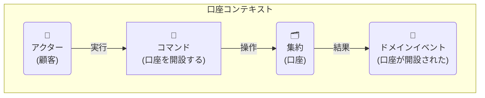
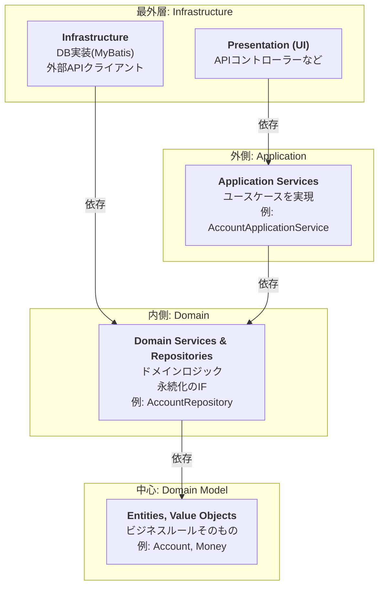
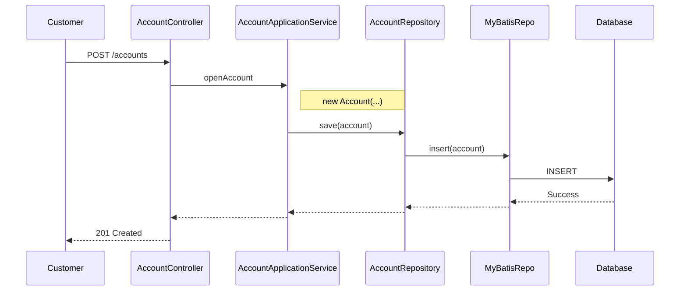
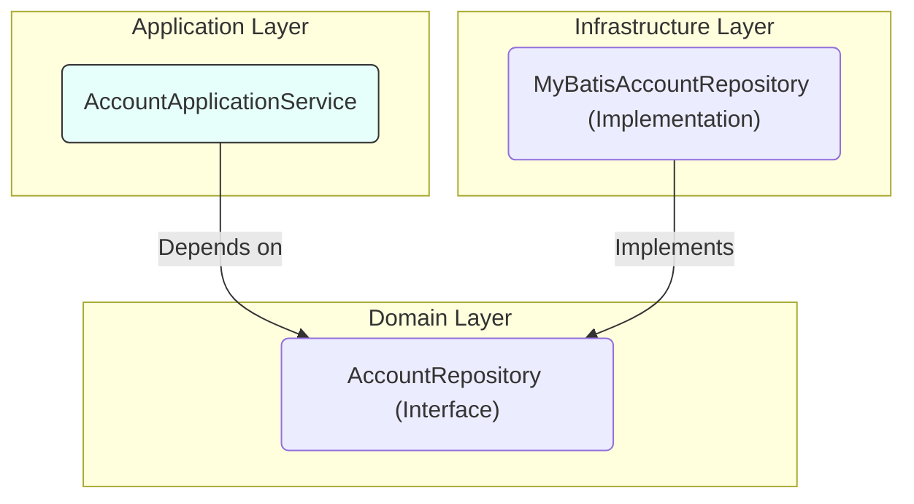
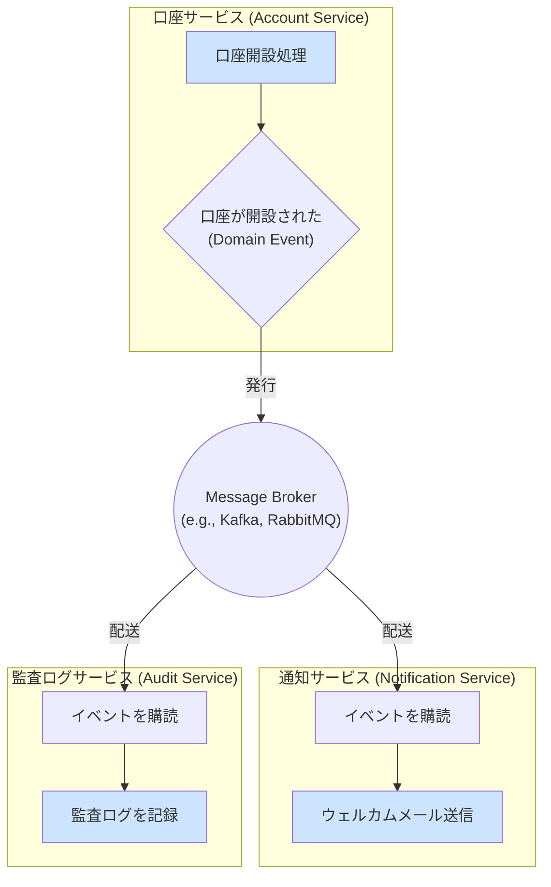
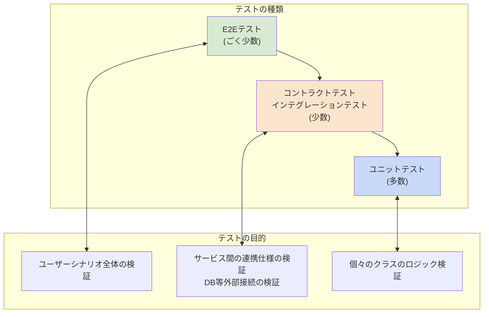
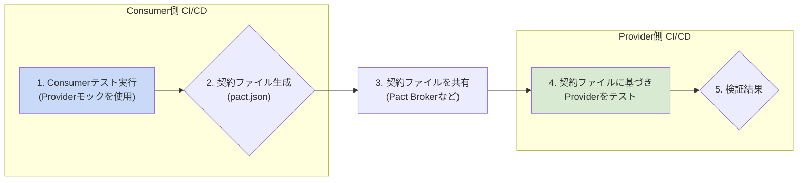

# DDD (ドメイン駆動設計) 開発ガイドライン (金融システム版)

**目次**
1. [はじめに](#1-はじめに)
2. [DDDの基本概念](#2-dddの基本概念)
3. [モデリング](#3-モデリング)
4. [アーキテクチャ](#4-アーキテクチャ)
5. [実装パターン (Java 17 & Spring Boot & MyBatis)](#5-実装パターン-java-17--spring-boot--mybatis)
6. [テスト方針](#6-テスト方針)
7. [よくある質問 (FAQ) とアンチパターン](#7-よくある質問-faq-とアンチパターン)
8. [付録](#8-付録)

---

## 1. はじめに

### 1.1. 本ガイドラインの目的

このドキュメントは、我々のチームがドメイン駆動設計（DDD）に基づいた金融システムの開発を円滑かつ一貫性を持って進めることを目的とします。
DDDの基本概念、アーキテクチャ、実装パターンなどを定義し、チームメンバー間の共通理解を形成します。

### 1.2. 対象読者

本ガイドラインは、当プロジェクトに参加するすべての開発者を対象とします。DDDの経験レベルに関わらず、参照できる内容を目指します。

---

## 2. DDDの基本概念

この章では、DDDを実践する上で欠かせない基本的な考え方や用語を学びます。これらは、チームで会話する際の「共通言語」の土台となります。

### 2.1. ユビキタス言語 (Ubiquitous Language)

プロジェクトに関わる全員（開発者、ドメイン専門家、ステークホルダー）が使用する共通言語です。
この言語は、ドメインモデルとコードに直接反映される必要があります。

- **目的**: 認識の齟齬を防ぎ、コミュニケーションを円滑にする。
- **実践**:
    - プロジェクトの初期段階で、ドメイン専門家と共にユビキタス言語の辞書を作成・維持します。
    - コード（クラス名、メソッド名、変数名）にもユビキタス言語を徹底して使用します。

> **比喩: 「チームの共通辞書」**
> ユビキタス言語は、海外旅行に行く前にチーム全員で同じ旅行ガイドブックを読み込むようなものです。同じ「ホテル」という言葉でも、全員が同じ場所とサービスを思い浮かべるようになり、現地で「どのホテルだっけ？」と迷うことがなくなります。

### 2.2. ドメインとサブドメイン (Domain and Subdomains)

- **コアドメイン**: ビジネスにとって最も価値が高く、競争優位性の源泉となる部分。最も力を入れて開発します。(例: 勘定系システムにおける取引処理)
- **支援サブドメイン**: ビジネスを支援するが、独自性は低い部分。(例: 顧客管理)
- **汎用サブドメイン**: 認証や通知など、既製のソリューションで解決できる一般的な問題領域。

### 2.3. 境界づけられたコンテキスト (Bounded Context)

言語的な境界であり、モデルの適用範囲を明確にするためのものです。各コンテキスト内では、ユビキタス言語が一貫性を保ちます。

- **コンテキストマップ**: 複数の境界づけられたコンテキスト間の関係性を図示します。
    - 例: 共有カーネル (Shared Kernel), 顧客/供給者 (Customer/Supplier), 腐敗防止層 (Anti-Corruption Layer) など。

> **比喩: 「会社の部署」**
> 境界づけられたコンテキストは、会社の中の「融資審査部」や「預金管理部」のようなものです。
> 同じ「顧客」という言葉でも、融資審査部では「与信情報」が重要ですが、預金管理部では「口座残高」が重要です。
> このように、各部署（コンテキスト）の中では言葉の意味が明確に定義され、一貫性が保たれます。部署間で連携する際には、どの部署の言葉で話すか、あるいは通訳（腐敗防止層）を挟むかを意識する必要があります。

---

## 3. モデリング

ドメインモデリングは、ドメインの専門家と開発者が協力し、ビジネスの構造とプロセスを深く理解するための活動です。ここでは、そのための具体的な手法と、成果を実装に結びつける方法を定義します。

### 3.1. ユビキタス言語の辞書作成

モデリングの過程で明らかになったユビキタス言語は、誰でも参照できる辞書としてドキュメント化します。この辞書は、プロジェクトの成長と共に常に更新される「生きたドキュメント」です。

**フォーマット例（Markdown）:**
| 用語 (Term) | 意味・文脈 (Meaning/Context) | 振る舞い・ルール (Behavior/Rule) | 関連語 |
| :--- | :--- | :--- | :--- |
| **口座 (Account)** | 当行の金融サービスを利用する顧客の資産を管理する単位。 | - 口座番号で一意に識別される。<br>- 残高は0円以上でなければならない。 | 顧客, 取引, 残高 |
| **取引 (Transaction)** | 口座間の資金移動。入金、出金、振込など。 | - 一度成立した取引は変更できない（取消取引で補正する）。<br>- 取引金額は0より大きい。 | 口座, 金額 |
| **顧客 (Customer)** | 当行の口座を保有する個人または法人。 | - 顧客IDで一意に識別される。 | 口座 |
| **残高 (Balance)** | 特定時点での口座内の金額。 | - `Money`値オブジェクトとして表現される。 | 金額, 通貨 |

### 3.2. イベントストーミング (Event Storming) の実践

ビジネスプロセスを可視化し、集約やコンテキストの境界を発見するために、イベントストーミングを積極的に実施します。

**参加者:**
- ドメインエキスパート、プロダクトオーナー、開発者、QAなど、プロジェクトに関わる多様なメンバー。

**使用する付箋の色分け（推奨）:**
- **オレンジ**: **ドメインイベント (Domain Event)** - `〜された` という過去形の事実。
- **青**: **コマンド (Command)** - イベントを発生させる原因となった操作。
- **黄 (小)**: **アクター (Actor)** - コマンドを実行する人や外部システム。
- **黄 (大)**: **集約 (Aggregate)** - コマンドが実行される対象。一貫性の境界。
- **ピンク**: **外部システム (External System)** - 連携する外部のサービス（例: 外部決済システム）。
- **緑**: **ビュー (View) / Read Model** - アクターが判断するために参照する情報。

**具体的な進め方:**
1.  **ドメインイベントの洗い出し**: ホワイトボードやMiroなどの無限キャンバスに、時間軸に沿ってオレンジ色の付箋（ドメインイベント）を右に向かって貼り出していきます。
    - 例: `口座が開設された`, `資金が入金された`, `口座が解約された`

2.  **コマンドとアクターの特定**: 各ドメインイベントの左側に、それを引き起こしたコマンド（青）とアクター（黄）を置きます。
    - 例: `口座を開設する` (コマンド) → `口座が開設された` (イベント)

3.  **集約の発見**: 関連するコマンドとイベントのグループを見つけ、それらがどの「塊」に対する操作かを考え、集約（黄色の大きな付箋）を定義します。多くの場合、名詞が候補となります。
    - 例: `入金する` `出金する` といったコマンド群は **`口座`** 集約に対する操作。

4.  **境界づけられたコンテキストの特定**: 言語の揺れや関心事の境界を見つけ、コンテキストの境界線を引きます。これがマイクロサービスやパッケージを分割する際の重要なヒントになります。

**モデリング例: 「口座開設」**


### 3.3. モデリングから実装へ

イベントストーミングで発見した要素は、オニオンアーキテクチャの各レイヤーに直接マッピングできます。

- **集約 (Aggregate)**
  - `domain/model` パッケージ内の **エンティティ** (`Account.java`) や関連する**値オブジェクト**になります。集約ルートがエンティティの中心です。
- **コマンド (Command)**
  - `application/service` の **アプリケーションサービス** のメソッド名（例: `openAccount`) や、そのメソッドが受け取る入力オブジェクト（例: `OpenAccountCommand.java`) に対応します。
- **ドメインイベント (Domain Event)**
  - 必要に応じて、ドメインイベントを表現するクラスを作成し、コンテキスト間の連携（非同期処理など）に利用できます。
- **ビュー (View)**
  - クエリ責務に対応し、`application/dto` や、CQRSパターンを採用する場合は専用のRead Modelとして実装されます。

---

## 4. アーキテクチャ

本プロジェクトでは、**オニオンアーキテクチャ** を採用します。
このアーキテクチャは、ヘキサゴナルアーキテクチャと同様に、アプリケーションの中心にドメインモデルを据え、依存関係を常に中心方向に向かわせることで、ビジネスロジックを外部の技術的関心事から隔離します。


> **依存性のルール: 外側の円は内側の円にしか依存できない。**

### 4.1. レイヤー構造

- **中心: Domain Model**: エンティティ、値オブジェクトなど、ビジネスの本質的なルール。
- **内側: Domain Services / Repositories (Interfaces)**: ドメインロジック、永続化IF。
- **外側: Application Services**: ユースケース、DTO、トランザクション境界。
- **最外層: Infrastructure, Presentation**: APIエンドポイント、DB実装、外部連携。

#### 4.1.1. リクエストの処理フロー


  
#### 4.1.2. 依存性逆転の原則（DIP）

具象（実装詳細）ではなく、抽象（インターフェース）に依存します。


- `AccountApplicationService`は、`MyBatisAccountRepository`を知りません。`AccountRepository`というインターフェースだけを知っています。
- これにより、DB実装を差し替えても、アプリケーションサービスのコードは変更が不要になり、システムの保守性とテスト容易性が向上します。

### 4.2. マイクロサービスアーキテクチャにおける考慮点

マイクロサービスアーキテクチャでは、単一のアプリケーションが複数の独立したサービスに分割されます。これにより、各サービスは自律的に開発・デプロイ・スケール可能になりますが、サービス間の連携方法が新たな課題となります。

#### 4.2.1. サービス境界と連携

- **原則**: 「[2.3. 境界づけられたコンテキスト](#23-境界づけられたコンテキスト)」が、マイクロサービスの分割単位の最も強力な候補となります。
- **連携の要**: サービス間の連携には、主に「**ドメインイベント**」を利用した非同期通信が中心的な役割を果たします。あるサービスで発生したビジネス上の重要な事実（例: `口座が開設された`）をイベントとして発行し、関心のある他のサービスがそれを購読して後続の処理を行います。



#### 4.2.2. 同期連携 vs 非同期連携

サービス間の連携方法には、大きく分けて「同期」と「非同期」の2つのスタイルがあります。

| 特徴 | 同期連携 (Synchronous) | 非同期連携 (Asynchronous) |
| :--- | :--- | :--- |
| **代表例** | REST API (HTTP), gRPC | メッセージング (Kafka, RabbitMQ) |
| **結合度** | **高い (密結合)** | **低い (疎結合)** |
| **即時性** | レスポンスを即時受け取る | レスポンスは即時には返らない |
| **耐障害性**| **低い**。呼び出し先がダウンすると、呼び出し元も影響を受ける（連鎖障害）。 | **高い**。呼び出し先が一時的にダウンしていても、リクエストはキューに保持され、復旧後に処理される。 |
| **実装** | 比較的容易 | メッセージブローカーの導入など、構成が複雑になりがち。 |
| **整合性** | 強い整合性 | **結果整合性 (Eventual Consistency)** |

- **同期連携**:
  - **メリット**: 呼び出し元が即座に結果を知ることができる。処理の流れが直感的で分かりやすい。
  - **デメリット**: サービス間の依存関係が強くなります。あるサービスが他のサービスを同期待ちする間、リソースを確保し続け、パフォーマンスのボトルネックになりやすいです。障害の影響がシステム全体に波及しやすいという致命的な欠点を持ちます。

- **非同期連携 (イベント駆動)**:
  - **メリット**: サービスが互いに独立しているため、一部のサービスが停止してもシステム全体が停止することはありません（**高い回復性**）。各サービスが自身のペースで処理を進められるため、システム全体のスループットが向上します。
  - **デメリット**: 全体的なビジネスプロセスがどのように進むかを追跡するのが難しくなる場合があります。また、データが即座に整合しない「結果整合性」の概念を許容する必要があります。

#### 4.2.3. 推奨される連携戦略

**原則として、サービス間連携には非同期のイベント駆動アーキテクチャを第一候補として採用します。**

これにより、各マイクロサービスは自律的かつ疎結合に保たれ、システム全体の回復力とスケーラビリティが向上します。

**同期連携が許容されるケース:**
- ユーザーからのリクエストに対して、複数のサービスから情報を集めて即座にレスポンスを生成する必要がある場合（例: API Gatewayによるクエリの集約）。
- ただし、この場合でも、連鎖障害を防ぐための**サーキットブレーカー**や、タイムアウト、リトライといった回復性パターンの実装が必須となります。

この方針により、マイクロサービスのメリットを最大限に活かした、堅牢で柔軟なシステムを構築します。

### 5.3. リポジトリ (Repository) と MyBatis 実装

各マイクロサービスは自身のデータベースを持ち、その永続化責務はリポジトリパターンによって抽象化されます。このセクションでは、ドメイン層のインターフェースと、インフラストラクチャ層の具体的なMyBatis実装を解説します。

#### 5.3.1. リポジトリインターフェース (Domain Layer)
ドメイン層に配置され、ドメインモデルがどのように永続化されるかを知らないようにします。

```java
// package com.example.domain.repository;
import com.example.domain.model.account.Account;
import java.util.Optional;

public interface AccountRepository {
    Optional<Account> findById(String accountId);
    void save(Account account);
}
```

#### 5.3.2. MapperインターフェースとXML (Infrastructure Layer)

インフラストラクチャ層に、MyBatisを使った具体的な実装を配置します。

**Mapperインターフェース**
```java
// package com.example.infrastructure.persistence.mapper;
import com.example.domain.model.account.Account;
import org.apache.ibatis.annotations.Mapper;
import java.util.Optional;

@Mapper
public interface AccountMapper {
    Optional<Account> findById(String accountId);
    int insert(Account account);
    int update(Account account);
    boolean existsById(String accountId);
}
```

**リポジトリ実装**
`AccountRepository`インターフェースの実装クラスです。楽観的ロックの失敗を検知し、例外をスローする責務も持ちます。

```java
// package com.example.infrastructure.persistence;
import com.example.domain.model.account.Account;
import com.example.domain.repository.AccountRepository;
import com.example.infrastructure.persistence.mapper.AccountMapper;
import org.springframework.dao.OptimisticLockingFailureException;
import org.springframework.stereotype.Repository;
import java.util.Optional;

@Repository
public class MyBatisAccountRepository implements AccountRepository {
    private final AccountMapper accountMapper;

    public MyBatisAccountRepository(AccountMapper accountMapper) {
        this.accountMapper = accountMapper;
    }

    @Override
    public Optional<Account> findById(String accountId) {
        return accountMapper.findById(accountId);
    }

    @Override
    public void save(Account account) {
        if (accountMapper.existsById(account.getAccountId())) {
            int updatedCount = accountMapper.update(account);
            if (updatedCount == 0) {
                throw new OptimisticLockingFailureException(
                    "Failed to update account " + account.getAccountId() + 
                    ". Version mismatch (optimistic lock).");
            }
        } else {
            accountMapper.insert(account);
        }
    }
}
```

**Mapper XML (`AccountMapper.xml`)**
`record`で定義した値オブジェクト(`Money`)や、`Account`エンティティのコンストラクタへのマッピングがポイントです。ネストした`resultMap`を利用して、ドメインオブジェクトを直接組み立てます。

```xml
<?xml version="1.0" encoding="UTF-8" ?>
<!DOCTYPE mapper PUBLIC "-//mybatis.org//DTD Mapper 3.0//EN" "http://mybatis.org/dtd/mybatis-3-mapper.dtd">
<mapper namespace="com.example.infrastructure.persistence.mapper.AccountMapper">

    <resultMap id="accountResultMap" type="com.example.domain.model.account.Account">
        <constructor>
            <idArg column="account_id" javaType="java.lang.String"/>
            <arg column="customer_id" javaType="java.lang.String"/>
            <arg javaType="com.example.domain.model.account.Money" resultMap="moneyResultMap"/>
            <arg column="version" javaType="long"/>
        </constructor>
    </resultMap>

    <resultMap id="moneyResultMap" type="com.example.domain.model.account.Money">
        <constructor>
            <arg column="balance_amount" javaType="java.math.BigDecimal"/>
            <arg column="balance_currency" javaType="java.lang.String"/>
        </constructor>
    </resultMap>

    <select id="findById" resultMap="accountResultMap">
        SELECT 
            account_id, 
            customer_id, 
            version,
            balance_amount, 
            balance_currency
        FROM accounts WHERE account_id = #{accountId}
    </select>
    
    <select id="existsById" resultType="boolean">
        SELECT COUNT(*) > 0 FROM accounts WHERE account_id = #{accountId}
    </select>
    
    <insert id="insert">
        INSERT INTO accounts (account_id, customer_id, balance_amount, balance_currency, version)
        VALUES (#{accountId}, #{customerId}, #{balance.amount}, #{balance.currency}, 1)
    </insert>
    
    <update id="update">
        UPDATE accounts SET 
            balance_amount = #{balance.amount},
            balance_currency = #{balance.currency},
            version = version + 1
        WHERE account_id = #{accountId} AND version = #{version}
    </update>
</mapper>
```

### 5.4. アプリケーションサービス (Application Service)

ユースケースを実装し、トランザクションの境界を管理します。

**例: `AccountApplicationService`**
```java
// package com.example.application.service;
// ... imports
import com.example.domain.model.account.Account;
import com.example.domain.model.account.AccountOpenedEvent;
import com.example.domain.repository.AccountRepository;
import org.springframework.cloud.stream.function.StreamBridge;
import org.springframework.stereotype.Service;
import org.springframework.transaction.annotation.Transactional;
import java.util.UUID;

@Service
public class AccountApplicationService {
    private final AccountRepository accountRepository;
    private final StreamBridge streamBridge; // メッセージブローカー連携用

    public AccountApplicationService(AccountRepository accountRepository, StreamBridge streamBridge) {
        this.accountRepository = accountRepository;
        this.streamBridge = streamBridge;
    }

    @Transactional
    public String openAccount(OpenAccountCommand command) {
        String accountId = UUID.randomUUID().toString();
        Account account = new Account(accountId, command.customerId());
        accountRepository.save(account);

        // イベントを発行
        AccountOpenedEvent event = new AccountOpenedEvent(account.getAccountId(), account.getCustomerId());
        // 'publishAccountOpenedEvent-out-0' というバインディング(送信先)にイベントを送信
        streamBridge.send("publishAccountOpenedEvent-out-0", event);

        return accountId;
    }
}
```

### 5.5. プレゼンテーション (Presentation)

**DTO (`OpenAccountCommand`)**
```java
// package com.example.application.dto;
import jakarta.validation.constraints.NotBlank;
public record OpenAccountCommand(@NotBlank String customerId) {}
```

**Controller**
```java
// package com.example.presentation.controller;
// ... imports
@RestController
@RequestMapping("/accounts")
public class AccountController {
    private final AccountApplicationService accountService;
    // ... constructor
    @PostMapping
    public ResponseEntity<Void> openAccount(@Valid @RequestBody OpenAccountCommand command) {
        String accountId = accountService.openAccount(command);
        URI location = ServletUriComponentsBuilder.fromCurrentRequest()
                .path("/{id}").buildAndExpand(accountId).toUri();
        return ResponseEntity.created(location).build();
    }
}
```
### 5.6. ドメインイベントの実装 (マイクロサービス版)

マイクロサービス間の連携には、同一プロセス内でのイベント発行とは異なり、**メッセージブローカー (Kafka, RabbitMQなど)** を介した非同期メッセージングが必要です。ここでは、特定のブローカー製品に依存しない実装を可能にする `Spring Cloud Stream` を利用したパターンを推奨します。

#### 5.6.1. 依存関係の追加
`pom.xml` に利用したいメッセージブローカーのバインダーを追加します。

**例: Kafkaの場合**
```xml
<dependency>
    <groupId>org.springframework.cloud</groupId>
    <artifactId>spring-cloud-starter-stream-kafka</artifactId>
</dependency>
```

#### 5.6.2. イベント発行 (Publisher) の設定
**`application.yml`での出力先定義**
```yaml
spring:
  cloud:
    stream:
      bindings:
        # `[関数名]-out-0` がバインディング名になる
        # 関数名: publishAccountOpenedEvent
        publishAccountOpenedEvent-out-0:
          destination: account-events # Kafkaのトピック名
          content-type: application/json
```
`AccountApplicationService`での`StreamBridge`を使った実装は、[5.4. アプリケーションサービス](#54-アプリケーションサービス)の例を参照してください。

#### 5.6.3. イベント受信 (Subscriber) の設定と実装

**`application.yml`での入力元定義**
```yaml
spring:
  cloud:
    stream:
      bindings:
        # `[関数名]-in-0` がバインディング名になる
        # 関数名: handleAccountOpenedEvent
        handleAccountOpenedEvent-in-0:
          destination: account-events # Kafkaのトピック名
          group: notification-service # Consumer Group
```

**イベントリスナーの実装 (例: 通知サービス)**
リスナーは `@EventListener` ではなく、`java.util.function.Consumer` を実装したBeanとして定義します。Bean名が`application.yml`で定義した関数名（`handleAccountOpenedEvent`）と一致することで、対応するトピックの購読が自動的に開始されます。

```java
// package com.example.notification.infra;
import com.example.notification.domain.AccountOpenedEvent;
import org.slf4j.Logger;
import org.slf4j.LoggerFactory;
import org.springframework.context.annotation.Bean;
import org.springframework.stereotype.Component;
import java.util.function.Consumer;

@Component
public class AccountEventSubscriber {
    private static final Logger log = LoggerFactory.getLogger(AccountEventSubscriber.class);

    // Bean名が application.yml の関数名と一致
    @Bean
    public Consumer<AccountOpenedEvent> handleAccountOpenedEvent() {
        return event -> {
            log.info("--- Received AccountOpenedEvent ---");
            log.info("--- Sending Welcome Notification ---");
            log.info("To Customer: {}", event.customerId());
            log.info("New Account ID: {}", event.accountId());
            // ここで実際にメール送信などの処理を行う
        };
    }
}
```
> `AccountOpenedEvent` レコードは、この通知サービスでも同じパッケージ・定義で共有されている必要があります。マイクロサービス環境では、このようなイベントのスキーマ（構造）を共有するために、**共有ライブラリ**として切り出したり、**スキーマレジストリ**を利用したりするのが一般的です。

---
## 6. テスト方針

### 6.1. テスト戦略
マイクロサービス環境においても、Unit Testを厚く書くテストピラミッドの原則は変わりません。しかし、サービス間の連携が増えるため、新たに**コントラクトテスト**が重要な役割を担います。



- **Unit Test (単体テスト)**: 個々のクラスのロジックを検証します。
    - **Sociable**: 依存オブジェクトをそのまま使い、クラス群の振る舞いをテストします。（例: `Account`と`Money`の連携）
    - **Solitary**: 依存オブジェクトをモックに差し替え、クラス単体のロジックを分離してテストします。（例: `ApplicationService`のテスト）
- **Integration Test (結合テスト)**:
    - **インプロセス結合テスト**: サービス内部で、DBや外部APIクライアントなど、インフラ層を含めた結合をテストします。（例: `@MybatisTest`）
    - **コントラクトテスト**: サービス間のAPI仕様（契約）が守られているかを検証します。詳細は[6.5. コントラクトテスト](#65-コントラクトテスト)で後述します。
- **E2E Test (エンドツーエンドテスト)**: 複数のサービスを連携させ、ユーザーの操作から始まるシナリオ全体を検証します。

### 6.2. Domain Layer のテスト (Sociable Unit Test)
**テストコード例: `Account`エンティティのテスト**
```groovy
// src/test/groovy/com/example/domain/model/account/AccountSpec.groovy
package com.example.domain.model.account
import spock.lang.Specification
import java.math.BigDecimal

class AccountSpec extends Specification {
    def "入金すると残高が増える"() {
        given: "初期残高が1000円の口座"
        def initialBalance = new Money(new BigDecimal("1000"))
        def account = new Account("acc-001", "cust-001", initialBalance, 1L)
        and: "入金額は500円"
        def depositAmount = new Money(new BigDecimal("500"))
        when: "口座に入金する"
        account.deposit(depositAmount)
        then: "口座の残高が1500円になる"
        account.getBalance().amount() == new BigDecimal("1500")
    }

    def "残高を超える金額を出金しようとすると例外が発生する"() {
        given: "初期残高が1000円の口座"
        def account = new Account("acc-001", "cust-001", new Money(new BigDecimal("1000")), 1L)
        and: "出金額は2000円"
        def withdrawalAmount = new Money(new BigDecimal("2000"))
        when: "口座から出金する"
        account.withdraw(withdrawalAmount)
        then: "残高不足のためIllegalStateExceptionがスローされる"
        thrown(IllegalStateException)
    }
}
```

### 6.3. Application Layer のテスト (Solitary Unit Test)
**テストコード例: `AccountApplicationService`のテスト**
```groovy
// src/test/groovy/com/example/application/service/AccountApplicationServiceSpec.groovy
package com.example.application.service
import com.example.application.dto.OpenAccountCommand
import com.example.domain.model.account.Account
import com.example.domain.model.account.AccountOpenedEvent
import com.example.domain.repository.AccountRepository
import org.springframework.context.ApplicationEventPublisher
import spock.lang.Specification

class AccountApplicationServiceSpec extends Specification {
    AccountRepository accountRepository = Mock()
    ApplicationEventPublisher eventPublisher = Mock()
    AccountApplicationService target = new AccountApplicationService(accountRepository, eventPublisher)

    def "口座を開設できる"() {
        given: "口座開設コマンド"
        def command = new OpenAccountCommand("cust-123")
        when: "口座開設処理を呼び出す"
        def accountId = target.openAccount(command)
        then: "リポジトリのsaveとイベント発行が1回ずつ呼び出される"
        1 * accountRepository.save(_ as Account)
        1 * eventPublisher.publishEvent(_ as AccountOpenedEvent)
        and: "accountIdが返される"
        accountId != null
    }
}
```

### 6.4. Infrastructure Layer のテスト (インプロセス結合テスト)

**1. Persistence (Repository) のテスト**
`@MybatisTest` を使い、MapperのSQLやマッピングを検証します。
```groovy
// src/test/groovy/com/example/infrastructure/persistence/mapper/AccountMapperSpec.groovy
package com.example.infrastructure.persistence.mapper
// ... imports
import org.mybatis.spring.boot.test.autoconfigure.MybatisTest
import org.springframework.beans.factory.annotation.Autowired
import org.springframework.boot.test.context.SpringBootTest
import org.springframework.test.context.jdbc.Sql

@SpringBootTest @MybatisTest
@Sql(scripts = "/test-data/accounts.sql")
class AccountMapperSpec extends Specification {
    @Autowired private AccountMapper accountMapper

    def "findByIdで口座を取得できる"() {
        given: "存在する口座ID"
        def id = "acc-001"
        when: "Mapperで検索"
        def actual = accountMapper.findById(id)
        then: "期待通りの口座が取得できる"
        actual.isPresent()
        actual.get().getCustomerId() == "cust-001"
        actual.get().getBalance().amount() == new BigDecimal("10000.00")
    }
    
    def "楽観的ロックが機能すること"() {
        given: "バージョン1の口座を取得"
        def account = accountMapper.findById("acc-001").get()
        
        and: "別のトランザクションで同じ口座が更新されたと仮定"
        accountMapper.update(account) // versionが2になる
        
        when: "取得した古いバージョン(1)のデータで更新しようとする"
        def updatedCount = accountMapper.update(account)
        
        then: "更新件数は0件となる"
        updatedCount == 0
    }
}
```

**2. Presentation (Controller) のテスト**
`@WebMvcTest` を使い、Controllerの動作を検証します。`ApplicationService`は`@MockBean`でモック化します。
```groovy
// src/test/groovy/com/example/infrastructure/web/AccountControllerSpec.groovy
package com.example.infrastructure.web
// ... imports
import org.springframework.boot.test.autoconfigure.web.servlet.WebMvcTest
import org.springframework.boot.test.mock.mockito.MockBean
import static org.springframework.test.web.servlet.request.MockMvcRequestBuilders.post
import static org.springframework.test.web.servlet.result.MockMvcResultMatchers.*

@WebMvcTest(AccountController.class)
class AccountControllerSpec extends Specification {
    @Autowired MockMvc mockMvc
    @Autowired ObjectMapper objectMapper
    @MockBean AccountApplicationService accountService

    def "POST /accounts で口座を開設できる"() {
        given: "リクエストボディ"
        def command = new OpenAccountCommand("cust-123")
        and: "サービスは新しい口座IDを返すように設定"
        accountService.openAccount(command) >> "new-acc-id"
        
        when: "POSTリクエストを送信"
        def result = mockMvc.perform(post("/accounts")
                .contentType(MediaType.APPLICATION_JSON)
                .content(objectMapper.writeValueAsString(command)))

        then: "ステータスコード 201 が返り、Locationヘッダが設定されている"
        result.andExpect(status().isCreated())
              .andExpect(header().string("Location", containsString("/accounts/new-acc-id")))
    }
}
```

### 6.5. コントラクトテスト (Contract Testing)
マイクロサービスアーキテクチャでは、あるサービスの変更が、それに依存する別のサービスを破壊する可能性があります。コントラクトテストは、サービス間のAPIの「契約（Contract）」を定義し、その契約が双方で守られているかを継続的に検証する仕組みです。

- **Consumer (消費者)**: 他のサービスのAPIを呼び出すサービス。（例: `口座開設`イベントを受けて、`顧客情報サービス`に顧客詳細を問い合わせる`口座サービス`）
- **Provider (提供者)**: APIを提供するサービス。（例: `顧客情報サービス`）

**テストの進め方 (Pact / Spring Cloud Contract の例):**
1.  **Consumer側のテスト**:
    - Consumerは、ProviderのAPIに対して期待するリクエストとレスポンスを定義したテスト（契約ファイル）を作成します。
    - このテストを実行すると、Providerのモックが生成され、Consumerはそのモックに対してテストを行います。成功すると、**契約ファイル (pactファイル)** が生成されます。
2.  **契約の共有**:
    - 生成された契約ファイルを、Providerがアクセスできる場所（Pact BrokerやGitリポジトリなど）に共有します。
3.  **Provider側のテスト**:
    - Providerは、共有された契約ファイルを取得します。
    - 契約ファイルに定義されたリクエストを自身のサービスに送信し、実際のレスポンスが契約ファイルに定義されたレスポンスと一致するかを検証します。
4.  **継続的インテグレーション**:
    - この一連の流れをCI/CDパイプラインに組み込むことで、ProviderがAPI仕様を破壊するような変更を行った際に、即座に検知できるようになります。


この仕組みにより、サービス間の結合を疎に保ちつつ、意図しない破壊的な変更を早期に発見できます。

### 6.6. バックエンドE2Eテスト
`Testcontainers`と`REST Assured`を使い、本番同様の環境（複数のサービスをDockerコンテナで起動）でAPI仕様全体を検証します。
- **目的**: 個々のサービスの連携が、ビジネスシナリオ全体として正しく機能することを確認する。
- **注意点**:
    - E2Eテストは作成と維持のコストが非常に高いため、数は最小限に絞るべきです。
    - 主要な正常系のシナリオ（ハッピーパス）に焦点を当て、異常系の細かいテストは下位のテスト（Unit, Integration）でカバーします。
    - 複数のサービスにまたがるため、失敗時の原因特定が困難になりやすいです。分散トレーシングなどの仕組みが役立ちます。

---
## 7. よくある質問 (FAQ) とアンチパターン

このセクションでは、DDDでの開発において頻繁に直面する疑問や、陥りがちなアンチパターンについて解説します。

### Q1: バリデーションはどこに書くべき？
**A. 責務に応じて複数のレイヤーに書きます。一つの場所にまとめようとしないことが重要です。**
- **値オブジェクト (ドメイン層)**:
    - **責務**: オブジェクトとして存在するために必須の、不変のルール。
    - **例**: `Money`オブジェクトの金額がマイナスではないこと、通貨コードがISO形式であること。`new Money(new BigDecimal("-100"))` の時点で例外をスローし、不正なオブジェクトの生成を防ぎます。
- **エンティティ / ドメインサービス (ドメイン層)**:
    - **責務**: ビジネスプロセス上のルール。他のエンティティの状態にも依存することがあります。
    - **例**: `Account`エンティティの`withdraw`メソッド内で、残高が不足していないかチェックする。振込処理で、振込元と振込先が同じ口座でないことを確認する。
- **アプリケーションサービス (アプリケーション層)**:
    - **責務**: ユースケースを実行するための事前条件のチェック。
    - **例**: 外部から渡されたIDでリソースが存在するかどうかを確認する。べき等性を担保するために、既に処理済みのリクエストIDでないかチェックする。
- **プレゼンテーション層 (DTO)**:
    - **責務**: 入力値の基本的な形式チェック。
    - **例**: `@NotBlank`や`@Email`などのBean Validationアノテーションを使い、リクエストがアプリケーションサービスに到達する前に基本的な形式エラーを弾く。

### Q2: DTOとドメインオブジェクトの使い分けは？APIでドメインオブジェクトを直接返すべき？
**A. いいえ、ドメインオブジェクトを直接APIのレスポンスとして返すべきではありません。必ずDTO（Data Transfer Object）に変換してください。**

- **なぜ？ (理由)**
    - **関心の分離**: プレゼンテーション層（APIの見た目）の要求と、ドメイン層（ビジネスルール）の要求は異なります。ドメインオブジェクトを直接返すと、UIの都合（「この項目も追加で表示したい」など）でドメインモデルが歪められる危険性があります。
    - **情報の隠蔽**: ドメインオブジェクトには永続化のための`version`情報や、内部的な状態を持つことがあります。これらを外部に公開するのは、カプセル化を破壊し、セキュリティリスクになり得ます。DTOを使うことで、外部に公開する情報を意図的に選択できます。
- **アンチパターン: ドメインモデルの直接公開**
    - `@RestController`から`Account`エンティティを直接返してしまうと、`Account`クラスのフィールド変更が意図せずAPI仕様の変更に繋がってしまいます。
- **ベストプラクティス: DTOへの変換**
    - アプリケーションサービスがリポジトリから取得したドメインオブジェクトを操作し、その結果をプレゼンテーション層に返すDTOにマッピングします。この変換処理はアプリケーションサービスか、専用のMapperクラスが担当します。

### Q3: トランザクション境界はどこに置くべき？
**A. アプリケーションサービスのpublicメソッドに設定するのが基本です。**

- **原則**: 1ユースケース = 1トランザクション。
- **実装**: Springでは、アプリケーションサービスのメソッドに`@Transactional`アノテーションを付与することで、メソッドの開始時にトランザクションが始まり、正常に終了すればコミット、例外が発生すればロールバックされます。
- **アンチパターン**:
    - **Controllerに`@Transactional`を付与する**: レスポンスのレンダリングまでトランザクションが延長され、不必要にDBコネクションを保持してしまいます。
    - **リポジトリメソッドごとにトランザクションをかける**: `a.save(); b.save();` のような処理で、`a`の保存は成功し`b`で失敗した場合に一貫性が崩れます。ユースケース全体を一つのトランザクションで囲むべきです。

### Q4: 貧血ドメインモデルを避けるには？
**A. 「Tell, Don't Ask (尋ねるな、命じろ)」の原則に従い、データとその振る舞いを同じオブジェクト（エンティティ）にまとめます。**

- **貧血ドメインモデルとは？**: getter/setterしか持たない単なるデータコンテナと化したドメインオブジェクトのこと。ビジネスロジックはすべてサービスクラスに実装されてしまいます。これは単なる手続き型プログラミングであり、DDDのメリットを享受できません。
- **アンチパターン: Service層でのロジック実装**
    ```java
    // BAD: Serviceクラスでロジックを実装
    public void withdraw(String accountId, Money amount) {
        Account account = accountRepository.findById(accountId);
        if (account.getBalance().isLessThan(amount)) { // ロジックが外部にある
            throw new Exception();
        }
        account.setBalance(account.getBalance().subtract(amount)); // ただのsetter
        accountRepository.save(account);
    }
    ```
- **ベストプラクティス: エンティティへのロジック移譲**
    ```java
    // GOOD: エンティティ自身が振る舞いを持つ
    // ApplicationService
    public void withdraw(String accountId, Money amount) {
        Account account = accountRepository.findById(accountId);
        account.withdraw(amount); // エンティティに命じる
        accountRepository.save(account);
    }

    // Account (Entity)
    public void withdraw(Money amount) {
        if (this.balance.isLessThan(amount)) { // ロジックは内部にある
            throw new InsufficientFundsException();
        }
        this.balance = this.balance.subtract(amount);
    }
    ```

### Q5: 巨大な集約（God Aggregate）を防ぐには？
**A. トランザクション整合性の境界を正しく見極め、集約を小さく保つことが重要です。**

- **集約の役割**: 一貫性を保つための単位。集約内のオブジェクトは、一つのトランザクションで必ず整合性が取れている状態に保たれます。
- **アンチパターン: 何でもかんでも一つの集約に含める**
    - 例: `顧客`集約に、その顧客の`取引履歴`（数千件になる可能性）のリストをすべて含めてしまう。
    - **問題点**:
        - 取引を追加するだけの操作なのに、巨大な`顧客`オブジェクト全体をDBから取得・ロックする必要があり、パフォーマンスが著しく悪化する。
        - 複数のユーザーが同じ顧客の異なる取引を同時に更新しようとすると、ロックの衝突が頻発する。
- **ベストプラクティス: 集約を分割し、IDで関連付ける**
    - `顧客`と`取引`は別の集約として設計します。`取引`集約は`顧客ID`を保持して関連付けます。
    - 「取引を追加しても、顧客のステータスは即時変更されなくても良い」といった**結果整合性（Eventual Consistency）**で十分な場合が多いです。
    - **ルール**: 「本当に、このデータとあのデータは、1ナノ秒でもズレたらビジネスが成り立たないほど不可分か？」と自問自答します。答えがNoなら、それは別の集約にすべきです。

### Q6: リポジトリにはどんなメソッドを置くべき？
**A. 集約ルートを単位とした、基本的な永続化操作に限定すべきです。**

- **責務**: メモリ上にあるドメインオブジェクトと、データストア（DB）との間のマッピング。あたかもコレクションのように振る舞います。
- **ベストプラクティス**:
    - `findById(id)`: IDで集約を一つ取得する。
    - `save(aggregate)`: 集約を保存する（新規作成または更新）。
    - `delete(aggregate)`: 集約を削除する。
- **アンチパターン: UIのための検索メソッド**
    - `findByCustomerNameAndTransactionDateBetweenOrderByAmountDesc(...)`のような、特定の画面表示に特化した検索メソッドをリポジトリに追加すること。
    - **問題点**: プレゼンテーション層の要求がリポジトリ、ひいてはドメインモデルにまで影響を及ぼし、ドメイン層の純粋性が失われます。
- **解決策: CQRS (コマンド・クエリ責務分離)**
    - 更新系（コマンド）はDDDのモデルとリポジトリを経由します。
    - 参照系（クエリ）は、ドメインモデルを介さず、専用のクエリサービスが直接DBにアクセスして画面表示用のDTOを取得します。これにより、複雑な検索要件とドメインモデルを分離できます。

### Q7: 複数のサービスにまたがるデータの参照（クエリ）はどうすれば良い？
**A. いくつかのアプローチがありますが、API Gatewayによる集約が最も一般的なパターンです。**
- **背景**: マイクロサービスではデータが各サービスに分散しているため、例えば「顧客名と最新の取引履歴を一覧表示する」といった単純な画面でも、複数のサービス(`顧客サービス`と`口座サービス`)から情報を取得する必要があります。
- **パターン1: API Gatewayによる集約**
    - クライアントからのリクエストを単一の窓口であるAPI Gatewayが受け取ります。
    - API Gatewayは、リクエストに応じて必要な各マイクロサービスを呼び出し、その結果をクライアントが使いやすい形にマージして返します。
    - これにより、クライアントはバックエンドの複雑なサービス構成を意識する必要がなくなります。
    ```mermaid
    sequenceDiagram
        participant Client as クライアント
        participant Gateway as API Gateway
        participant CustomerSvc as 顧客サービス
        participant AccountSvc as 口座サービス

        Client->>Gateway: GET /customer-dashboard/{customerId}
        Gateway->>CustomerSvc: GET /customers/{customerId}
        CustomerSvc-->>Gateway: 顧客情報
        Gateway->>AccountSvc: GET /accounts?customerId={customerId}
        AccountSvc-->>Gateway: 口座情報・取引履歴
        Gateway->>Gateway: 顧客情報と口座情報をマージ
        Gateway-->>Client: ダッシュボード表示用データ
    ```
- **パターン2: CQRSビューの利用**
    - 参照専用のDB（Read Model Store）を用意するパターンです。
    - 各サービスは自身のデータ更新時にイベントを発行し、そのイベントを購読する専用のプロセッサが参照用DBを更新します。
    - 画面表示のリクエストは、この参照用DBに問い合わせるだけなので、非常に高速に応答できます。ただし、構成が複雑になり、データは結果整合性となります。

### Q8: サービス間で共通のDTOやイベントクラスはどう管理すべき？
**A. 共有ライブラリとして切り出し、バージョン管理するのが現実的です。**
- **課題**: `口座サービス`が発行する`AccountOpenedEvent`を`通知サービス`が購読する場合、両サービスで同じクラス定義が必要になります。これを各サービスで個別に定義すると、定義の同期が取れなくなり、デシリアライズエラーなどの問題が発生します。
- **解決策**:
    1. **共有ライブラリの作成**: イベントクラスや、サービス間でやり取りされるDTOのみを含む、独立したMaven/Gradleモジュール（例: `project-api-contracts`）を作成します。
    2. **バージョン管理**: この共有ライブラリは、セマンティックバージョニング（例: `1.0.0`, `1.1.0`）に従ってバージョンを付け、NexusやArtifactoryのようなリポジトリで管理します。
    3. **各サービスでの利用**: 各マイクロサービスは、`pom.xml`や`build.gradle`で、必要なバージョンの共有ライブラリを依存関係に追加します。
- **注意点**: 共有ライブラリにドメインロジックや実装を含めてはいけません。含めるのは、あくまでデータ構造を定義するクラス（`record`など）のみに限定し、サービス間の結合度を最小限に保つべきです。

### Q9: Sagaの途中で失敗した場合のデバッグや追跡はどうする？
**A. 分散トレーシングの仕組みを導入することが不可欠です。**
- **課題**: Sagaでは、一つのビジネスプロセスが複数のサービスにまたがるため、ログが各サービスに分散してしまいます。どこで処理が失敗したのかを追跡するのが非常に困難です。
- **解決策: 分散トレーシング (Distributed Tracing)**
    - **相関ID (Correlation ID)**: 最初のAPIリクエスト時に一意なID（相関ID）を生成し、それを後続のすべてのサービス呼び出し（HTTPヘッダーやイベントのメタデータ）に引き渡します。これにより、ログを集約した際に、特定のリクエストに関連するログだけをフィルタリングできます。
    - **ツール**: OpenTelemetryを標準とし、ZipkinやJaegerといったツールを導入することで、リクエストの流れを可視化し、各ステップの所要時間やエラー発生箇所を特定できます。

### Q10: ドメインイベントはどんな時に使うのが効果的？
**A. ある集約で起きたことを、別の集約や外部コンテキスト（特に別サービス）に通知したい時に使います。**

- **主な使いどころ**:
    - **コンテキスト間の連携**: 「口座コンテキスト」で`口座が開設された`イベントが発生したら、「通知コンテキスト」がそれを検知してウェルカムメールを送信する。
    - **結果整合性で良い処理の分離**: `取引`が完了した(トランザクションコミット)後、非同期で`監査ログ`を記録する。これにより、主要な取引処理の応答速度を向上させることができます。
    - **更新の副作用の通知**: ある処理が完了したことを、同じコンテキスト内の他の集約に伝える。
- **実装のヒント**: Spring Cloud Streamを使ってイベントを発行し、`Consumer` Beanで購読するのがマイクロサービス環境での標準的な方法です。

### Q11: 金額計算の注意点は？
**A. `double`や`float`は使わず、必ず`BigDecimal`を使います。** 浮動小数点数では丸め誤差が発生し、金融計算では致命的です。`Money`値オブジェクトに計算ロジックをカプセル化することで、この間違いを防ぎます。

### Q12: 排他制御はどのレイヤーの責務？
**A. 更新の衝突を検知する仕組みはリポジトリ層の責務です。衝突発生後の対応はアプリケーションサービスが担当します。**
- **リポジトリ (Infrastructure層)**:
    - `UPDATE`文の`WHERE`句に`version`を含めて更新します。
    - 更新件数が0件だった場合（＝衝突）、`OptimisticLockingFailureException`のような例外をスローします。
- **アプリケーションサービス (Application層)**:
    - リポジトリが投げた例外をキャッチします。
    - ユーザーに「他のユーザーによって更新されました。もう一度やり直してください」といったメッセージを返したり、場合によってはリトライ処理を行ったりします。

---
## 8. 付録
(参考文献など) 