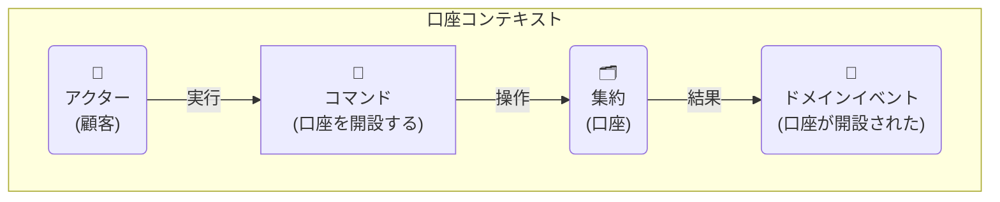

## 3. モデリング

ドメインモデリングは、ドメインの専門家と開発者が協力し、ビジネスの構造とプロセスを深く理解するための活動です。ここでは、そのための具体的な手法と、成果を実装に結びつける方法を定義します。

### 3.1. ユビキタス言語の辞書作成

モデリングの過程で明らかになったユビキタス言語は、誰でも参照できる辞書としてドキュメント化します。この辞書は、プロジェクトの成長と共に常に更新される「生きたドキュメント」です。

**フォーマット例（Markdown）:**
| 用語 (Term) | 意味・文脈 (Meaning/Context) | 振る舞い・ルール (Behavior/Rule) | 関連語 |
| :--- | :--- | :--- | :--- |
| **口座 (Account)** | 当行の金融サービスを利用する顧客の資産を管理する単位。 | - 口座番号で一意に識別される。 - 残高は0円以上でなければならない。 | 顧客, 取引, 残高 |
| **取引 (Transaction)** | 口座間の資金移動。入金、出金、振込など。 | - 一度成立した取引は変更できない（取消取引で補正する）。 - 取引金額は0より大きい。 | 口座, 金額 |
| **顧客 (Customer)** | 当行の口座を保有する個人または法人。 | - 顧客IDで一意に識別される。 | 口座 |
| **残高 (Balance)** | 特定時点での口座内の金額。 | - `Money`値オブジェクトとして表現される。 | 金額, 通貨 |

### 3.2. イベントストーミング (Event Storming) の実践

ビジネスプロセスを可視化し、集約やコンテキストの境界を発見するために、イベントストーミングを積極的に実施します。

**参加者:**
- ドメインエキスパート、プロダクトオーナー、開発者、QAなど、プロジェクトに関わる多様なメンバー。

**使用する付箋の色分け（推奨）:**
- **オレンジ**: **ドメインイベント (Domain Event)** - `〜された` という過去形の事実。
- **青**: **コマンド (Command)** - イベントを発生させる原因となった操作。
- **黄 (小)**: **アクター (Actor)** - コマンドを実行する人や外部システム。
- **黄 (大)**: **集約 (Aggregate)** - コマンドが実行される対象。一貫性の境界。
- **ピンク**: **外部システム (External System)** - 連携する外部のサービス（例: 外部決済システム）。
- **緑**: **ビュー (View) / Read Model** - アクターが判断するために参照する情報。

**具体的な進め方:**
1.  **ドメインイベントの洗い出し**: ホワイトボードやMiroなどの無限キャンバスに、時間軸に沿ってオレンジ色の付箋（ドメインイベント）を右に向かって貼り出していきます。
    - 例: `口座が開設された`, `資金が入金された`, `口座が解約された`

2.  **コマンドとアクターの特定**: 各ドメインイベントの左側に、それを引き起こしたコマンド（青）とアクター（黄）を置きます。
    - 例: `口座を開設する` (コマンド) → `口座が開設された` (イベント)

3.  **集約の発見**: 関連するコマンドとイベントのグループを見つけ、それらがどの「塊」に対する操作かを考え、集約（黄色の大きな付箋）を定義します。多くの場合、名詞が候補となります。
    - 例: `入金する` `出金する` といったコマンド群は **`口座`** 集約に対する操作。

4.  **境界づけられたコンテキストの特定**: 言語の揺れや関心事の境界を見つけ、コンテキストの境界線を引きます。これがマイクロサービスやパッケージを分割する際の重要なヒントになります。

**モデリング例: 「口座開設」**

### 3.3. モデリングから実装へ

イベントストーミングで発見した要素は、オニオンアーキテクチャの各レイヤーに直接マッピングできます。

- **集約 (Aggregate)**
  - `domain/model` パッケージ内の **エンティティ** (`Account.java`) や関連する**値オブジェクト**になります。集約ルートがエンティティの中心です。
- **コマンド (Command)**
  - `application/service` の **アプリケーションサービス** のメソッド名（例: `openAccount`) や、そのメソッドが受け取る入力オブジェクト（例: `OpenAccountCommand.java`) に対応します。
- **ドメインイベント (Domain Event)**
  - 必要に応じて、ドメインイベントを表現するクラスを作成し、コンテキスト間の連携（非同期処理など）に利用できます。
- **ビュー (View)**
  - クエリ責務に対応し、`application/dto` や、CQRSパターンを採用する場合は専用のRead Modelとして実装されます。 