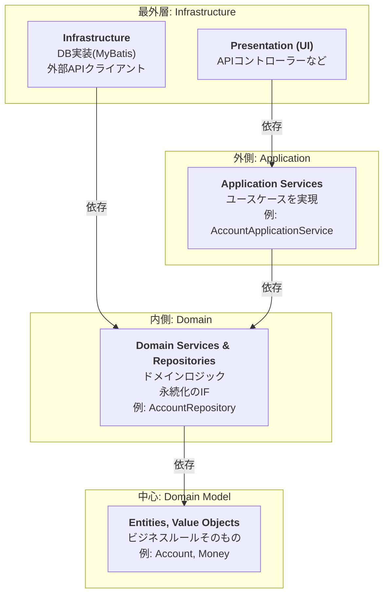
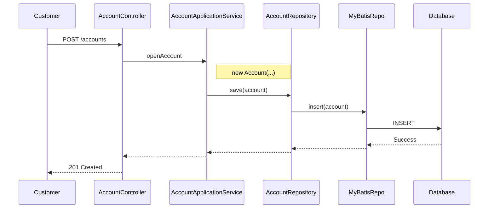
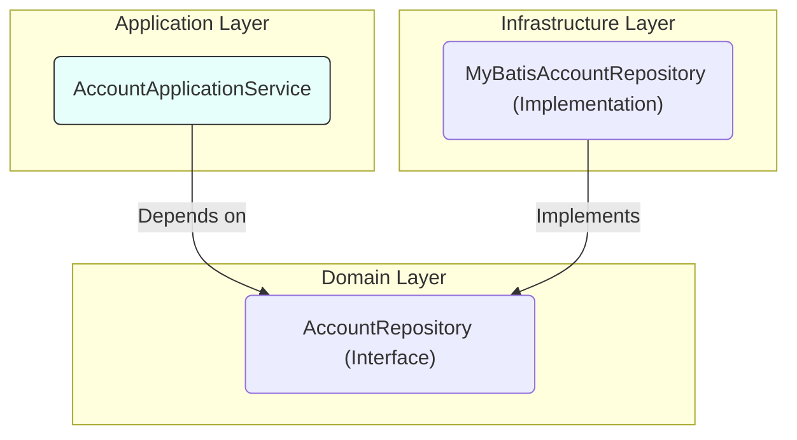
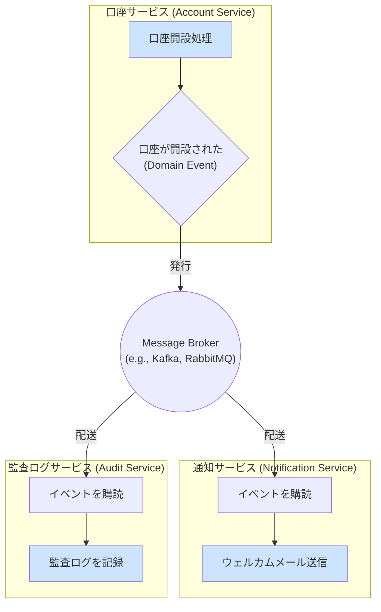

## 4. アーキテクチャ

本プロジェクトでは、**オニオンアーキテクチャ** を採用します。
このアーキテクチャは、ヘキサゴナルアーキテクチャと同様に、アプリケーションの中心にドメインモデルを据え、依存関係を常に中心方向に向かわせることで、ビジネスロジックを外部の技術的関心事から隔離します。

> **依存性のルール: 外側の円は内側の円にしか依存できない。**

### 4.1. レイヤー構造

- **中心: Domain Model**: エンティティ、値オブジェクトなど、ビジネスの本質的なルール。
- **内側: Domain Services / Repositories (Interfaces)**: ドメインロジック、永続化IF。
- **外側: Application Services**: ユースケース、DTO、トランザクション境界。
- **最外層: Infrastructure, Presentation**: APIエンドポイント、DB実装、外部連携。

#### 4.1.1. リクエストの処理フロー

  
#### 4.1.2. 依存性逆転の原則（DIP）

具象（実装詳細）ではなく、抽象（インターフェース）に依存します。

- `AccountApplicationService`は、`MyBatisAccountRepository`を知りません。`AccountRepository`というインターフェースだけを知っています。
- これにより、DB実装を差し替えても、アプリケーションサービスのコードは変更が不要になり、システムの保守性とテスト容易性が向上します。

### 4.2. マイクロサービスアーキテクチャにおける考慮点

マイクロサービスアーキテクチャでは、単一のアプリケーションが複数の独立したサービスに分割されます。これにより、各サービスは自律的に開発・デプロイ・スケール可能になりますが、サービス間の連携方法が新たな課題となります。

#### 4.2.1. サービス境界と連携

- **原則**: 「[2.3. 境界づけられたコンテキスト](#23-境界づけられたコンテキスト)」が、マイクロサービスの分割単位の最も強力な候補となります。
- **連携の要**: サービス間の連携には、主に「**ドメインイベント**」を利用した非同期通信が中心的な役割を果たします。あるサービスで発生したビジネス上の重要な事実（例: `口座が開設された`）をイベントとして発行し、関心のある他のサービスがそれを購読して後続の処理を行います。

#### 4.2.2. 同期連携 vs 非同期連携

サービス間の連携方法には、大きく分けて「同期」と「非同期」の2つのスタイルがあります。

| 特徴 | 同期連携 (Synchronous) | 非同期連携 (Asynchronous) |
| :--- | :--- | :--- |
| **代表例** | REST API (HTTP), gRPC | メッセージング (Kafka, RabbitMQ) |
| **結合度** | **高い (密結合)** | **低い (疎結合)** |
| **即時性** | レスポンスを即時受け取る | レスポンスは即時には返らない |
| **耐障害性**| **低い**。呼び出し先がダウンすると、呼び出し元も影響を受ける（連鎖障害）。 | **高い**。呼び出し先が一時的にダウンしていても、リクエストはキューに保持され、復旧後に処理される。 |
| **実装** | 比較的容易 | メッセージブローカーの導入など、構成が複雑になりがち。 |
| **整合性** | 強い整合性 | **結果整合性 (Eventual Consistency)** |

- **同期連携**:
  - **メリット**: 呼び出し元が即座に結果を知ることができる。処理の流れが直感的で分かりやすい。
  - **デメリット**: サービス間の依存関係が強くなります。あるサービスが他のサービスを同期待ちする間、リソースを確保し続け、パフォーマンスのボトルネックになりやすいです。障害の影響がシステム全体に波及しやすいという致命的な欠点を持ちます。

- **非同期連携 (イベント駆動)**:
  - **メリット**: サービスが互いに独立しているため、一部のサービスが停止してもシステム全体が停止することはありません（**高い回復性**）。各サービスが自身のペースで処理を進められるため、システム全体のスループットが向上します。
  - **デメリット**: 全体的なビジネスプロセスがどのように進むかを追跡するのが難しくなる場合があります。また、データが即座に整合しない「結果整合性」の概念を許容する必要があります。

#### 4.2.3. 推奨される連携戦略

**原則として、サービス間連携には非同期のイベント駆動アーキテクチャを第一候補として採用します。**

これにより、各マイクロサービスは自律的かつ疎結合に保たれ、システム全体の回復力とスケーラビリティが向上します。

**同期連携が許容されるケース:**
- ユーザーからのリクエストに対して、複数のサービスから情報を集めて即座にレスポンスを生成する必要がある場合（例: API Gatewayによるクエリの集約）。
- ただし、この場合でも、連鎖障害を防ぐための**サーキットブレーカー**や、タイムアウト、リトライといった回復性パターンの実装が必須となります。

この方針により、マイクロサービスのメリットを最大限に活かした、堅牢で柔軟なシステムを構築します。 