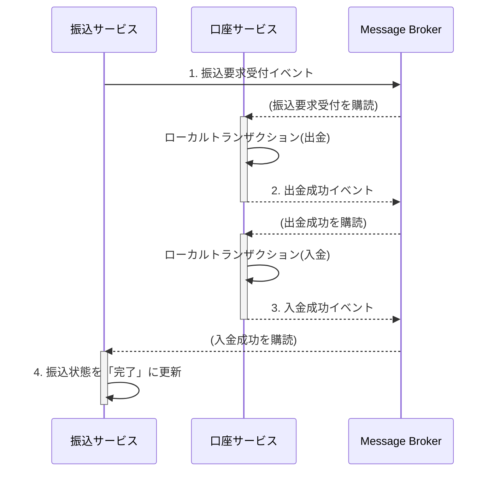

## 5. 実装パターン (Java 17 & Spring Boot & MyBatis)

この章では、ドメインモデルとアーキテクチャを具体的なコードに落とし込むための実装パターンを解説します。

### 5.1. Sagaパターンによる分散トランザクション

マイクロサービスアーキテクチャでは、複数のサービスにまたがるビジネスプロセス（例: 銀行振込）の一貫性をどのように担保するかが大きな課題となります。従来のモノリシックなシステムで使われたACIDトランザクションは、データベースがサービスごとに分割されているため利用できません。

この課題を解決するアプローチが **Saga パターン** です。

Sagaは、一連のローカルトランザクションのシーケンスです。各ローカルトランザクションは、自身のサービス内のデータを更新し、次のローカルトランザクションをトリガーするためのメッセージ（イベント）を発行します。もし途中のステップで失敗した場合、Sagaはそれまでに完了したトランザクションを取り消すための **補償トランザクション (Compensating Transaction)** を実行します。

Sagaの実装には主に2つの方法があります。
*   **コレオグラフィ (Choreography)**: 中央の管理者がおらず、各サービスがイベントを購読し、次に行うべきことを自律的に判断する分散型の方法。サービス間の結合度が低く、柔軟性が高い。
*   **オーケストレーション (Orchestration)**: 中央のオーケストレーター（指揮者）が、どのサービスをどの順序で呼び出すかを管理する方法。プロセスの流れが中央集権的に管理されるため、可視性が高い。

本ガイドでは、サービス間の結合度を低く保ち、自律性を高めることができる**コレオグラフィ型**を推奨します。

**振込処理におけるコレオグラフィSagaの例:**

1.  **振込の要求**: `振込サービス` が `振込要求受付` イベントを発行。
2.  **出金処理**: `口座サービス` が `振込要求受付` イベントを購読し、口座Aから出金（ローカルトランザクション）。成功後、`出金成功` イベントを発行。
3.  **入金処理**: `口座サービス` は（自身が発行した）`出金成功` イベントを購読し、口座Bに入金（ローカルトランザクション）。成功後、`入金成功` イベントを発行。
4.  **振込の完了**: `振込サービス` が `入金成功` イベントを購読し、振込の状態を「完了」に更新。

**もし入金処理が失敗した場合:**
- `口座サービス` は `入金失敗` イベントを発行します。
- `口座サービス` は（自身が発行した）`入金失敗` イベントを購読し、補償トランザクションとして出金された金額を口座Aに戻す処理（`出金取消`）を実行します。
- `振込サービス` も `入金失敗` イベントを購読し、振込の状態を「失敗」に更新します。



> **💡なぜSagaパターンが必要なのか？**
>
> 伝統的なシステム（モノリス）では、振込処理は単一のデータベース内で「トランザクション」という安全な箱の中で行えました。出金と入金がセットで成功するか、セットで失敗するかが保証されていたのです（All or Nothing）。
>
> しかし、マイクロサービスでは**「出金サービス」と「入金サービス」のデータベースが物理的に分かれています**。そのため、従来のトランザクションは使えません。
>
> もしSagaパターンを使わずに単純に出金APIと入金APIを順番に呼び出すだけだと、**「出金は成功したのに、ネットワーク障害で入金APIの呼び出しに失敗した」**という最悪の事態が起こりえます。これでは、お金が宙に消えてしまいます。
>
> Sagaパターンは、このような状況で「**もし途中で失敗したら、それまでに行った処理を取り消す（出金した分を元に戻す）**」という「補償」のルールを定義しておくための仕組みです。これにより、物理的に離れたサービス間でも、ビジネスとしての一連の処理の整合性を保つことができるのです。

### 5.2. リポジトリ (Repository) と MyBatis 実装

各マイクロサービスは自身のデータベースを持ち、その永続化責務はリポジトリパターンによって抽象化されます。このセクションでは、ドメイン層のインターフェースと、インフラストラクチャ層の具体的なMyBatis実装を解説します。

#### 5.2.1. リポジトリインターフェース (Domain Layer)
ドメイン層に配置され、ドメインモデルがどのように永続化されるかを知らないようにします。

```java
// package com.example.domain.repository;
import com.example.domain.model.account.Account;
import java.util.Optional;

public interface AccountRepository {
    Optional<Account> findById(String accountId);
    void save(Account account);
}
```

#### 5.2.2. MapperインターフェースとXML (Infrastructure Layer)

インフラストラクチャ層に、MyBatisを使った具体的な実装を配置します。

**Mapperインターフェース**
```java
// package com.example.infrastructure.persistence.mapper;
import com.example.domain.model.account.Account;
import org.apache.ibatis.annotations.Mapper;
import java.util.Optional;

@Mapper
public interface AccountMapper {
    Optional<Account> findById(String accountId);
    int insert(Account account);
    int update(Account account);
    boolean existsById(String accountId);
}
```

**リポジトリ実装**
`AccountRepository`インターフェースの実装クラスです。楽観的ロックの失敗を検知し、例外をスローする責務も持ちます。

```java
// package com.example.infrastructure.persistence;
import com.example.domain.model.account.Account;
import com.example.domain.repository.AccountRepository;
import com.example.infrastructure.persistence.mapper.AccountMapper;
import org.springframework.dao.OptimisticLockingFailureException;
import org.springframework.stereotype.Repository;
import java.util.Optional;

@Repository
public class MyBatisAccountRepository implements AccountRepository {
    private final AccountMapper accountMapper;

    public MyBatisAccountRepository(AccountMapper accountMapper) {
        this.accountMapper = accountMapper;
    }

    @Override
    public Optional<Account> findById(String accountId) {
        return accountMapper.findById(accountId);
    }

    @Override
    public void save(Account account) {
        if (accountMapper.existsById(account.getAccountId())) {
            int updatedCount = accountMapper.update(account);
            if (updatedCount == 0) {
                throw new OptimisticLockingFailureException(
                    "Failed to update account " + account.getAccountId() + 
                    ". Version mismatch (optimistic lock).");
            }
        } else {
            accountMapper.insert(account);
        }
    }
}
```

**Mapper XML (`AccountMapper.xml`)**
`record`で定義した値オブジェクト(`Money`)や、`Account`エンティティのコンストラクタへのマッピングがポイントです。ネストした`resultMap`を利用して、ドメインオブジェクトを直接組み立てます。

```xml
<?xml version="1.0" encoding="UTF-8" ?>
<!DOCTYPE mapper PUBLIC "-//mybatis.org//DTD Mapper 3.0//EN" "http://mybatis.org/dtd/mybatis-3-mapper.dtd">
<mapper namespace="com.example.infrastructure.persistence.mapper.AccountMapper">

    <resultMap id="accountResultMap" type="com.example.domain.model.account.Account">
        <constructor>
            <idArg column="account_id" javaType="java.lang.String"/>
            <arg column="customer_id" javaType="java.lang.String"/>
            <arg javaType="com.example.domain.model.account.Money" resultMap="moneyResultMap"/>
            <arg column="version" javaType="long"/>
        </constructor>
    </resultMap>

    <resultMap id="moneyResultMap" type="com.example.domain.model.account.Money">
        <constructor>
            <arg column="balance_amount" javaType="java.math.BigDecimal"/>
            <arg column="balance_currency" javaType="java.lang.String"/>
        </constructor>
    </resultMap>

    <select id="findById" resultMap="accountResultMap">
        SELECT 
            account_id, 
            customer_id, 
            version,
            balance_amount, 
            balance_currency
        FROM accounts WHERE account_id = #{accountId}
    </select>
    
    <select id="existsById" resultType="boolean">
        SELECT COUNT(*) > 0 FROM accounts WHERE account_id = #{accountId}
    </select>
    
    <insert id="insert">
        INSERT INTO accounts (account_id, customer_id, balance_amount, balance_currency, version)
        VALUES (#{accountId}, #{customerId}, #{balance.amount}, #{balance.currency}, 1)
    </insert>
    
    <update id="update">
        UPDATE accounts SET 
            balance_amount = #{balance.amount},
            balance_currency = #{balance.currency},
            version = version + 1
        WHERE account_id = #{accountId} AND version = #{version}
    </update>
</mapper>
```

### 5.3. アプリケーションサービス (Application Service)

ユースケースを実装し、トランザクションの境界を管理します。

**例: `AccountApplicationService`**
```java
// package com.example.application.service;
// ... imports
import com.example.domain.model.account.Account;
import com.example.domain.model.account.AccountOpenedEvent;
import com.example.domain.repository.AccountRepository;
import org.springframework.cloud.stream.function.StreamBridge;
import org.springframework.stereotype.Service;
import org.springframework.transaction.annotation.Transactional;
import java.util.UUID;

@Service
public class AccountApplicationService {
    private final AccountRepository accountRepository;
    private final StreamBridge streamBridge; // メッセージブローカー連携用

    public AccountApplicationService(AccountRepository accountRepository, StreamBridge streamBridge) {
        this.accountRepository = accountRepository;
        this.streamBridge = streamBridge;
    }

    @Transactional
    public String openAccount(OpenAccountCommand command) {
        String accountId = UUID.randomUUID().toString();
        Account account = new Account(accountId, command.customerId());
        accountRepository.save(account);

        // イベントを発行
        AccountOpenedEvent event = new AccountOpenedEvent(account.getAccountId(), account.getCustomerId());
        // 'publishAccountOpenedEvent-out-0' というバインディング(送信先)にイベントを送信
        streamBridge.send("publishAccountOpenedEvent-out-0", event);

        return accountId;
    }
}
```

### 5.4. プレゼンテーション (Presentation)

**DTO (`OpenAccountCommand`)**
```java
// package com.example.application.dto;
import jakarta.validation.constraints.NotBlank;
public record OpenAccountCommand(@NotBlank String customerId) {}
```

**Controller**
```java
// package com.example.presentation.controller;
// ... imports
@RestController
@RequestMapping("/accounts")
public class AccountController {
    private final AccountApplicationService accountService;
    // ... constructor
    @PostMapping
    public ResponseEntity<Void> openAccount(@Valid @RequestBody OpenAccountCommand command) {
        String accountId = accountService.openAccount(command);
        URI location = ServletUriComponentsBuilder.fromCurrentRequest()
                .path("/{id}").buildAndExpand(accountId).toUri();
        return ResponseEntity.created(location).build();
    }
}
```
### 5.5. ドメインイベントの実装 (マイクロサービス版)

マイクロサービス間の連携には、同一プロセス内でのイベント発行とは異なり、**メッセージブローカー (Kafka, RabbitMQなど)** を介した非同期メッセージングが必要です。ここでは、特定のブローカー製品に依存しない実装を可能にする `Spring Cloud Stream` を利用したパターンを推奨します。

#### 5.5.1. 依存関係の追加
`pom.xml` に利用したいメッセージブローカーのバインダーを追加します。

**例: Kafkaの場合**
```xml
<dependency>
    <groupId>org.springframework.cloud</groupId>
    <artifactId>spring-cloud-starter-stream-kafka</artifactId>
</dependency>
```

#### 5.5.2. イベント発行 (Publisher) の設定
**`application.yml`での出力先定義**
```yaml
spring:
  cloud:
    stream:
      bindings:
        # `[関数名]-out-0` がバインディング名になる
        # 関数名: publishAccountOpenedEvent
        publishAccountOpenedEvent-out-0:
          destination: account-events # Kafkaのトピック名
          content-type: application/json
```
`AccountApplicationService`での`StreamBridge`を使った実装は、[5.3. アプリケーションサービス](#53-アプリケーションサービス)の例を参照してください。

#### 5.5.3. イベント受信 (Subscriber) の設定と実装

**`application.yml`での入力元定義**
```yaml
spring:
  cloud:
    stream:
      bindings:
        # `[関数名]-in-0` がバインディング名になる
        # 関数名: handleAccountOpenedEvent
        handleAccountOpenedEvent-in-0:
          destination: account-events # Kafkaのトピック名
          group: notification-service # Consumer Group
```

**イベントリスナーの実装 (例: 通知サービス)**
リスナーは `@EventListener` ではなく、`java.util.function.Consumer` を実装したBeanとして定義します。Bean名が`application.yml`で定義した関数名（`handleAccountOpenedEvent`）と一致することで、対応するトピックの購読が自動的に開始されます。

```java
// package com.example.notification.infra;
import com.example.notification.domain.AccountOpenedEvent;
import org.slf4j.Logger;
import org.slf4j.LoggerFactory;
import org.springframework.context.annotation.Bean;
import org.springframework.stereotype.Component;
import java.util.function.Consumer;

@Component
public class AccountEventSubscriber {
    private static final Logger log = LoggerFactory.getLogger(AccountEventSubscriber.class);

    // Bean名が application.yml の関数名と一致
    @Bean
    public Consumer<AccountOpenedEvent> handleAccountOpenedEvent() {
        return event -> {
            log.info("--- Received AccountOpenedEvent ---");
            log.info("--- Sending Welcome Notification ---");
            log.info("To Customer: {}", event.customerId());
            log.info("New Account ID: {}", event.accountId());
            // ここで実際にメール送信などの処理を行う
        };
    }
}
```
> `AccountOpenedEvent` レコードは、この通知サービスでも同じパッケージ・定義で共有されている必要があります。マイクロサービス環境では、このようなイベントのスキーマ（構造）を共有するために、**共有ライブラリ**として切り出したり、**スキーマレジストリ**を利用したりするのが一般的です。 