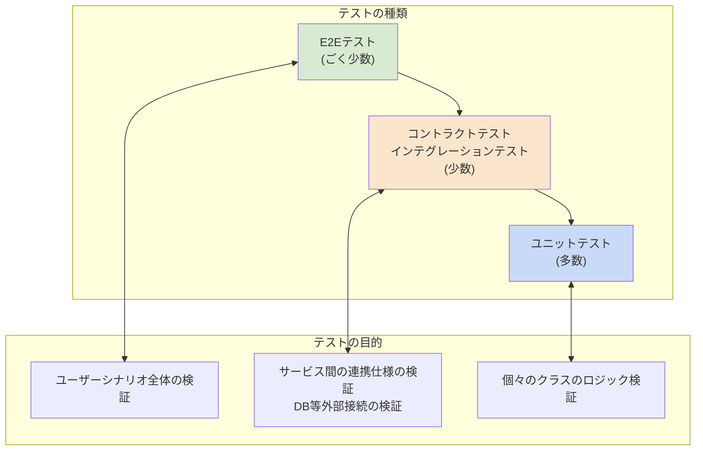
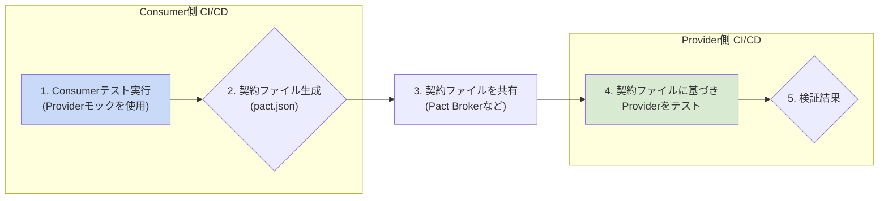

## 6. テスト方針

### 6.1. テスト戦略
マイクロサービス環境においても、Unit Testを厚く書くテストピラミッドの原則は変わりません。しかし、サービス間の連携が増えるため、新たに**コントラクトテスト**が重要な役割を担います。



- **Unit Test (単体テスト)**: 個々のクラスのロジックを検証します。
    - **Sociable**: 依存オブジェクトをそのまま使い、クラス群の振る舞いをテストします。（例: `Account`と`Money`の連携）
    - **Solitary**: 依存オブジェクトをモックに差し替え、クラス単体のロジックを分離してテストします。（例: `ApplicationService`のテスト）
- **Integration Test (結合テスト)**:
    - **インプロセス結合テスト**: サービス内部で、DBや外部APIクライアントなど、インフラ層を含めた結合をテストします。（例: `@MybatisTest`）
    - **コントラクトテスト**: サービス間のAPI仕様（契約）が守られているかを検証します。詳細は[6.5. コントラクトテスト](#65-コントラクトテスト)で後述します。
- **E2E Test (エンドツーエンドテスト)**: 複数のサービスを連携させ、ユーザーの操作から始まるシナリオ全体を検証します。

### 6.2. Domain Layer のテスト (Sociable Unit Test)
**テストコード例: `Account`エンティティのテスト**
```groovy
// src/test/groovy/com/example/domain/model/account/AccountSpec.groovy
package com.example.domain.model.account
import spock.lang.Specification
import java.math.BigDecimal

class AccountSpec extends Specification {
    def "入金すると残高が増える"() {
        given: "初期残高が1000円の口座"
        def initialBalance = new Money(new BigDecimal("1000"))
        def account = new Account("acc-001", "cust-001", initialBalance, 1L)
        and: "入金額は500円"
        def depositAmount = new Money(new BigDecimal("500"))
        when: "口座に入金する"
        account.deposit(depositAmount)
        then: "口座の残高が1500円になる"
        account.getBalance().amount() == new BigDecimal("1500")
    }

    def "残高を超える金額を出金しようとすると例外が発生する"() {
        given: "初期残高が1000円の口座"
        def account = new Account("acc-001", "cust-001", new Money(new BigDecimal("1000")), 1L)
        and: "出金額は2000円"
        def withdrawalAmount = new Money(new BigDecimal("2000"))
        when: "口座から出金する"
        account.withdraw(withdrawalAmount)
        then: "残高不足のためIllegalStateExceptionがスローされる"
        thrown(IllegalStateException)
    }
}
```

### 6.3. Application Layer のテスト (Solitary Unit Test)
**テストコード例: `AccountApplicationService`のテスト**
```groovy
// src/test/groovy/com/example/application/service/AccountApplicationServiceSpec.groovy
package com.example.application.service
import com.example.application.dto.OpenAccountCommand
import com.example.domain.model.account.Account
import com.example.domain.model.account.AccountOpenedEvent
import com.example.domain.repository.AccountRepository
import org.springframework.context.ApplicationEventPublisher
import spock.lang.Specification

class AccountApplicationServiceSpec extends Specification {
    AccountRepository accountRepository = Mock()
    ApplicationEventPublisher eventPublisher = Mock()
    AccountApplicationService target = new AccountApplicationService(accountRepository, eventPublisher)

    def "口座を開設できる"() {
        given: "口座開設コマンド"
        def command = new OpenAccountCommand("cust-123")
        when: "口座開設処理を呼び出す"
        def accountId = target.openAccount(command)
        then: "リポジトリのsaveとイベント発行が1回ずつ呼び出される"
        1 * accountRepository.save(_ as Account)
        1 * eventPublisher.publishEvent(_ as AccountOpenedEvent)
        and: "accountIdが返される"
        accountId != null
    }
}
```

### 6.4. Infrastructure Layer のテスト (インプロセス結合テスト)

**1. Persistence (Repository) のテスト**
`@MybatisTest` を使い、MapperのSQLやマッピングを検証します。
```groovy
// src/test/groovy/com/example/infrastructure/persistence/mapper/AccountMapperSpec.groovy
package com.example.infrastructure.persistence.mapper
// ... imports
import org.mybatis.spring.boot.test.autoconfigure.MybatisTest
import org.springframework.beans.factory.annotation.Autowired
import org.springframework.boot.test.context.SpringBootTest
import org.springframework.test.context.jdbc.Sql

@SpringBootTest @MybatisTest
@Sql(scripts = "/test-data/accounts.sql")
class AccountMapperSpec extends Specification {
    @Autowired private AccountMapper accountMapper

    def "findByIdで口座を取得できる"() {
        given: "存在する口座ID"
        def id = "acc-001"
        when: "Mapperで検索"
        def actual = accountMapper.findById(id)
        then: "期待通りの口座が取得できる"
        actual.isPresent()
        actual.get().getCustomerId() == "cust-001"
        actual.get().getBalance().amount() == new BigDecimal("10000.00")
    }
    
    def "楽観的ロックが機能すること"() {
        given: "バージョン1の口座を取得"
        def account = accountMapper.findById("acc-001").get()
        
        and: "別のトランザクションで同じ口座が更新されたと仮定"
        accountMapper.update(account) // versionが2になる
        
        when: "取得した古いバージョン(1)のデータで更新しようとする"
        def updatedCount = accountMapper.update(account)
        
        then: "更新件数は0件となる"
        updatedCount == 0
    }
}
```

**2. Presentation (Controller) のテスト**
`@WebMvcTest` を使い、Controllerの動作を検証します。`ApplicationService`は`@MockBean`でモック化します。
```groovy
// src/test/groovy/com/example/infrastructure/web/AccountControllerSpec.groovy
package com.example.infrastructure.web
// ... imports
import org.springframework.boot.test.autoconfigure.web.servlet.WebMvcTest
import org.springframework.boot.test.mock.mockito.MockBean
import static org.springframework.test.web.servlet.request.MockMvcRequestBuilders.post
import static org.springframework.test.web.servlet.result.MockMvcResultMatchers.*

@WebMvcTest(AccountController.class)
class AccountControllerSpec extends Specification {
    @Autowired MockMvc mockMvc
    @Autowired ObjectMapper objectMapper
    @MockBean AccountApplicationService accountService

    def "POST /accounts で口座を開設できる"() {
        given: "リクエストボディ"
        def command = new OpenAccountCommand("cust-123")
        and: "サービスは新しい口座IDを返すように設定"
        accountService.openAccount(command) >> "new-acc-id"
        
        when: "POSTリクエストを送信"
        def result = mockMvc.perform(post("/accounts")
                .contentType(MediaType.APPLICATION_JSON)
                .content(objectMapper.writeValueAsString(command)))

        then: "ステータスコード 201 が返り、Locationヘッダが設定されている"
        result.andExpect(status().isCreated())
              .andExpect(header().string("Location", containsString("/accounts/new-acc-id")))
    }
}
```

### 6.5. コントラクトテスト (Contract Testing)
マイクロサービスアーキテクチャでは、あるサービスの変更が、それに依存する別のサービスを破壊する可能性があります。コントラクトテストは、サービス間のAPIの「契約（Contract）」を定義し、その契約が双方で守られているかを継続的に検証する仕組みです。

- **Consumer (消費者)**: 他のサービスのAPIを呼び出すサービス。（例: `口座開設`イベントを受けて、`顧客情報サービス`に顧客詳細を問い合わせる`口座サービス`）
- **Provider (提供者)**: APIを提供するサービス。（例: `顧客情報サービス`）

**テストの進め方 (Pact / Spring Cloud Contract の例):**
1.  **Consumer側のテスト**:
    - Consumerは、ProviderのAPIに対して期待するリクエストとレスポンスを定義したテスト（契約ファイル）を作成します。
    - このテストを実行すると、Providerのモックが生成され、Consumerはそのモックに対してテストを行います。成功すると、**契約ファイル (pactファイル)** が生成されます。
2.  **契約の共有**:
    - 生成された契約ファイルを、Providerがアクセスできる場所（Pact BrokerやGitリポジトリなど）に共有します。
3.  **Provider側のテスト**:
    - Providerは、共有された契約ファイルを取得します。
    - 契約ファイルに定義されたリクエストを自身のサービスに送信し、実際のレスポンスが契約ファイルに定義されたレスポンスと一致するかを検証します。
4.  **継続的インテグレーション**:
    - この一連の流れをCI/CDパイプラインに組み込むことで、ProviderがAPI仕様を破壊するような変更を行った際に、即座に検知できるようになります。


この仕組みにより、サービス間の結合を疎に保ちつつ、意図しない破壊的な変更を早期に発見できます。

### 6.6. バックエンドE2Eテスト
`Testcontainers`と`REST Assured`を使い、本番同様の環境（複数のサービスをDockerコンテナで起動）でAPI仕様全体を検証します。
- **目的**: 個々のサービスの連携が、ビジネスシナリオ全体として正しく機能することを確認する。
- **注意点**:
    - E2Eテストは作成と維持のコストが非常に高いため、数は最小限に絞るべきです。
    - 主要な正常系のシナリオ（ハッピーパス）に焦点を当て、異常系の細かいテストは下位のテスト（Unit, Integration）でカバーします。
    - 複数のサービスにまたがるため、失敗時の原因特定が困難になりやすいです。分散トレーシングなどの仕組みが役立ちます。 