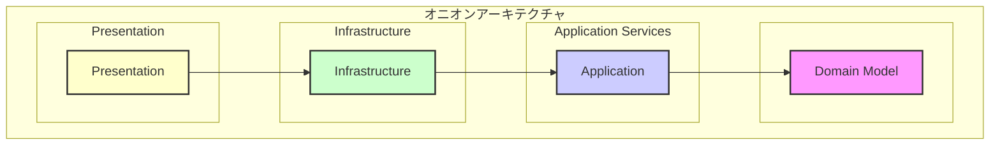
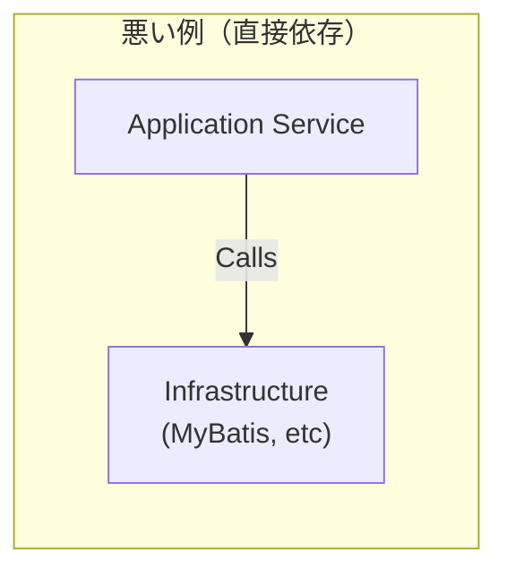
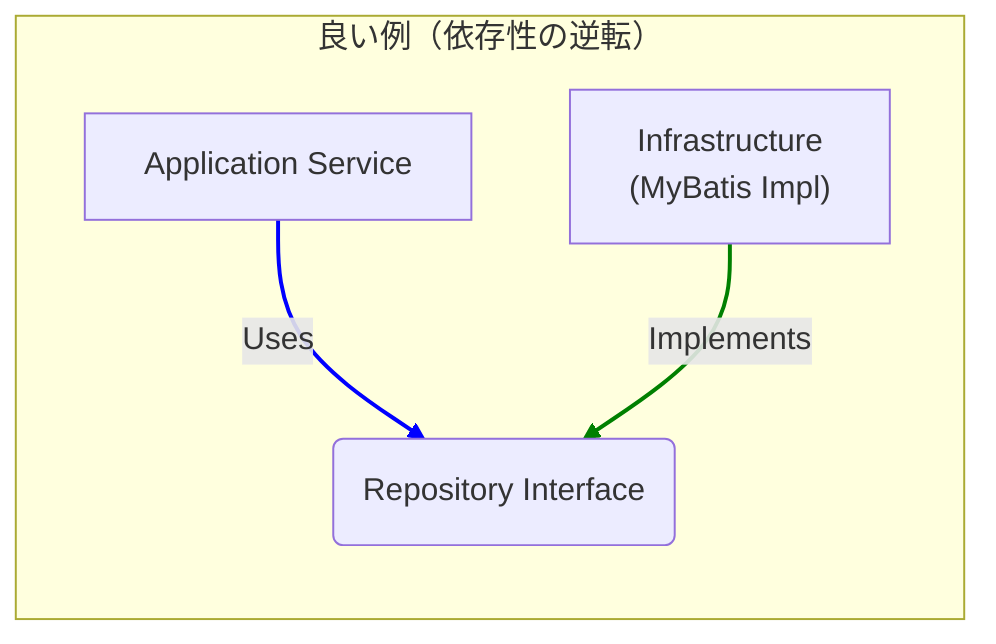

# 第2章：設計の羅針盤 - オニオンアーキテクチャ

DDDの考え方をコードで実現する上で、強力な味方となるのが「オニオンアーキテクチャ」です。玉ねぎ（オニオン）のように、アプリケーションを複数の層（レイヤー）で構成します。

このアーキテクチャの最大の目的は、**ビジネスの核となるルールを、技術的な詳細から徹底的に保護すること**です。

## オニオンアーキテクチャの構造

### 中心のルール：依存性の逆転

オニオンアーキテクチャには、たった一つだけ、しかし非常に重要なルールがあります。

> **外側のレイヤーは、内側のレイヤーにのみ依存できる。**

つまり、矢印は常に中心に向かいます。
- `Infrastructure`層は`Application`層を知っているが、`Application`層は`Infrastructure`層を知らない。
- `Application`層は`Domain`層を知っているが、`Domain`層は`Application`層を知らない。

これにより、最も重要な`Domain Model`（ビジネスルール）は、他のどのレイヤーにも依存しない、最も保護された存在となります。データベースやUIの技術が変わっても、ドメインモデルは影響を受けません。

### 各レイヤーの責務

-   **Domain Model (ドメインモデル層)**
    -   システムの心臓部。ビジネスの概念、ルール、振る舞いを表現するオブジェクト（エンティティ、値オブジェクト）が配置されます。
    -   このレイヤーは、他のどのレイヤーにも依存しません。フレームワーク（Springなど）のコードもここには現れません。純粋なJava(POJO)で記述されます。

-   **Application Services (アプリケーション層)**
    -   システムのユースケース（機能）を実装します。
    -   ドメインオブジェクトを組み合わせて、特定のビジネスフロー（例：「口座を開設する」「振込を実行する」）を実現します。
    -   トランザクションの管理もこの層の責務です。

-   **Infrastructure (インフラストラクチャ層)**
    -   データベースとのやり取り、外部APIの呼び出し、メッセージの送受信など、技術的な詳細をすべて担当します。
    -   **重要な点**: アプリケーション層で定義されたインターフェース（例: `AccountRepository`）を、この層で具象クラス（例: `MyBatisAccountRepository`）として実装します。これにより、依存性の方向が逆転します。

-   **Presentation (プレゼンテーション層)**
    -   外部とのインターフェースを担当します。
    -   REST APIのエンドポイント（Controller）、Web UI、gRPCサーバーなどがこの層にあたります。
    -   ユーザーからのリクエストを受け取り、アプリケーション層に処理を委譲します。

## 依存性の逆転の原則 (DIP)

なぜインフラ層がアプリケーション層のインターフェースを実装することが「依存性の逆転」なのでしょうか？

通常、高レベルのモジュール（Application）が低レベルのモジュール（Infrastructure）を直接呼び出すと考えがちです。

しかし、オニオンアーキテクチャでは、間に「インターフェース」を挟みます。

1.  **Application層**は、具体的な技術を知らない`Repository`**インターフェース**を定義し、それを利用します。
2.  **Infrastructure層**は、その**インターフェース**を実装（`implements`）します。

これにより、**制御の流れ**（`Application`が`Infrastructure`を呼び出す）と、**ソースコードの依存関係**（`Infrastructure`が`Application`のインターフェースに依存）の方向が逆になります。これが**依存性逆転の原則**です。

この原則のおかげで、データベースをMyBatisから別の技術（例: JPA/Hibernate）に載せ替える場合でも、修正はインフラストラクチャ層に限定され、アプリケーション層やドメイン層のコードには一切変更が不要になります。

これが、オニオンアーキテクチャが「変更に強い」と言われる理由です。 