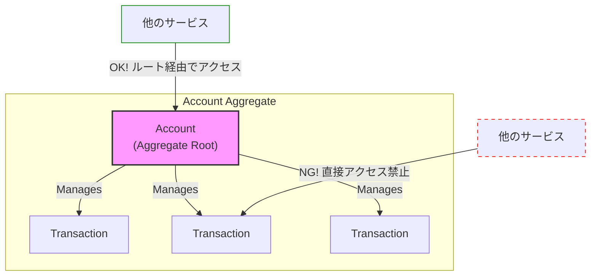

# 第3章：DDDのビルディングブロック - 金融ドメインを表現する道具たち

ドメイン駆動設計では、ビジネスの世界をコードで表現するために、いくつかの決まった設計要素（ビルディングブロック）を使います。この章では、特に重要な要素を、金融ドメインの例を使って見ていきましょう。

## 3.1. 値オブジェクト (Value Object)

**値オブジェクト**は、その「値」自体が意味を持つオブジェクトです。IDを持たず、一度作成したら変更できない（**不変; Immutable**）という性質を持ちます。

**例：`Money` オブジェクト**

金融システムで「金額」を扱うとき、`BigDecimal`型を直接使うとどうなるでしょうか？

```java
// 悪い例
BigDecimal amount = new BigDecimal("-1000"); // マイナスの金額が作れてしまう
add(amount1, currency1, amount2, currency2); // 通貨の違う足し算をしてしまう危険性
```

このような問題を避けるため、「金額」という概念を一つの型として定義します。これが値オブジェクトです。

Java 17の `record` を使うと、不変なオブジェクトを非常に簡潔に記述できます。

```java
// 良い例: Money 値オブジェクト
// （domain.model.common パッケージなどに配置）
package com.example.domain.model.common;

import java.math.BigDecimal;
import java.util.Objects;

public record Money(BigDecimal amount, String currency) {
    
    public Money {
        // nullチェック
        Objects.requireNonNull(amount, "amount must not be null");
        Objects.requireNonNull(currency, "currency must not be null");

        // 不変条件: 金額はマイナスであってはならない
        if (amount.compareTo(BigDecimal.ZERO) < 0) {
            throw new IllegalArgumentException("Amount cannot be negative.");
        }
    }

    // 振る舞い: 加算ロジック
    public Money add(Money other) {
        // 不変条件: 通貨が異なれば足し算はできない
        if (!this.currency.equals(other.currency)) {
            throw new IllegalArgumentException("Cannot add Money with different currencies.");
        }
        return new Money(this.amount.add(other.amount), this.currency);
    }
}
```

**値オブジェクトのメリット:**
- **不変条件のカプセル化**: 「金額はマイナスにならない」といったビジネスルールをコンストラクタに記述することで、不正な状態のオブジェクトが存在できなくなります。
- **コードの意図が明確になる**: `BigDecimal`ではなく`Money`という型を使うことで、その変数が「金額」を表すことが一目瞭然になります。
- **再利用性が高い**: `Money`オブジェクトは、口座(Account)だけでなく、取引(Transaction)など、様々な場所で再利用できます。

同様に、`CustomerId` や `AccountId` といったIDも、単なる`String`ではなく、`public record CustomerId(String value) {}` のように値オブジェクトにすることで、型の安全性を高めることができます。

## 3.2. エンティティ (Entity)

**エンティティ**は、ライフサイクルを通じて状態が変化し、一意なIDによって識別されるオブジェクトです。値オブジェクトとは対照的に、属性がすべて同じでもIDが違えば別のものとして扱われます。

**例：`Account`（口座）エンティティ**

口座は、開設され、入金・出金によって残高が変わり、最終的に解約されるというライフサイクルを持ちます。「口座番号」という一意なIDで識別されます。

```java
// （domain.model.account パッケージなどに配置）
package com.example.domain.model.account;

import com.example.domain.model.common.Money;
// ... imports

public class Account {
    private final AccountId accountId; // ID (値オブジェクト)
    private final CustomerId customerId; // ID (値オブジェクト)
    private Money balance; // 残高 (値オブジェクト)
    private long version; // 楽観的ロック用バージョン

    // コンストラクタや振る舞い（メソッド）
    public Account(AccountId accountId, CustomerId customerId) {
        this.accountId = accountId;
        this.customerId = customerId;
        this.balance = Money.ZERO_JPY; // 初期残高は0円
        this.version = 1L;
    }

    public void deposit(Money amountToDeposit) {
        // ビジネスルール: 入金処理
        this.balance = this.balance.add(amountToDeposit);
    }

    public void withdraw(Money amountToWithdraw) {
        // ビジネスルール: 残高が足りているかチェック
        if (this.balance.amount().compareTo(amountToWithdraw.amount()) < 0) {
            throw new InsufficientBalanceException("Insufficient balance.");
        }
        this.balance = new Money(this.balance.amount().subtract(amountToWithdraw.amount()), this.balance.currency());
    }
    
    // ... ゲッターなど
}
```
`Account`エンティティは、`deposit`や`withdraw`といった振る舞い（メソッド）を持ち、自身の状態（`balance`）をビジネスルールに従って変更する責務を持ちます。

## 3.3. 集約 (Aggregate)

**集約（アグリゲート）** は、関連するエンティティと値オブジェクトをまとめた、データ整合性の単位です。集約は、その境界内のオブジェクトを一貫した状態に保つ責任を持ちます。

- **集約のルート (Aggregate Root)**: 集約の代表となるエンティティ。外部から集約内のオブジェクトにアクセスする場合は、必ずこのルートを経由します。
- **不変条件 (Invariants)**: 集約が常に満たすべきビジネスルール（例：「口座の残高はマイナスであってはならない」）。

**金融取引における集約の例:**
「口座」と「取引履歴」を考えてみましょう。

-   **`Account`（口座）** を集約ルートとします。
-   **`Transaction`（取引履歴）** は、`Account`集約に属するエンティティとします。

**なぜこの形か？**
「残高」と「取引履歴の合計」は常に一致している、という不変条件を守るためです。もし外部から`Transaction`を自由に追加・削除できてしまうと、この整合性が崩れる可能性があります。



**ルール:**
- 集約内のオブジェクトへのアクセスは、必ず集約ルートを通して行う。
- 1つのトランザクションで更新できる集約は、原則として1つだけ。

このルールにより、複雑なシステムの中でもデータの整合性を保ちやすくなります。

## 3.4. リポジトリ (Repository)

**リポジトリ**は、ドメインオブジェクトを永続化層（データベースなど）から出し入れするための仕組みをカプセル化（隠蔽）する役割を持ちます。

アプリケーションは、まるでオブジェクトがメモリ上のコレクションに存在するかのように、リポジトリを通じてドメインオブジェクトを取得・保存できます。

重要なのは、**リポジトリのインターフェースはドメイン層に定義する**という点です。

```java
// （domain.model.account パッケージなどに配置）
package com.example.domain.model.account;

import java.util.Optional;

public interface AccountRepository {
    // 口座IDで集約を検索する
    Optional<Account> findById(AccountId accountId);

    // 集約を保存（新規作成または更新）する
    void save(Account account);
}
```

ドメイン層は、このインターフェースにのみ依存します。実際にデータベースとやり取りする具体的な実装（MyBatisやJPAを使ったコード）は、インフラストラクチャ層に記述します。これが、第2章で学んだ「依存性の逆転」の実践です。

## 3.5. ドメインイベント (Domain Event)

**ドメインイベント**は、ドメイン内で発生した「過去の出来事」を表現するオブジェクトです。

**例：`AccountOpenedEvent`（口座開設イベント）、`TransferSucceededEvent`（振込成功イベント）**

```java
// （domain.model.account.event パッケージなどに配置）
public record AccountOpenedEvent(
    Instant occurredOn,
    AccountId accountId,
    CustomerId customerId
) {
    public AccountOpenedEvent(AccountId accountId, CustomerId customerId) {
        this(Instant.now(), accountId, customerId);
    }
}
```
イベントは、過去形（`...ed`）で命名するのが慣習です。

**ドメインイベントの役割:**
マイクロサービスアーキテクチャにおいて、ドメインイベントはサービス間の連携を疎結合に保つための非常に重要な役割を果たします。

1.  `口座サービス`が口座を開設し、`AccountOpenedEvent`をメッセージブローカー（Kafkaなど）に発行します。
2.  `通知サービス`は、そのイベントを購読（受信）し、「ようこそ」メールを顧客に送信します。
3.  `分析サービス`も同じイベントを購読し、新規口座開設の統計データを更新します。

`口座サービス`は、`通知サービス`や`分析サービス`の存在を一切知る必要がありません。ただ「口座が開設された」という事実を叫ぶだけです。これにより、各サービスは自律的に動作し、システム全体の柔軟性が高まります。 