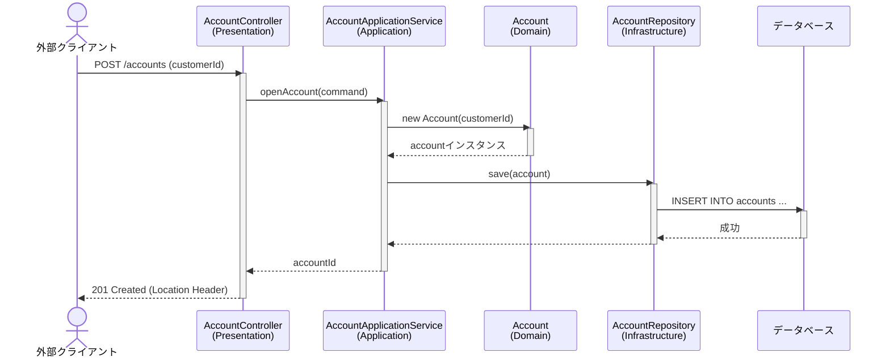

# 第4章：Spring Bootによるアーキテクチャ実装

前の章までで学んだ理論（オニオンアーキテクチャ、DDDビルディングブロック）を、実際のSpring Bootプロジェクトでどのように構成していくかを解説します。

## パッケージ構成

オニオンアーキテクチャの各レイヤーは、Spring Bootプロジェクトのパッケージとして表現するのが一般的です。以下に、`account-service`（口座サービス）というマイクロサービスを例としたパッケージ構成を示します。

```
com.example.accountservice
├── AccountServiceApplication.java
│
├── domain // ドメイン層: ビジネスの核となるルール
│   └── model
│       ├── account // account集約
│       │   ├── Account.java
│       │   ├── AccountId.java
│       │   ├── AccountRepository.java // インターフェース
│       │   ├── InsufficientBalanceException.java
│       │   └── event
│       │       └── AccountOpenedEvent.java
│       │
│       └── common // 複数のドメインで共通の値オブジェクトなど
│           ├── Money.java
│           └── CustomerId.java
│
├── application // アプリケーション層: ユースケース
│   ├── service
│   │   └── AccountApplicationService.java
│   └── dto
│       ├── OpenAccountCommand.java
│       └── DepositCommand.java
│
├── infrastructure // インフラストラクチャ層: 技術的詳細
│   ├── persistence // 永続化（DB関連）
│   │   ├── repository
│   │   │   └── MyBatisAccountRepository.java // リポジトリの実装
│   │   └── mapper
│   │       └── AccountMapper.java // MyBatis Mapper
│   │
│   └── messaging // 非同期メッセージング関連
│       └── event
│           └── AccountEventPublisher.java
│
└── presentation // プレゼンテーション層: 外部とのI/F
    └── controller
        └── AccountController.java
```

**ポイント：**
- **`domain`パッケージ**: 他のどのパッケージにも依存しません。フレームワークのコード（`@Service`や`@Entity`のようなアノテーション）もここには含めません。
- **`AccountRepository.java`**: ドメイン層に**インターフェース**として定義されています。
- **`MyBatisAccountRepository.java`**: インフラ層でその**インターフェースを実装**しています。これが「依存性の逆転」の具体的な現れです。

## リクエスト処理の流れ

ユーザーが「口座開設API」を呼び出したとき、リクエストが各レイヤーをどのように流れていくかをシーケンス図で見てみましょう。



**処理の解説:**
1.  **Presentation (`AccountController`)**:
    -   HTTPリクエストを受け取ります。
    -   リクエストボディをDTO (`OpenAccountCommand`) に変換します。
    -   アプリケーション層の `AccountApplicationService` を呼び出します。
    -   結果を受け取り、HTTPレスポンス（`201 Created`）を返します。

2.  **Application (`AccountApplicationService`)**:
    -   `@Transactional`アノテーションにより、トランザクションを開始します。
    -   ドメイン層の`Account`エンティティを生成します。
    -   ドメイン層の`AccountRepository`インターフェースを呼び出し、エンティティの永続化を依頼します。
    -   トランザクションをコミットします。

3.  **Domain (`Account`)**:
    -   ビジネスルールに従って、自身の状態を初期化します。（例：初期残高は0円）

4.  **Infrastructure (`MyBatisAccountRepository` & `DB`)**:
    -   `AccountRepository`の実装として、実際にデータベースへの`INSERT`文を実行します。

このように、各レイヤーがそれぞれの責務を明確に分担することで、コードの見通しが良くなり、変更やテストが容易になります。

## 5. クラス設計の基本原則

保守性と拡張性の高いコードを維持するため、以下の設計原則に従います。

### 単一責任の原則 (SRP)
各クラスは、一つの、そしてそのクラスだけの責任を持つべきです。
- **エンティティ**: ビジネスロジックとそれに伴う状態変更に責任を持ちます。永続化や外部通知のロジックは含みません。
  - 例: `Account`クラスは、預入や引出といった口座の振る舞いのみを実装します。
- **リポジトリ**: 特定の集約の永続化（DBへの保存、読込、更新、削除）に責任を持ちます。
- **アプリケーションサービス**: ユースケースの実現に責任を持ちます。トランザクションの管理や、複数のドメインオブジェクトやリポジトリを連携させる役割を担います。

### 不変性 (Immutability) の活用
意図しない状態変更を防ぎ、システムの堅牢性を高めるために、不変性を積極的に採用します。
- **値オブジェクト (Value Object)**: 原則として不変にします。Java 17の`record`は、不変な値オブジェクトを簡潔に定義するための最適な手段です。
  ```java
  // 通貨と金額を表す不変の値オブジェクト
  public record Money(BigDecimal amount, Currency currency) {
      public Money add(Money other) {
          if (!this.currency.equals(other.currency)) {
              throw new IllegalArgumentException("Cannot add money with different currencies.");
          }
          return new Money(this.amount.add(other.amount), this.currency);
      }
  }
  ```
- **DTO (Data Transfer Object)**: アプリケーション層とプレゼンテーション層の間でデータを転送するために使います。ロジックを持たず、状態も不変であるべきです。こちらも`record`の使用を推奨します。
  ```java
  // 口座開設のためのコマンドオブジェクト
  public record OpenAccountCommand(String customerId) {}
  ```

### 依存性の方向
依存関係は常に外側のレイヤーから内側のレイヤーへ向かうべきです（依存性逆転の原則）。
- **Domain → Application → Infrastructure / Presentation** という依存関係は **禁止** します。
- Domain層は他のどの層にも依存せず、純粋なビジネスロジックを表現します。
- Infrastructure層はApplication層やDomain層で定義されたインターフェースを実装します。

## 6. メソッド命名規則

メソッド名は、その目的と振る舞いが明確に伝わるように命名します。

### ユビキタス言語に従う
ドメインエキスパートと開発チームが共有する「ユビキ- タス言語」をそのままメソッド名に採用します。
- 「口座を有効化する」という業務ルールがあれば、`enableAccount()` や `activate()` のように、チームで合意した用語を使います。

### Command-Query Separation (CQS)
メソッドを「状態を変更するコマンド」と「状態を返すクエリ」に明確に分離します。

- **コマンド (Command)**:
  - システムの状態を変更する操作です。
  - 戻り値は原則として`void`、または操作対象のIDなど最小限の情報とします。
  - **動詞** または **動詞句** で命名します。
  - 例: `deposit(Money money)`, `transfer(AccountId to, Money amount)`, `disableAccount()`

- **クエリ (Query)**:
  - システムの状態を変更せず、データを返却する操作です。
  - **`get` / `find`**: 特定の条件でオブジェクトを取得します。
    - `findById(AccountId id)`: 主キーで単一のオブジェクトを取得します。
    - `findByStatus(AccountStatus status)`: 特定のステータスで複数のオブジェクトを取得します。
  - **`is` / `has` / `can`**: 真偽値(`boolean`)を返すメソッドの接頭辞として使用し、状態を問い合わせることを明示します。
    - `boolean hasSufficientBalance(Money amount)`: 十分な残高があるか確認します。
    - `boolean isActive()`: 口座が有効か確認します。
    - `boolean canWithdraw(Money amount)`: 引き出し可能か（ルール上）確認します。

### アプリケーションサービスのメソッド
アプリケーションサービスの公開メソッドは、一つのビジネスユースケースに対応します。
- メソッド名は、そのユースケースを具体的に表現するものにします。
  ```java
  public class AccountApplicationService {
      // 「資金を送金する」というユースケース
      public void transferFunds(TransferCommand command) {
          // ...
      }

      // 「口座を開設する」というユースケース
      public AccountId openAccount(OpenAccountCommand command) {
          // ...
      }
  }
  ``` 