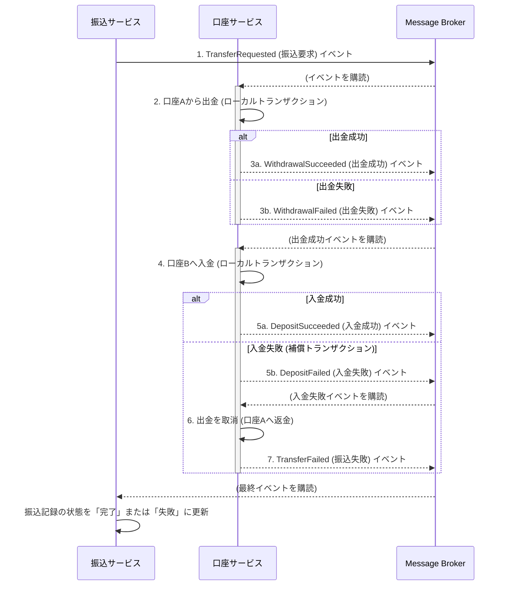

# 第5章：金融システム特有の実装パターン

この章では、特に金融システムにおいて重要となる、データの整合性や監査性を担保するための具体的な実装パターンを解説します。

## 5.1. 楽観的ロックによる排他制御

複数のユーザーやプロセスが同時に同じ口座の残高を更新しようとすると、データ不整合が発生する可能性があります（例：最後の更新が前の更新を上書きしてしまう「上書き損失」問題）。

これを防ぐための一般的な方法が**排他制御**です。ここでは、システムのスループットを維持しやすい**楽観的ロック**方式を採用します。

**仕組み：**
1.  テーブルに `version` カラム（数値型）を追加します。
2.  データを読み込む際に `version` の値も一緒に取得します。
3.  データを更新する際、`UPDATE`文の`WHERE`句に「`id = ? AND version = ?`」という条件を指定します。
4.  更新が成功したら、`version` カラムの値を `+1` します。
5.  もし更新対象の行が0件だった場合、それは自分がデータを読み込んだ後、他の誰かが先に更新した（`version`が変わった）ことを意味します。この場合、トランザクションを失敗させ、クライアントにエラーを返します。

**MyBatisでの実装例 (`AccountMapper.xml`)**
```xml
<update id="update">
    UPDATE accounts SET 
        balance_amount = #{balance.amount},
        balance_currency = #{balance.currency},
        version = version + 1
    WHERE 
        account_id = #{accountId} AND version = #{version}
</update>
```

**リポジトリでの実装例 (`MyBatisAccountRepository.java`)**
リポジトリの実装は、更新件数が0件だった場合に例外をスローする責務を持ちます。

```java
@Override
public void save(Account account) {
    // ... (existsByIdを使った新規/更新判定)
    if (isNew) {
        accountMapper.insert(account);
    } else {
        int updatedCount = accountMapper.update(account);
        if (updatedCount == 0) {
            // 更新件数が0なら、バージョン不一致とみなし例外をスロー
            throw new OptimisticLockingFailureException(
                "Failed to update account " + account.getAccountId() + 
                ". Version mismatch (optimistic lock).");
        }
    }
}
```
Springは `OptimisticLockingFailureException` を検知すると、HTTP 409 Conflict ステータスを返すように設定できます。これにより、クライアントはリトライ（再試行）などの適切な処理を行うことができます。

## 5.2. Sagaパターンによる分散トランザクション

マイクロサービスアーキテクチャでは、複数のサービスにまたがる「振込」のようなビジネスプロセスを、単一のACIDトランザクションで管理することはできません。この問題を解決するのが **Saga パターン** です。

Sagaは、一連のローカルトランザクションの連鎖であり、各ステップで失敗した場合の「補償トランザクション（取り消し処理）」を定義しておくことで、プロセス全体としての一貫性を保ちます。

ここでは、サービス間の結合度を低く保てる**コレオグラフィ型Saga**を推奨します。これは、中央の管理者を置かず、各サービスがイベントを購読して自律的に次のアクションを実行する方式です。

**振込処理のシーケンス図:**


**Spring Cloud Streamによる実装:**
`Spring Cloud Stream`は、KafkaやRabbitMQといった具体的なメッセージブローカーの実装を抽象化し、イベント駆動のマイクロサービス開発を容易にします。

**イベント発行側 (Publisher)**
`StreamBridge`を使って、任意のタイミングでイベントを発行できます。

```java
// ApplicationService内
@Service
public class TransferApplicationService {
    private final StreamBridge streamBridge;
    // ...
    @Transactional
    public void requestTransfer(TransferCommand command) {
        // ...
        TransferRequestedEvent event = new TransferRequestedEvent(...);
        // "transfer-events"というトピックにイベントを送信
        streamBridge.send("transfer-events", event);
    }
}
```

**イベント受信側 (Subscriber)**
`@Bean`として`Consumer`を定義することで、イベントを購読できます。Bean名が`application.yml`の設定とリンクします。

```java
// infrastructure.messaging パッケージなど
@Configuration
public class AccountEventSubscriber {
    @Bean
    public Consumer<WithdrawalSucceededEvent> handleWithdrawalSucceeded() {
        return event -> {
            // 入金処理を実行するロジック
        };
    }
    
    @Bean
    public Consumer<DepositFailedEvent> handleDepositFailed() {
        return event -> {
            // 出金を取り消す補償トランザクションを実行するロジック
        };
    }
}
```
このパターンにより、各サービスは自身の責務に集中し、他のサービスの存在を意識することなく、システム全体としての一貫したビジネスプロセスを実現できます。

## 5.3. 監査ログ (Audit Trail)

金融システムでは、「いつ、誰が、何を、どのように操作したか」を記録する監査ログが不可欠です。Spring AOP（アスペクト指向プログラミング）を使うと、この機能をビジネスロジックから分離して実装できます。

1.  **カスタムアノテーションの作成**
    どのメソッドの実行を監査対象とするかを示すためのアノテーションを作成します。
    ```java
    @Target(ElementType.METHOD)
    @Retention(RetentionPolicy.RUNTIME)
    public @interface Auditable {
        String action(); // 例: "ACCOUNT_OPEN", "TRANSFER"
    }
    ```

2.  **AOP Aspect の作成**
    `@Auditable`アノテーションが付与されたメソッドの実行前後に、ログを記録するロジックを実装します。
    ```java
    @Aspect
    @Component
    public class AuditLogAspect {
        private static final Logger auditLogger = LoggerFactory.getLogger("audit");

        @Around("@annotation(auditable)")
        public Object logAudit(ProceedingJoinPoint joinPoint, Auditable auditable) throws Throwable {
            // ... (操作ユーザー情報の取得など)
            
            Object result = joinPoint.proceed(); // 本来のメソッドを実行
            
            // 監査ログの出力
            auditLogger.info("Action: {}, User: {}, Details: {}", 
                auditable.action(), /* userName */, /* args */);

            return result;
        }
    }
    ```

3.  **サービスメソッドへの適用**
    監査したいアプリケーションサービスのメソッドにアノテーションを付与します。
    ```java
    @Service
    public class AccountApplicationService {
        @Transactional
        @Auditable(action = "ACCOUNT_OPEN")
        public String openAccount(OpenAccountCommand command) {
            // ...
        }
    }
    ```
これにより、ビジネスロジックのコード内にログ出力のコードを記述することなく、横断的な関心事である監査ログの記録を実現できます。 