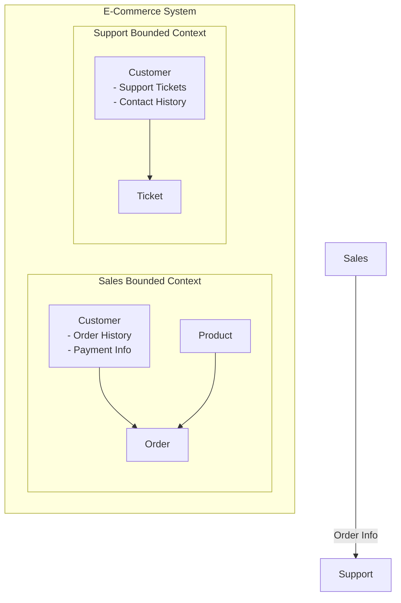

# 第1章: ドメイン駆動設計（DDD）の核心

## 1.1. ドメイン駆動設計（DDD）とは？

ドメイン駆動設計（DDD）は、ソフトウェア開発のアプローチであり、その中心には**ドメインモデル**のプログラミングがあります。ここでの「ドメイン」とは、ソフトウェアが対象とするビジネスの専門分野、そのルール、プロセス、そして専門知識全体を指します。DDDの最大の目的は、この複雑なビジネスドメインをソフトウェアの設計に正確に反映させ、ビジネス要件と技術的な実装との間に生じがちなギャップを埋めることです。

このアプローチは、ドメインエキスパート（業務の専門家）と開発者が密接に協力し、**ユビキタス言語**という共通の言葉を築き上げながら進められます。DDDは特定のフレームワークではなく、複雑な問題領域に取り組むための思考の道具箱であり、それによってビジネスの価値を最大化するソフトウェアを構築することを目指します。

## 1.2. クラス設計におけるDDDの重要性

DDDの原則は、クラスの設計方法に直接的な影響を与え、ビジネスロジックを豊かに内包した、保守性の高いクラス構造へと導きます。

-   **ビジネスの本質をコードに反映**: DDDでは、「このクラスはビジネスの何を表すのか？」という問いが設計の中心となります。これにより、クラスは単なるデータの入れ物ではなく、ドメインの知識と振る舞いをカプセル化した能動的な存在となります。
-   **「貧血ドメインモデル」からの脱却**: データ（プロパティ）のみを持ち、ビジネスロジックを持たない「貧血ドメインモデル」は、DDDが避けようとするアンチパターンです。ロジックがサービスクラスなどに分散すると、コードの凝集性が低下し、保守性が損なわれます。DDDは、データとそのデータを操作するロジックを同じクラス内に配置することを強く推奨します。

結果として、DDDに基づいたクラス設計は、ビジネスの変化に強く、新しい開発者が参加しやすい、持続可能なコードベースを実現します。

---

# 第2章: 戦略的設計：モデルの境界を定義する

戦略的設計は、大規模で複雑なシステムを管理可能な大きさに分割し、その全体構造を定義するためのマクロな視点を提供します。

## 2.1. ユビキタス言語 (Ubiquitous Language)

ユビキタス言語は、プロジェクトに関わる全員（ドメインエキスパート、開発者、マネージャーなど）が使用する、厳密に定義された共通の言語です。

-   **目的**: コミュニケーションの曖昧さをなくし、ビジネスの概念が誤解なくソフトウェアモデルに反映されることを保証します。
-   **クラス設計への影響**: クラス名、メソッド名、プロパティ名に、このユビキタス言語が直接使用されます。例えば、「顧客」を"Customer"、「注文する」を"placeOrder"と呼ぶことがチームで合意されれば、それがそのままコードに現れます。これにより、コード自体が「生きたドキュメント」としての役割を果たします。

## 2.2. 境界づけられたコンテキスト (Bounded Context)

境界づけられたコンテキストは、特定のドメインモデルが有効である範囲、つまり「境界」を定義します。

-   **目的**: 大規模なシステムを、それぞれが独立したモデルを持つ複数の小さなコンテキストに分割します。これにより、モデルの複雑さを管理し、各モデル内での一貫性を保ちます。
-   **クラス設計への影響**: 同じ「商品」という言葉でも、「在庫管理コンテキスト」と「販売コンタクト」では意味や持つべきデータが異なります。境界づけられたコンテキストを定義することで、それぞれの文脈に特化した`Product`クラスを設計できます。これにより、単一の巨大で複雑なクラスが生まれるのを防ぎ、各クラスが持つべき責務を明確にします。

例えば、Eコマースシステムにおけるコンテキストの例を以下に示します。



この図のように、「販売コンテキスト」の顧客と「サポートコンテキスト」の顧客は、関心事が異なるため、別のモデルとして表現されます。これにより、各コンテキストは自身の責務に集中できます。

---

# 第3章: 戦術的設計：ドメインモデルの構成要素

戦術的設計は、境界づけられたコンテキストの内部で、ドメインモデルを構成する具体的なクラス（ビルディングブロック）をどのように設計するかに焦点を当てます。

## 3.1. 値オブジェクト (Value Object)

-   **定義**: そのものが誰であるか（アイデンティティ）ではなく、その属性によって定義されるオブジェクト。「金額(Money)」や「住所(Address)」のように、値を記述します。
-   **主要な特徴**:
    -   **不変性 (Immutable)**: 一度作成したら状態を変更できません。変更が必要な場合は新しいインスタンスを作成します。
    -   **等価性**: 構成する全ての属性が同じであれば、等しいと見なされます（`equals()`と`hashCode()`の実装が重要）。
    -   **自己検証**: コンストラクタで自身の値が不正でないかを検証し、常に正しい状態を保ちます。

```java
// 金額を表す値オブジェクトの例
public final class Money {

    private final BigDecimal amount;
    private final String currency;

    public Money(BigDecimal amount, String currency) {
        if (amount == null || amount.compareTo(BigDecimal.ZERO) < 0) {
            throw new IllegalArgumentException("金額には0以上の値を指定してください。");
        }
        if (currency == null || currency.isEmpty()) {
            throw new IllegalArgumentException("通貨単位は必須です。");
        }
        this.amount = amount;
        this.currency = currency;
    }

    // 金額を加算するロジック。新しいMoneyインスタンスを返すことで不変性を保つ。
    public Money add(Money other) {
        if (!this.currency.equals(other.currency)) {
            throw new IllegalArgumentException("異なる通貨単位の金額は加算できません。");
        }
        return new Money(this.amount.add(other.amount), this.currency);
    }
    
    // Getter, equals(), hashCode() は省略
}
```

## 3.2. エンティティ (Entity)

-   **定義**: 属性が変化しても、ライフサイクルを通じて一貫したアイデンティティ（識別子）を持つオブジェクト。「顧客(Customer)」や「注文(Order)」がこれにあたります。
-   **主要な特徴**:
    -   **一意な識別子 (ID)**: 他のインスタンスと区別するためのIDを持ちます。
    -   **可変性 (Mutable)**: ライフサイクルの中で状態（属性）が変化する可能性があります。
    -   **ライフサイクル**: 生成、変更、削除といったライフサイクルを持ちます。

```java
// 顧客を表すエンティティの例
public class Customer {

    private final CustomerId id; // 識別子
    private String name;

    public Customer(CustomerId id, String name) {
        this.id = Objects.requireNonNull(id);
        changeName(name);
    }

    // 顧客名を変更するビジネスロジック
    public void changeName(String newName) {
        if (newName == null || newName.trim().isEmpty()) {
            throw new IllegalArgumentException("顧客名は必須です。");
        }
        this.name = newName;
    }

    // IDで等価性を判断する
    @Override
    public boolean equals(Object o) {
        if (this == o) return true;
        if (o == null || getClass() != o.getClass()) return false;
        Customer customer = (Customer) o;
        return id.equals(customer.id);
    }

    @Override
    public int hashCode() {
        return id.hashCode();
    }
    
    // Getter は省略
}

// CustomerId は値オブジェクトとして実装されることが多い
public final class CustomerId {
    private final String value;
    // コンストラクタ、equals, hashCodeなど
}
```

## 3.3. 集約 (Aggregate)

-   **定義**: 関連するエンティティと値オブジェクトを一つのまとまりとして扱う単位。データ変更の一貫性を保つための境界となります。
-   **主要な特徴**:
    -   **集約ルート (Aggregate Root)**: 集約の代表となるエンティティ。外部から集約内のオブジェクトにアクセスする際は、必ずこのルートを経由します。
    -   **不変条件の保護**: 集約ルートは、集約全体が一貫した状態（ビジネスルール上、常に満たされるべき条件）を保つ責任を持ちます。
    -   **トランザクションの境界**: データベースへの保存や更新は、通常、集約単位で行われます。

```java
// 「注文」集約の例
public class Order { // 集約ルート

    private final OrderId id;
    private final CustomerId customerId;
    private final List<OrderLine> orderLines;
    private Money totalPrice;
    private OrderStatus status;

    public Order(OrderId id, CustomerId customerId) {
        this.id = id;
        this.customerId = customerId;
        this.orderLines = new ArrayList<>();
        this.totalPrice = new Money(BigDecimal.ZERO, "JPY");
        this.status = OrderStatus.DRAFT;
    }

    // 集約の不変条件を保護するロジック
    public void addOrderLine(Product product, int quantity) {
        if (status != OrderStatus.DRAFT) {
            throw new IllegalStateException("下書き状態の注文にしか明細を追加できません。");
        }
        OrderLine line = new OrderLine(product.getId(), product.getPrice(), quantity);
        this.orderLines.add(line);
        recalculateTotalPrice(); // 集約内の一貫性を保つ
    }

    private void recalculateTotalPrice() {
        this.totalPrice = orderLines.stream()
                                    .map(OrderLine::calculatePrice)
                                    .reduce(new Money(BigDecimal.ZERO, "JPY"), Money::add);
    }
    
    public void confirm() {
        if (orderLines.isEmpty()) {
            throw new IllegalStateException("明細が空の注文は確定できません。");
        }
        this.status = OrderStatus.CONFIRMED;
    }
    // Getter などは省略
}

// 注文明細（エンティティまたは値オブジェクト）
public class OrderLine {
    private final ProductId productId;
    private final Money price;
    private final int quantity;

    public OrderLine(ProductId productId, Money price, int quantity) {
        // ...
    }
    
    public Money calculatePrice() {
        return price.multiply(quantity); // Moneyクラスにmultiplyメソッドがあると仮定
    }
}
```

## 3.4. ドメインサービス (Domain Service)

-   **定義**: 特定のエンティティや値オブジェクトに自然に属さない、複数のドメインオブジェクトをまたがるようなビジネスロジックをカプセル化します。
-   **主要な特徴**:
    -   **ステートレス**: 通常、自身の状態を持ちません。
    -   **例**: 「銀行振込」のように、2つの口座（Account）エンティティを操作するロジックなど。

```java
// 振込操作を行うドメインサービスの例
public class TransferService {

    private final AccountRepository accountRepository;

    public TransferService(AccountRepository accountRepository) {
        this.accountRepository = accountRepository;
    }

    // 振込処理。複数の集約（Account）を操作する。
    public void transfer(AccountId sourceAccountId, AccountId destinationAccountId, Money amount) {
        Account sourceAccount = accountRepository.findById(sourceAccountId)
            .orElseThrow(() -> new AccountNotFoundException(sourceAccountId));
        
        Account destinationAccount = accountRepository.findById(destinationAccountId)
            .orElseThrow(() -> new AccountNotFoundException(destinationAccountId));

        // 口座(Account)エンティティ内のロジックを呼び出す
        sourceAccount.withdraw(amount);
        destinationAccount.deposit(amount);

        // 更新された集約を保存する
        accountRepository.save(sourceAccount);
        accountRepository.save(destinationAccount);
    }
}
```

## 3.5. リポジトリ (Repository)

-   **定義**: ドメインオブジェクトの永続化（データベースへの保存や読み出し）を抽象化する責務を持ちます。
-   **主要な特徴**:
    -   **コレクションのような振る舞い**: `findById`や`save`といったメソッドを提供し、あたかもメモリ上のコレクションを扱うかのように見せかけます。
    -   **ドメイン層の独立性**: ドメイン層はリポジトリのインターフェースにのみ依存し、具体的なデータベース技術からは隔離されます。

```java
// 注文(Order)集約のためのリポジトリのインターフェース例
public interface OrderRepository {

    // IDを元に集約を検索する
    Optional<Order> findById(OrderId id);
    
    // 次の採番IDを取得する
    OrderId nextId();

    // 集約を保存（新規作成または更新）する
    void save(Order order);
}

/*
// --- infrastructure層での実装例（例：JPA） ---
@Repository
public class OrderRepositoryJpa implements OrderRepository {
    
    @PersistenceContext
    private EntityManager entityManager;

    @Override
    public Optional<Order> findById(OrderId id) {
        // JPAを使った検索処理
    }

    // ... save, nextId の実装 ...
}
*/

## 3.6. ファクトリ (Factory)

-   **定義**: 複雑なオブジェクト（特にエンティティや集約）の生成ロジックをカプセル化します。
-   **目的**: オブジェクトが生成される時点で、その内部状態が正しく、一貫性が保たれていることを保証します。

```java
// 注文(Order)集約を生成するファクトリの例
public class OrderFactory {

    private final OrderRepository orderRepository;
    private final CustomerValidator customerValidator; // 顧客の有効性を検証するドメインサービスなど

    public OrderFactory(OrderRepository orderRepository, CustomerValidator customerValidator) {
        this.orderRepository = orderRepository;
        this.customerValidator = customerValidator;
    }

    /**
     * 新規の注文集約を生成する
     * @param customerId 顧客ID
     * @param orderLines 注文明細
     * @return 生成された注文集約
     */
    public Order createOrder(CustomerId customerId, List<OrderLineParam> orderLines) {
        // ビジネスルール：優良顧客かどうかを検証する
        if (!customerValidator.isEligibleForOrder(customerId)) {
            throw new OrderCreationException("この顧客は現在注文できません。");
        }
        
        // リポジトリから新しいIDを採番
        OrderId newOrderId = orderRepository.nextId();
        
        // 新しいOrderインスタンスを生成
        Order newOrder = new Order(newOrderId, customerId);

        // 明細を追加
        orderLines.forEach(param -> {
            // Productの取得などは別途必要
            newOrder.addOrderLine(param.getProduct(), param.getQuantity());
        });

        // 生成された集約は、初期状態で不変条件を満たしている必要がある
        return newOrder;
    }
}
```

---

# 第4章: アンチパターン：ドメインモデル貧血症

ドメインモデル貧血症（Anemic Domain Model）は、DDDの実践において最も陥りやすいアンチパターンの一つです。

## 4.1. 貧血ドメインモデルとは？

ドメインオブジェクトが、ビジネスロジックを持たず、単なるプロパティのgetter/setterを持つだけの「データの入れ物」になってしまう状態を指します。本来ドメインオブジェクトが担うべきビジネスルールや振る舞いは、すべてアプリケーションサービスなどの別の層に実装されてしまいます。

## 4.2. なぜ問題なのか？

-   **凝集度の低下**: データとロジックが分離されるため、関連する処理がコードベースのあちこちに分散します。
-   **保守性の悪化**: 一つの仕様変更が、多数のクラスに影響を及ぼす可能性が高くなります。
-   **オブジェクト指向の原則からの逸脱**: ドメインオブジェクトがその責務を果たしておらず、手続き型プログラミングに近い構造になってしまいます。

## 4.3. 解決策

-   **ロジックの移行**: サービス層にあるビジネスロジックを、関連するエンティティや値オブジェクトのメソッドとして移動させます。
-   **振る舞いのカプセル化**: オブジェクトが自身の状態を管理し、外部からの不正な変更を防ぐように設計します。
-   **継続的なリファクタリング**: コードに手を入れる際は、常にドメインモデルが貧血症に陥っていないかを確認し、リッチな（振る舞いが豊富な）モデルを維持するよう努めます。 