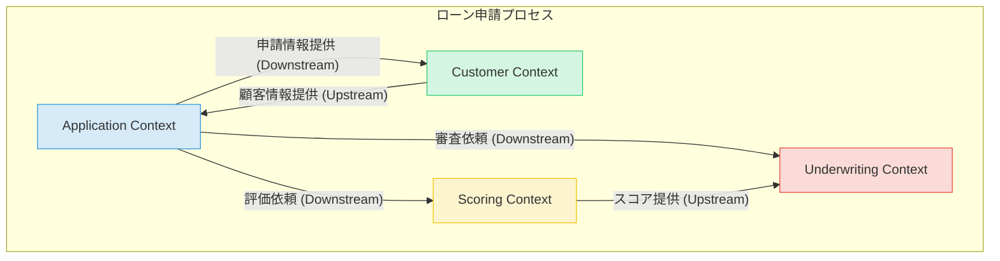

# Chapter 1: プロジェクトの全体像と設計

この章では、`guide04`で構築する「ローン申請・審査システム」の全体像を定義します。ドメイン駆動設計（DDD）の戦略的設計プラクティスを用いて、複雑なビジネス要件を管理しやすいマイクロサービス群へと分割していくプロセスを学びます。

## 1.1. ビジネスドメインの理解

システム開発を成功させる最初のステップは、対象となるビジネスドメインを深く理解することです。ここでは、ローン申請から承認（または否認）に至るまでの一連のプロセスを定義し、関係者全員が共通の言葉で対話するための「ユビキタス言語」を確立します。

### ビジネスフロー

ローン申請プロセスは、以下の主要なステップで構成されます。

1.  **申請受付**: 顧客がオンラインフォームからローン申請を行います。
2.  **本人確認 (KYC)**: 顧客情報（氏名、住所など）の正当性を確認します。
3.  **信用評価**: 外部の信用情報機関や内部データに基づき、顧客の信用スコアを算出します。
4.  **最終審査**: 申請内容、信用スコア、その他の基準を基に、融資の可否を総合的に判断します。
5.  **結果通知**: 審査結果（承認または否認）を顧客に通知します。

### ユビキタス言語（Ubiquitous Language）

ドメインエキスパートと開発者が共通の理解を持つための用語集です。

| 用語 (英語) | 用語 (日本語) | 説明 |
| :--- | :--- | :--- |
| `LoanApplication` | ローン申請 | 顧客からの融資申請を表す中心的な情報。申請ID、希望額、ステータス等を持つ。 |
| `Customer` | 顧客 | ローンを申請する個人または法人。 |
| `CreditScore` | 信用スコア | 顧客の返済能力を数値化した評価指標。 |
| `Underwriting` | （ローン）審査 | 申請内容を評価し、承認または否認を決定するプロセス。 |
| `Collateral` | 担保 | ローンが返済されない場合に備えて提供される資産。 |
| `LoanApproved` | ローン承認 | 審査の結果、ローンが承認された状態を示すイベント。 |
| `LoanRejected` | ローン否認 | 審査の結果、ローンが否認された状態を示すイベント。 |

---

## 1.2. 戦略的設計

ドメインを理解した上で、次はその構造をモデル化します。戦略的設計は、大規模なドメインをより小さく、独立した「境界づけられたコンテキスト」に分割するための強力なツールです。

### サブドメインと境界づけられたコンテキスト

私たちのローン申請システムは、以下のサブドメインに分割できます。これらは、それぞれが独立したマイクロサービス（境界づけられたコンテキスト）として実装されます。

-   **申請受付 (Application Context)**: 顧客からの申請を受け付け、プロセス全体のライフサイクルを管理する中核ドメイン。
-   **顧客管理 (Customer Context)**: 顧客情報の管理に特化したドメイン。本人確認(KYC)などを担当。
-   **信用評価 (Scoring Context)**: 顧客の信用力を評価することに特化したドメイン。
-   **審査 (Underwriting Context)**: 最終的な融資判断を行うドメイン。

### コンテキストマップ (Context Map)

コンテキストマップは、これらの境界づけられたコンテキスト間の関係性を視覚化します。


*   **Upstream/Downstream**: `Application Context`は他のコンテキストにとって情報を提供する`Upstream`（上流）であり、他のコンテキストはそれを利用する`Downstream`（下流）となります。

---

## 1.3. システムアーキテクチャ

最後に、これまでの設計を具体的なシステムアーキテクチャに落とし込みます。

### マイクロサービスアーキテクチャ

各境界づけられたコンテキストは、独立してデプロイ・運用可能なマイクロサービスとして実装されます。サービス間の通信には、非同期メッセージング（イベント駆動）方式を採用します。

```mermaid
graph TD
    subgraph "外部"
        UserInterface[クライアント (UI/Mobile)]
    end

    subgraph "システム内部"
        Gateway[API Gateway]
        
        subgraph "マイクロサービス群"
            AppService[Application Service]
            CustomerService[Customer Service]
            ScoringService[Scoring Service]
            UnderwritingService[Underwriting Service]
        end

        subgraph "メッセージブローカー"
            Broker[(Kafka/RabbitMQ)]
        end
    end

    UserInterface --> Gateway

    Gateway --> AppService
    Gateway --> CustomerService

    AppService -- "LoanApplicationSubmitted" --> Broker
    Broker -- "LoanApplicationSubmitted" --> ScoringService
    Broker -- "LoanApplicationSubmitted" --> CustomerService

    ScoringService -- "CreditScoreCalculated" --> Broker
    Broker -- "CreditScoreCalculated" --> UnderwritingService

    UnderwritingService -- "LoanApproved / LoanRejected" --> Broker
    Broker -- "LoanApproved / LoanRejected" --> AppService

```

### なぜ非同期メッセージングなのか？

サービス間を直接的なAPIコール（同期的）で接続するのではなく、メッセージブローカーを介した非同期通信を選択するのには、以下の利点があります。

-   **疎結合 (Loose Coupling)**: 各サービスは、他のサービスの稼働状況に直接影響されません。例えば、`Scoring Service`が一時的に停止していても、`Application Service`は申請を受け付け続けることができます。
-   **回復力 (Resilience)**: 一部のサービスに障害が発生しても、システム全体が停止することはありません。
-   **拡張性 (Scalability)**: 各サービスを独立してスケールさせることが容易になります。負荷の高いサービスだけを増強できます。

### API Gatewayの役割

API Gatewayは、システムへの唯一のエントリポイントとして機能します。

-   **リクエストの集約とルーティング**: 外部クライアントからのリクエストを受け、適切なマイクロサービスに振り分けます。
-   **横断的関心事の処理**: 認証、認可、レート制限、ロギングといった、複数のサービスに共通する処理を一箇所で担当します。

---

これで、プロジェクトの全体像が明確になりました。次の章からは、この設計図に基づき、実際の開発環境の準備と実装に入っていきます。 