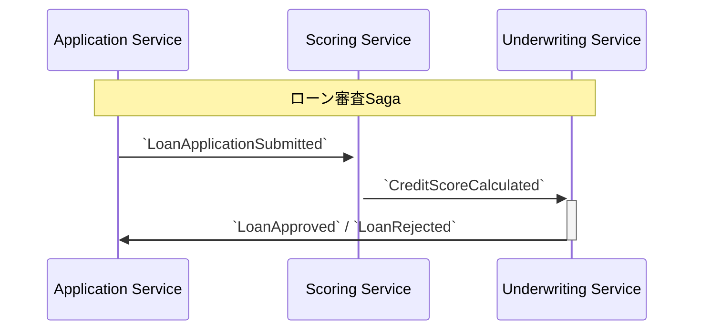

# Chapter 5: Sagaパターンによる審査プロセスの実装

これまでの章で、独立したマイクロサービスを構築し、イベントを介して疎に連携させる方法を学びました。しかし、「申請受付 → 信用評価 → 最終審査 → 結果通知」という一連のビジネスプロセスは、複数のサービスにまたがっています。このような長期的なトランザクションを管理するためのパターンが「Saga」です。

本章では、中央の調整役（オーケストレータ）を置かずに、各サービスがイベントを交換し合うことでプロセスを進行させる「コレオグラフィ(Choreography)型」のSagaを実装します。

## 5.1. Sagaパターンの導入

### ローン審査Sagaの全体像

ローン審査プロセスは、以下のようなイベントの連鎖として表現できます。



-   各サービスは、自身が関心のあるイベントを購読し、処理を実行します。
-   処理が完了すると、次のステップのトリガーとなる新たなイベントを発行します。
-   これにより、プロセス全体が分散して実行され、単一障害点（SPOF）がなくなります。

### 補償トランザクション（補足）

Sagaの重要な側面は、プロセス途中でエラーが発生した場合のロールバック処理です。これを「補償トランザクション」と呼びます。例えば、審査サービスでエラーが発生した場合、それ以前のステップを取り消すためのイベント（例: `UnderwritingFailed`）を発行し、各サービスがそれを購読して自身の状態を元に戻す処理を行います。（本ガイドでは実装を簡略化しますが、実システムでは必須の考慮事項です）

---

## 5.2. 審査サービス(Underwriting Service)の実装

Sagaの中核を担う3つ目のマイクロサービス、「審査サービス」を構築します。

### イベントリスナー

信用評価サービスが発行した`CreditScoreCalculated`イベントを購読し、審査プロセスを開始します。

```java
// underwriting-service/src/main/java/com/example/underwriting/infrastructure/messaging/ScoringEventsListener.java
@Component
public class ScoringEventsListener {
    // ...
    @KafkaListener(topics = "credit-scores")
    public void handleCreditScoreCalculated(CreditScoreCalculated event) {
        underwritingService.performUnderwriting(
            event.loanApplicationId(), 
            event.score()
        );
    }
}
```

### `Underwriting` 集約

-   **`Underwriting.java`**:
    -   審査ロジックをカプセル化する集約です。
    -   `perform()`ファクトリメソッドが、信用スコアやその他のルールに基づき、承認または否認を決定します。

```java
// underwriting-service/src/main/java/com/example/underwriting/domain/Underwriting.java
public class Underwriting extends AggregateRoot<UnderwritingId> {

    // ...
    public static Underwriting perform(LoanApplicationId loanApplicationId, int creditScore) {
        
        Underwriting underwriting = new Underwriting(...);
        
        // 審査ルール（ドメインロジック）
        if (creditScore >= 700) {
            underwriting.status = UnderwritingStatus.APPROVED;
            underwriting.registerEvent(new LoanApproved(loanApplicationId.getValue()));
        } else {
            underwriting.status = UnderwritingStatus.REJECTED;
            underwriting.registerEvent(new LoanRejected(loanApplicationId.getValue()));
        }
        
        return underwriting;
    }
    // ...
}
```

-   **発行するイベント**:
    -   `LoanApproved`: 審査が承認されたことを示すイベント。
    -   `LoanRejected`: 審査が否認されたことを示すイベント。

---

## 5.3. 結果の反映 (申請受付サービス)

Sagaの最終ステップとして、申請受付サービスが審査結果のイベントを購読し、元の`LoanApplication`集約の状態を更新します。

```java
// application-service/src/main/java/com/example/loan/infrastructure/messaging/UnderwritingEventsListener.java
@Component
@RequiredArgsConstructor
public class UnderwritingEventsListener {

    private final LoanApplicationService applicationService;

    @KafkaListener(topics = "underwriting-results", groupId = "loan-application-group")
    public void handleLoanResult(Object event) { // JsonDeserializerが適切な型に変換
        if (event instanceof LoanApproved approvedEvent) {
            applicationService.approveApplication(new LoanApplicationId(approvedEvent.loanApplicationId()));
        } else if (event instanceof LoanRejected rejectedEvent) {
            applicationService.rejectApplication(new LoanApplicationId(rejectedEvent.loanApplicationId()));
        }
    }
}
```

```java
// application-service/src/main/java/com/example/loan/application/LoanApplicationService.java
@Service
public class LoanApplicationService {
    // ...
    @Transactional
    public void approveApplication(LoanApplicationId id) {
        LoanApplication application = loanApplicationRepository.findById(id)
            .orElseThrow(() -> new EntityNotFoundException("Application not found"));
            
        application.approve(); // 状態変更とイベント発行
        
        loanApplicationRepository.save(application);
        eventPublisher.publish(application.getDomainEvents()); // 例: `ApplicationStatusChanged`イベントを発行
    }
    // ... rejectApplicationも同様 ...
}
```

---

## 5.4. Sagaのテスト

複数のマイクロサービスとメッセージブローカーが連携するSagaのテストは、最も複雑ですが、最も価値のあるテストの一つです。Testcontainersと`docker-compose`を組み合わせることで、本番に近い環境を構築し、エンドツーエンドのシナリオを検証します。

1.  **`docker-compose.yml`の活用**:
    -   テスト専用の`docker-compose.test.yml`を用意し、テスト対象の全サービス（コンテナ化されている前提）と、PostgreSQL、Kafkaを定義します。

2.  **テストクラスの実装**:
    -   JUnit 5の`@Testcontainers`アノテーションと`DockerComposeContainer`クラスを使って、コンテナ群をテストのライフサイクルに合わせて起動・停止します。

```java
// e2e-tests/src/test/java/com/example/saga/LoanApplicationSagaTest.java
@Testcontainers
class LoanApplicationSagaTest {

    // docker-compose.test.ymlを読み込む
    @Container
    public static DockerComposeContainer<?> environment = 
        new DockerComposeContainer<>(new File("src/test/resources/docker-compose.test.yml"))
            .withExposedService("application-service_1", 8080)
            .withExposedService("kafka_1", 9092);

    @Test
    void shouldCompleteLoanApplicationSagaSuccessfully() {
        // 1. 起点となるAPIを呼び出す
        // application-serviceの公開ポートを取得してリクエストを送信
        String appServiceUrl = "http://" + environment.getServiceHost("application-service_1", 8080)
                             + ":" + environment.getServicePort("application-service_1", 8080);
        
        // WebClientやRestAssuredで申請APIをコール

        // 2. 最終結果を検証する
        // Awaitilityを使い、非同期処理の完了を待つ
        await().atMost(30, TimeUnit.SECONDS).untilAsserted(() -> {
            // application-serviceのDBを直接確認するか、
            // ステータス確認APIを呼び出して、状態が`APPROVED`になっていることを検証
        });
    }
}
```

---

この章では、コレオグラフィ型のSagaパターンを用いて、複数のマイクロサービスにまたがるビジネスプロセスを実装しました。これにより、システム全体としての一貫性を保ちつつ、各サービスの独立性を維持することができます。また、Docker ComposeとTestcontainersを連携させた、強力なE2Eテストのアプローチも学びました。

次の最終章では、CQRSによる読み取り専用モデルの導入と、API Gatewayの構築について解説します。 