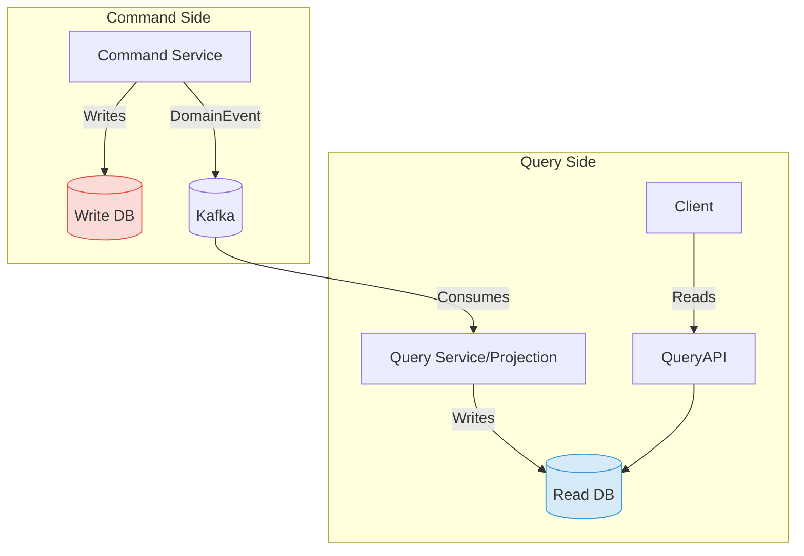

# Chapter 6: クエリとAPI Gateway

これまでの章で、コマンド（状態を変更する操作）を実行するマイクロサービス群を構築してきました。しかし、実際のアプリケーションでは、データを「参照（クエリ）」する要件も同様に重要です。本章では、コマンドとクエリの責務を分離してシステムの性能と柔軟性を高めるCQRSパターンと、マイクロサービス群への入り口を統一するAPI Gatewayを導入します。

## 6.1. CQRS (Command Query Responsibility Segregation) の導入

CQRSは、システムの関心を「状態を変更するコマンド側」と「状態を参照するクエリ側」に明確に分離するパターンです。

### なぜCQRSが必要か？

-   **モデルの最適化**: コマンド側は、一貫性を保つために複雑なビジネスルールを持つ正規化されたモデル（集約）が適しています。一方、クエリ側は、特定の画面表示に最適化された非正規化モデル（DTO）の方が効率的です。CQRSは、それぞれの目的に合わせたモデルの利用を可能にします。
-   **パフォーマンス**: クエリ処理は、コマンド処理から物理的に分離されたデータベース（リードレプリカなど）に対して実行できるため、システム全体のパフォーマンスとスケーラビリティが向上します。

### シンプルなCQRSの実装

本ガイドでは、イベントソーシングを伴わないシンプルなCQRSを実装します。

1.  **リードモデル（参照用テーブル）の作成**:
    -   「申請状況一覧」画面の表示に特化した、非正規化されたテーブル (`query.loan_application_summary`) を用意します。このテーブルには、複数の集約（`LoanApplication`, `Customer`, `Underwriting`）にまたがる情報があらかじめ結合された形で格納されます。

2.  **イベントハンドラによるリードモデルの更新**:
    -   各サービスが発行するドメインイベント（`LoanApplicationSubmitted`, `LoanApproved`など）を購読するイベントハンドラを作成します。
    -   このハンドラは、イベントを受け取るたびに、リードモデルのテーブルに対して直接`INSERT`や`UPDATE`を行い、常に最新の状態を保ちます。

```java
// query-service/src/main/java/com/example/query/LoanApplicationProjection.java
@Component
public class LoanApplicationProjection {

    private final JdbcTemplate jdbcTemplate; // またはJooq, MyBatisなど

    @KafkaListener(topics = "...")
    public void handleEvent(DomainEvent event) {
        if (event instanceof LoanApplicationSubmitted e) {
            // loan_application_summaryテーブルに新しい行をINSERT
        } else if (event instanceof LoanApproved e) {
            // 該当する行のステータスを'APPROVED'にUPDATE
        }
        // ...
    }
}
```

3.  **クエリ専用API**:
    -   リードモデルのテーブルを直接参照する、シンプルな参照系APIを作成します。このAPIは複雑なビジネスロジックを持たず、高速なデータ取得に特化します。



---

## 6.2. API Gatewayの構築

マイクロサービスアーキテクチャでは、クライアント（Webフロントエンドやモバイルアプリ）が多数のサービスと直接通信するのは非効率的で危険です。API Gatewayは、システムへの単一のエントリポイントとして機能し、この問題を解決します。

### API Gatewayの役割

-   **リクエストルーティング**: `/applications/**`へのリクエストは申請受付サービスへ、`/customers/**`へのリクエストは顧客サービスへ、といったように、パスに基づいてリクエストを適切なマイクロサービスに振り分けます。
-   **横断的関心事の集約**:
    -   **認証・認可**: JWTの検証など、セキュリティ関連の処理をゲートウェイで一元的に行います。
    -   **レート制限**: 特定のクライアントからの過剰なリクエストを防ぎます。
    -   **ロギング・メトリクス収集**: システム全体のリクエストに関する情報を集約します。
-   **プロトコル変換**: 外部との通信はHTTP、内部サービス間はgRPCといったように、プロトコルを変換することも可能です。

### Spring Cloud Gatewayによる実装

Spring Cloud Gatewayを使えば、宣言的な方法でルーティングルールを簡単に定義できます。

```yaml
# api-gateway/src/main/resources/application.yml
spring:
  cloud:
    gateway:
      routes:
        - id: application_service_route
          uri: lb://application-service  # Eureka等のサービスディスカバリと連携
          predicates:
            - Path=/api/applications/**
          filters:
            - StripPrefix=2 # /api/applications を取り除く

        - id: query_service_route
          uri: lb://query-service
          predicates:
            - Path=/api/queries/applications/**
            - Method=GET
          filters:
            - StripPrefix=3
            # - CustomAuthenticationFilter # 独自フィルターの適用
```

---

## 7. まとめと今後の展望 (Chapter 7)

このガイドを通じて、私たちはDDD、マイクロサービス、イベント駆動アーキテクチャ、CQRSといったモダンな設計原則とパターンを組み合わせ、複雑な金融システムを構築するプロセスを追体験しました。

-   **学んだことの振り返り**:
    -   戦略的設計により、複雑なドメインを管理可能な単位（境界づけられたコンテキスト）に分割しました。
    -   オニオンアーキテクチャにより、ビジネスロジックを技術的関心事から保護しました。
    -   イベント駆動アーキテクチャとSagaパターンにより、疎結合で回復力のあるサービス連携を実現しました。
    -   CQRSにより、コマンドとクエリの要求に合わせてモデルを最適化しました。

-   **さらなる学習のために**:
    -   **分散トレーシング**: ZipkinやJaegerを導入し、サービスをまたがるリクエストの流れを可視化する。
    -   **監視**: PrometheusとGrafanaを用いて、各サービスのヘルスチェックやパフォーマンスメトリクスを監視する。
    -   **コンテナオーケストレーション**: KubernetesやOpenShiftを用いて、コンテナ化されたアプリケーションのデプロイ、スケーリング、管理を自動化する。

この`guide04`が、あなたの次のプロジェクトへの挑戦の確かな一歩となることを願っています。 