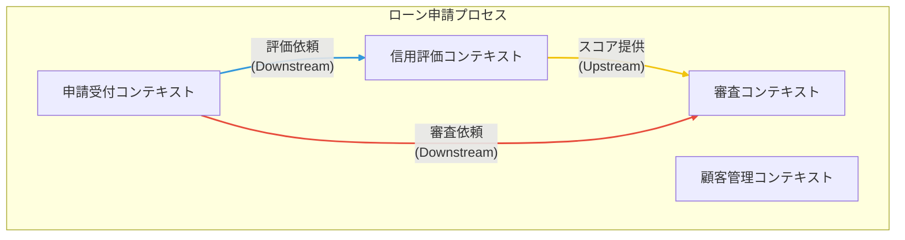

# Chapter 2: 戦略的設計 - ビジネスとコードの地図作り

ソフトウェア開発、特に金融のような複雑なドメインでは、いきなりコードを書き始めるのは、地図を持たずに航海に出るようなものです。戦略的設計は、私たちがどこに向かうのか、どのような航路を通るのかを定義するための「航海図」作りにあたります。

これは、ビジネスそのものを深く理解し、その構造をソフトウェアの構造に反映させるための、マクロな視点での設計活動です。

## 2.1 まずはビジネスの戦場を把握する：サブドメイン

すべてのビジネス領域が等しく重要であるわけではありません。戦略的設計の第一歩は、ビジネスのドメインをその戦略的重要性に応じて分類することです。

-   **コアドメイン (Core Domain)**
    -   ビジネスの競争優位性の源泉。最も独自性が高く、組織が最大の投資を行うべき領域です。
    -   **例（ローン申請システム）**: `審査 (Underwriting)`。どの顧客にどれだけ融資できるかを判断するロジックは、ビジネスの収益性とリスクを直接左右する核心部分です。

-   **支援サブドメイン (Supporting Subdomain)**
    -   コアドメインを支援するための、比較的に定型的な業務領域。独自性は低いですが、ビジネス運営に不可欠です。
    -   **例（ローン申請システム）**: `申請受付 (Application)` `顧客管理 (Customer)`。これらは必須ですが、他社と差別化する要素は少ないため、効率的な実装が求められます。

-   **汎用サブドメイン (Generic Subdomain)**
    -   認証、通知、決済など、多くのシステムで共通して必要とされる機能。通常、外部のパッケージやサービスを利用して解決します。
    -   **例（ローン申請システム）**: `本人確認書類のOCR読み取り` `メール通知機能`。自前で開発するメリットはほとんどありません。

この分類により、限られたリソースを最も価値のある「コアドメイン」に集中させ、それ以外は効率的に構築するという戦略的な意思決定が可能になります。

## 2.2 共通の言葉を紡ぐ：ユビキタス言語

ドメインエキスパートが「当社の審査モデルでは…」と語るとき、開発者は「`UnderwritingModel`クラスのことだな」と即座に理解できなければなりません。

**ユビキタス言語**は、プロジェクトに関わる全員（ビジネス、開発、QA）が使用する、厳密に定義された共通言語です。この言語は、会話、ドキュメント、そして何よりも**コード（クラス名、メソッド名、変数名）**に直接反映されなければなりません。

**ユビキタス言語の辞書（例）**

| 用語 (英語) | 用語 (日本語) | 説明 |
| :--- | :--- | :--- |
| `LoanApplication` | ローン申請 | 顧客からの融資申請を表す中心的な情報。申請ID、希望額、ステータス等を持つ。 |
| `CreditScore` | 信用スコア | 顧客の返済能力を数値化した評価指標。 |
| `Underwriting` | （ローン）審査 | 申請内容を評価し、承認または否認を決定するプロセス。 |

> **Point:** ユビキタス言語は「生きたドキュメント」です。プロジェクトの進行と共に、常に更新・維持されていきます。

## 2.3 モデルの境界線を引く：境界づけられたコンテキスト

「顧客」という言葉を考えてみましょう。
-   **営業部門**では、「過去の取引履歴」や「連絡先」が重要です。
-   **カスタマーサポート**では、「問い合わせ履歴」や「対応状況」が重要です。

同じ言葉でも、文脈（コンテキスト）によって意味や関心事が異なります。この言語的な境界を明確に定義するのが**境界づけられたコンテキスト (Bounded Context)** です。

各コンテキスト内では、ユビキタス言語の定義は一貫性を保ちます。この境界を越えると、言葉の意味が変わる可能性があります。

> **Point:** **境界づけられたコンテキストは、マイクロサービスを設計する際の最も有力な分割単位**となります。各コンテキストは、それぞれが独立したドメインモデルと責務を持つサービスとして実装される候補です。

**ローン申請システムのコンテキスト分割例**
- 申請受付コンテキスト
- 顧客管理コンテキスト
- 信用評価コンテキスト
- 審査コンテキスト

## 2.4 コンテキスト間の関係を視覚化する：コンテキストマップ

システム全体は、複数の境界づけられたコンテキストの集合体として構築されます。**コンテキストマップ**は、これらのコンテキスト間の関係性を視覚的に表現した地図です。

このマップを描くことで、チームは以下の点を明確にできます。
-   **Upstream/Downstream**: 他のコンテキストに影響を与える側（Upstream）と、影響を受ける側（Downstream）の関係。
-   **連携方法**: どのようにしてコンテキスト間で情報をやり取りするか（例: API呼び出し、イベント通知）。
-   **保護すべき境界**: 例えば、`審査コンテキスト`が`申請受付コンテキスト`の変更から影響を受けないように、「腐敗防止層 (Anti-Corruption Layer)」という防御壁を設けるなどの設計判断が可能になります。

---

戦略的設計によってビジネスの地図が描かれました。次の章からは、この地図を頼りに、境界づけられたコンテキストの内部を構成する具体的な部品（値オブジェクト、エンティティ、集約など）を設計する「戦術的設計」の世界へと進んでいきます。 