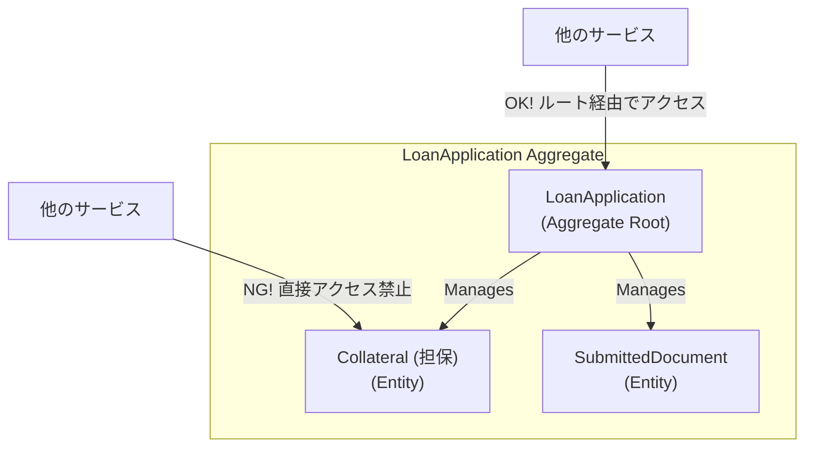

# Chapter 3: 戦術的設計 - ドメインを表現する構成要素

戦略的設計でビジネスの「地図」を描いた今、次はその地図の各エリア（境界づけられたコンテキスト）を、どのような部品で構築していくかを考える番です。これが**戦術的設計**です。

戦術的設計は、ドメインモデルを構成する具体的なソフトウェアの部品、すなわち**ビルディングブロック**の設計に焦点を当てます。これらのブロックを正しく組み合わせることで、ドメインのルールを豊かに表現し、堅牢で保守性の高いコードを構築できます。

## 3.1. 値オブジェクト (Value Object) - 「測り、量り、記述する」

**値オブジェクト**は、その「値」自体に意味があり、識別子を持たないオブジェクトです。その価値は、それが誰であるかではなく、それが何であるかによって決まります。

- **主な特徴**:
    - **不変 (Immutable)**: 一度作成したら、その状態は決して変わりません。変更が必要な場合は、新しいインスタンスを作成します。
    - **等価性**: IDではなく、構成する全ての属性が同じであれば、等しいと見なされます。
    - **自己検証**: 自身のコンストラクタで、値がビジネスルール上、不正でないことを検証します。

**Java 17 `record` によるベストプラクティス**

Java 17の`record`は、不変性、`equals()`/`hashCode()`の自動実装といった、値オブジェクトに求められる要件を簡潔に満たすための最適な機能です。

```java
// domain/model/common/Money.java
// 「金額」を表す値オブジェクト
public record Money(BigDecimal amount, String currency) {
    
    // コンパクトコンストラクタで不変条件を検証
    public Money {
        Objects.requireNonNull(amount);
        Objects.requireNonNull(currency);
        if (amount.compareTo(BigDecimal.ZERO) < 0) {
            throw new IllegalArgumentException("金額には0以上の値を指定してください。");
        }
    }

    // ドメインロジック（振る舞い）。新しいインスタンスを返すことで不変性を維持する。
    public Money add(Money other) {
        if (!this.currency.equals(other.currency)) {
            throw new IllegalArgumentException("異なる通貨の金額は加算できません。");
        }
        return new Money(this.amount.add(other.amount), this.currency);
    }
}
```
> **Point:** `String`や`Long`といったプリミティブな型をそのままIDに使うのではなく、`public record LoanApplicationId(UUID value) {}` のように値オブジェクトでラップすることで、型安全性が劇的に向上し、意図しないバグを防ぐことができます。

## 3.2. エンティティ (Entity) - 「識別され、変化する」

**エンティティ**は、属性が変化しても、ライフサイクルを通じて一貫した識別子（ID）によって追跡されるオブジェクトです。「顧客」や「口座」のように、時間と共に状態が変わるが、存在としては同じものであり続けるドメインの概念を表します。

- **主な特徴**:
    - **一意な識別子**: 他のインスタンスと区別するためのIDを持ちます。このIDは通常、値オブジェクトです。
    - **可変 (Mutable)**: ライフサイクルの中で状態（属性）が変化します。
    - **ライフサイクル**: 生成、変更、削除といった明確なライフサイクルを持ちます。

```java
// domain/model/loan/LoanApplication.java
// 「ローン申請」を表すエンティティ
public class LoanApplication {

    private final LoanApplicationId id; // 識別子
    private Money amount;
    private ApplicationStatus status;
    private final CustomerId customerId;

    public LoanApplication(LoanApplicationId id, CustomerId customerId, Money amount) {
        this.id = Objects.requireNonNull(id);
        this.customerId = Objects.requireNonNull(customerId);
        this.amount = Objects.requireNonNull(amount);
        this.status = ApplicationStatus.SUBMITTED; // 初期状態
    }

    // 振る舞い。自身の状態を変更するビジネスロジック。
    public void approve() {
        if (this.status != ApplicationStatus.UNDER_REVIEW) {
            throw new IllegalStateException("審査中の申請のみ承認できます。");
        }
        this.status = ApplicationStatus.APPROVED;
    }
    
    // ... 他の振る舞い（reject, reviewなど）やGetter

    // 等価性はIDでのみ比較する
    @Override
    public boolean equals(Object o) {
        if (this == o) return true;
        if (o == null || getClass() != o.getClass()) return false;
        LoanApplication that = (LoanApplication) o;
        return id.equals(that.id);
    }

    @Override
    public int hashCode() {
        return id.hashCode();
    }
}
```

## 3.3. 集約 (Aggregate) - 「一貫性を守る境界」

戦術的設計において最も重要かつ強力な概念が**集約**です。集約は、関連するエンティティと値オブジェクトを一つのまとまりとして扱う単位であり、**データ変更の一貫性を保つための境界**となります。

- **集約ルート (Aggregate Root)**: 集約の代表となるエンティティ。外部から集約内のオブジェクトにアクセスする際は、必ずこのルートを経由します。集約ルートは、境界内のオブジェクト群がビジネスルール（**不変条件**）を常に満たすよう監視する「番人」の役割を果たします。
- **トランザクションの境界**: データベースへの保存や更新は、原則として**集約単位**で行います。

**アグリゲート設計の4大原則**
1.  **真の不変条件を保護する**: 「注文合計金額は明細合計と一致する」のような、必ず守るべきルールを境界内で保護する。
2.  **小さく設計する**: パフォーマンスとスケーラビリティのため、アグリゲートは可能な限り小さくする。
3.  **IDで参照する**: 他のアグリゲートはオブジェクト参照で持たず、ID（値オブジェクト）で参照する。
4.  **結果整合性を利用する**: アグリゲート間の整合性は、ドメインイベントを介した非同期処理で最終的に担保する。


> **Point:** 「1トランザクション、1アグリゲート」。この原則に従うことで、システムは疎結合になり、パフォーマンスとスケーラビリティが大幅に向上します。

## 3.4. リポジトリ (Repository) - 「永続化を隠蔽する」

**リポジトリ**は、ドメインオブジェクト（特に集約）を永続化層（データベースなど）から出し入れするための仕組みをカプセル化（隠蔽）します。

アプリケーション層は、まるでオブジェクトがメモリ上のコレクションであるかのようにリポジトリを扱え、データベースの具体的な技術（JPA, MyBatis, etc.）を意識する必要がありません。

**依存性の逆転の実践**
- **インターフェース**: ドメイン層に定義します。ビジネスの言葉で「何ができるか」を記述します。
- **実装クラス**: インフラストラクチャ層に定義します。具体的な技術を使って「どうやるか」を実装します。

```java
// domain/model/loan/LoanApplicationRepository.java
public interface LoanApplicationRepository {
    Optional<LoanApplication> findById(LoanApplicationId id);
    void save(LoanApplication loanApplication);
}

// infrastructure/persistence/LoanApplicationRepositoryImpl.java
@Repository // Springのコンポーネントとして登録
public class LoanApplicationRepositoryImpl implements LoanApplicationRepository {
    // MyBatisやJPAのMapper/EntityManagerをDIする
    private final LoanApplicationMapper mapper;

    @Override
    public void save(LoanApplication loanApplication) {
        // ... DBへの保存処理
    }
    // ...
}
```

## 3.5. ファクトリとドメインサービス - 「補助的な組み立て役」

- **ファクトリ (Factory)**: 複雑なオブジェクト、特に集約の生成ロジックをカプセル化します。コンストラクタが複雑になりすぎる場合に有効です。
- **ドメインサービス (Domain Service)**: 特定のエンティティや値オブジェクトに自然に属さない、複数のドメインオブジェクトをまたがるようなビジネスロジックを担当します。例えば、「2つの口座間での振込処理」のように、複数の集約を操作する必要がある場合に利用します。ドメインサービスはステートレスであるべきです。

---
これらのビルディングブロックを組み合わせることで、ドメインの核心的なロジックを豊かに、そして正確に表現するドメインモデルを構築することができます。次の章では、これらの静的なモデルに命を吹き込み、システムを動かす「ドメインイベント」について探求します。 