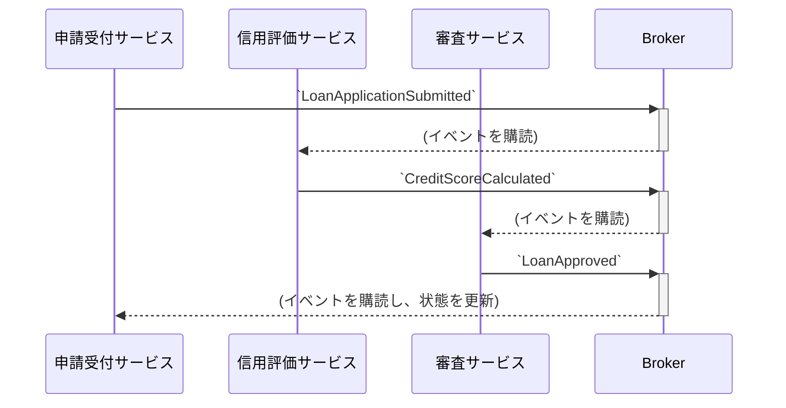

# Chapter 4: ドメインイベント - システムの鼓動

これまでの章で設計したモデルは、いわばシステムの「静的な骨格」です。この骨格に血を通わせ、時間と共に変化し、ビジネスプロセスを駆動させる動的な力、それが**ドメインイベント**です。

ドメインイベントとは、ビジネス領域で過去に発生した、関係者が関心を持つ**「事実」**です。これをモデルに組み込むことで、システムは単なるデータの入れ物から、ビジネスの物語を語る生きた存在へと進化します。

## 4.1. ドメインイベントの解剖学

ドメインイベントは、以下の特徴を持つ不変（Immutable）なオブジェクトとして設計されます。

- **過去形の命名**: `LoanApplicationSubmitted`, `CreditScoreCalculated`のように、過去に起こった事実であることを明確に示します。
- **不変性**: 一度発生した事実は変わりません。イベントオブジェクトも同様に、一度作成されたらその状態は変更不可能です。
- **関連情報の保持**: イベントの購読者（後続処理を行うコンポーネント）が必要とする最低限の情報（何が、誰に、いつ起こったか）を保持します。

**Java 17 `record`による実装**
`record`は、不変なデータオブジェクトであるドメインイベントを表現するのに最適です。

```java
// domain/model/loan/event/LoanApplicationSubmitted.java

// `いつ`発生したかを示すタイムスタンプと、
// `何が` `誰の`申請であったかを示すIDを保持する。
public record LoanApplicationSubmitted(
    Instant occurredOn,
    LoanApplicationId loanApplicationId,
    CustomerId customerId
) {
    // 補助的なコンストラクタで、発生時刻を自動的に記録する
    public LoanApplicationSubmitted(LoanApplicationId loanApplicationId, CustomerId customerId) {
        this(Instant.now(), loanApplicationId, customerId);
    }
}
```

## 4.2. なぜドメインイベントが不可欠なのか？

ドメインイベントは、特に現代的なマイクロサービスアーキテクチャにおいて、システムの品質を決定づける極めて重要な役割を担います。

### 1. 究極の疎結合を実現する

イベント発行者（Publisher）は、「ローン申請が提出された」という事実を叫ぶだけです。その後の「本人確認(KYC)」や「信用評価」といったプロセスを担当するサービス（Subscriber）の存在を一切知る必要がありません。

この疎結合な関係により、
- 新しい購読者（例: 不正検知サービス）を、発行者に一切変更を加えることなく追加できる。
- あるサービスの障害が、他のサービスに直接伝播しない。
という、柔軟で回復力の高いシステムが実現します。

### 2. 分散トランザクションを可能にする (Sagaパターン)

複数のマイクロサービスにまたがるビジネスプロセス（例: ローン審査プロセス全体）は、単一のデータベーストランザクションでは管理できません。ここでドメインイベントが活躍します。

`申請受付` → `信用評価` → `最終審査` というプロセスは、以下のようなイベントの連鎖（**コレオグラフィ型Saga**）として実現されます。


各サービスは、前のサービスの完了を示すイベントをトリガーに自身の処理を開始し、完了したら次のイベントを発行します。これにより、システム全体としての一貫性（**結果整合性**）を保ちつつ、各サービスは独立して動作できます。

### 3. ビジネスプロセスを可視化する

`LoanApplicationSubmitted` → `CreditScoreCalculated` → `LoanApproved` というイベントの流れは、それ自体がビジネスプロセスのドキュメントとなります。これにより、開発者とビジネスサイドの認識が一致しやすくなります。

## 4.3. ドメインイベントの実践的実装パターン

### イベントは集約から生まれる

ドメインイベントは、アグリゲートの状態変更の結果として生成されるのが最も安全なパターンです。これにより、イベントが常にビジネスルール上、一貫性のある正しい状態から発行されることが保証されます。

```java
// domain/model/loan/LoanApplication.java
public class LoanApplication extends AggregateRoot<LoanApplicationId> {
    // ...
    public void submit() {
        if (this.status != ApplicationStatus.DRAFT) {
            throw new IllegalStateException("下書き状態の申請のみ提出できます。");
        }
        this.status = ApplicationStatus.SUBMITTED;

        // 状態変更の結果としてドメインイベントを生成し、内部に保持する
        this.registerEvent(new LoanApplicationSubmitted(this.id, this.customerId));
    }
}

// どのアグリゲートも継承する基底クラス
public abstract class AggregateRoot<ID> extends Entity<ID> {
    private final transient List<Object> domainEvents = new ArrayList<>();

    protected void registerEvent(Object event) {
        this.domainEvents.add(event);
    }
    
    // 発行のためにイベントを取り出す
    public List<Object> pollDomainEvents() {
        List<Object> events = new ArrayList<>(this.domainEvents);
        this.domainEvents.clear();
        return events;
    }
}
```

### 発行と購読の仕組み

アグリゲート内で生成されたイベントは、アプリケーションサービスを通じて発行（Publish）されます。

```java
// application/service/LoanApplicationService.java
@Service
@Transactional
public class LoanApplicationService {
    private final LoanApplicationRepository repository;
    private final DomainEventPublisher publisher;
    // ...
    public void submitApplication(LoanApplicationId id) {
        // 1. アグリゲートのメソッドを呼び出す
        LoanApplication application = repository.findById(id).orElseThrow();
        application.submit();
        
        // 2. アグリゲートを保存する
        repository.save(application);

        // 3. アグリゲートが保持するイベントを発行する
        publisher.publish(application.pollDomainEvents());
    }
}
```
`DomainEventPublisher`は、Springの`ApplicationEventPublisher`やKafkaのプロデューサーなどをラップした、インフラ層のコンポーネントです。

そして、別のサービスやコンポーネントが、このイベントを購読して後続処理を実行します。

```java
// scoring-service 内のイベントリスナー
@Component
public class LoanApplicationEventsListener {

    private final ScoringService scoringService;

    @KafkaListener(topics = "loan-applications", groupId = "scoring-group")
    public void handle(LoanApplicationSubmitted event) {
        // イベントを受け取り、信用評価というビジネスロジックを実行する
        scoringService.calculateScore(event.loanApplicationId());
    }
}
```
---
ドメインイベントは、静的なドメインモデルを、ビジネスのダイナミズムを反映した生きたシステムへと変貌させるための鍵です。次のパートでは、これまでに学んだ戦略的・戦術的設計の理論を、システムのアーキテクチャとして具体的にどのように組み立てていくかを見ていきます。 