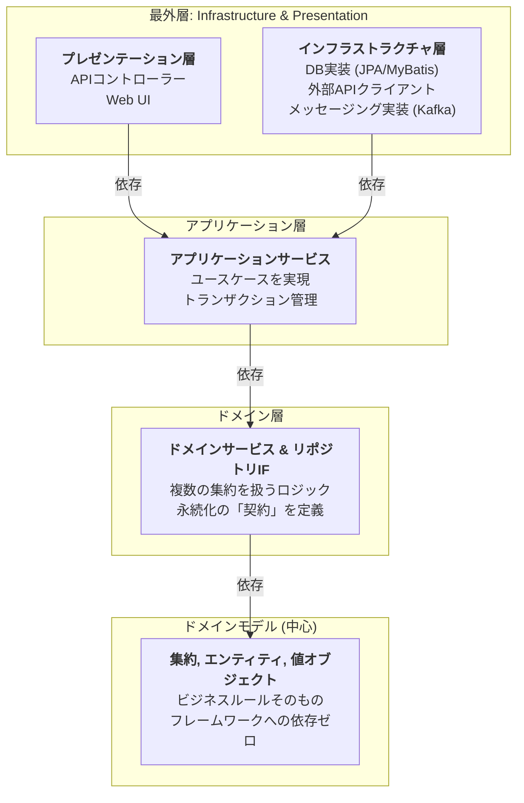
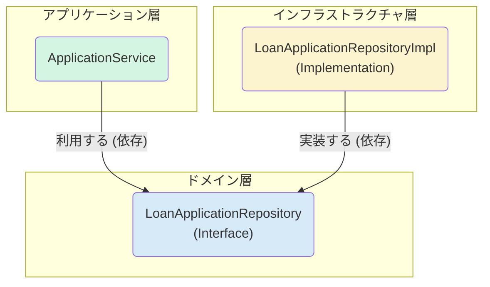

# Part 2: 設計編 - 堅牢なシステムのアーキテクチャ

# Chapter 5: クリーンアーキテクチャの選択 - ドメインを守る城壁

Part 1で設計したドメインモデルは、我々のソフトウェアにおける最も価値ある資産です。しかし、この資産は非常に繊細で、データベースの詳細、フレームワークの都合、UIの要件といった外部の要因によって容易に汚染されてしまいます。

**クリーンアーキテクチャ**（オニオンアーキテクチャやヘキサゴナルアーキテクチャといった設計思想の総称）は、この最も重要なドメインモデルを、外部の技術的関心事から断固として守るための「城壁」を築くための設計戦略です。

その目的はただ一つ、**ビジネスロジックをアプリケーションの心臓部として独立させ、テスト可能で、UIやデータベース、Webフレームワークから切り離すこと**です。

## 5.1. オニオンアーキテクチャの構造

クリーンアーキテクチャの具体的な実装として、本ガイドでは**オニオンアーキテクチャ**を採用します。その名の通り、玉ねぎのような多層構造でアプリケーションを構成します。



### 唯一絶対のルール：依存性は常に中心へ

このアーキテクチャには、ただ一つだけ守るべき絶対的なルールが存在します。

> **依存性の矢印は、常に外側のレイヤーから内側のレイヤーへ向かわなければならない。**

-   **ドメインモデル (中心)**: 最も価値があり、最も保護されるべき層。他のどのレイヤーにも依存しません。フレームワークの`@Entity`や`@Service`といったアノテーションすら、ここには存在しません。純粋なビジネスロジックの結晶です。
-   **ドメイン層**: ドメインモデルにのみ依存します。
-   **アプリケーション層**: ドメイン層とドメインモデルに依存します。
-   **インフラ/プレゼンテーション層 (最外層)**: アプリケーション層やドメイン層に依存します。

このルールにより、データベースの種類を変更したり、Webフレームワークを乗り換えたりしても、アプリケーションの心臓部であるドメインモデルは一切影響を受けません。

## 5.2. 依存性逆転の原則 (DIP) - アーキテクチャの心臓

「外側が内側に依存する」というルールは当たり前に見えます。しかし、「アプリケーション層が、データベースと通信するインフラ層の処理を呼び出す」場合、どうやってこのルールを守るのでしょうか？

ここで登場するのが、クリーンアーキテクチャの根幹をなす**依存性逆転の原則 (DIP: Dependency Inversion Principle)** です。

> **A. 上位モジュールは下位モジュールに依存すべきではない。両方とも抽象に依存すべきである。**
> **B. 抽象は詳細に依存すべきではない。詳細は抽象に依存すべきである。**
> - Robert C. Martin

これを`Repository`パターンに当てはめてみましょう。

1.  **「契約」を定義する (ドメイン層)**: まず、ビジネスロジックが必要とする永続化の振る舞いを、ドメイン層で**インターフェース**として定義します。これは「こういう機能が欲しい」という**抽象的な契約**です。

    ```java
    // domain/model/loan/LoanApplicationRepository.java
    public interface LoanApplicationRepository {
        Optional<LoanApplication> findById(LoanApplicationId id);
        void save(LoanApplication loanApplication);
    }
    ```

2.  **「契約」を利用する (アプリケーション層)**: アプリケーションサービスは、具体的な実装（MyBatisやJPA）を知ることなく、この**インターフェース**にのみ依存します。

    ```java
    // application/service/LoanApplicationService.java
    public class LoanApplicationService {
        private final LoanApplicationRepository loanRepository; // 実装クラスではなく、IFに依存

        public LoanApplicationService(LoanApplicationRepository loanRepository) {
            this.loanRepository = loanRepository;
        }
        // ...
    }
    ```

3.  **「契約」を実装する (インフラストラクチャ層)**: データベースと実際にやり取りする実装クラスは、最外層であるインフラ層に配置し、ドメイン層で定義されたインターフェースを`implements`します。

    ```java
    // infrastructure/persistence/LoanApplicationRepositoryImpl.java
    @Repository
    public class LoanApplicationRepositoryImpl implements LoanApplicationRepository {
        // ... MyBatisやJPAの実装詳細 ...
    }
    ```

### 何が「逆転」したのか？

-   **制御の流れ**: `ApplicationService` → `LoanApplicationRepositoryImpl` （呼び出し）
-   **ソースコードの依存関係**: `LoanApplicationRepositoryImpl` → `LoanApplicationRepository` （実装）

`LoanApplicationRepositoryImpl`という**詳細**が、`LoanApplicationRepository`という**抽象**に依存しています。これにより、**ソースコードの依存性の矢印が、制御の流れと逆方向を向く**ことになります。これが「依存性の逆転」です。



この原則のおかげで、データベース技術をPostgreSQLからMySQLに変更したとしても、修正範囲は`LoanApplicationRepositoryImpl`の内部だけに限定され、ドメイン層やアプリケーション層のコードには一切の変更が必要なくなります。これこそが、変更に強く、持続可能なシステムを支えるアーキテクチャの力です。

---
次の章では、このアーキテクチャの上で、マイクロサービスがどのように連携し、イベント駆動の仕組みがどう機能するのかをさらに詳しく見ていきます。 