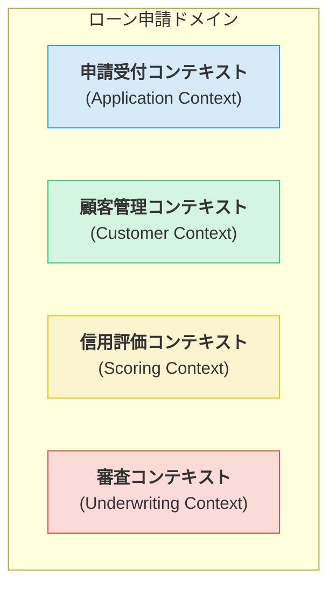
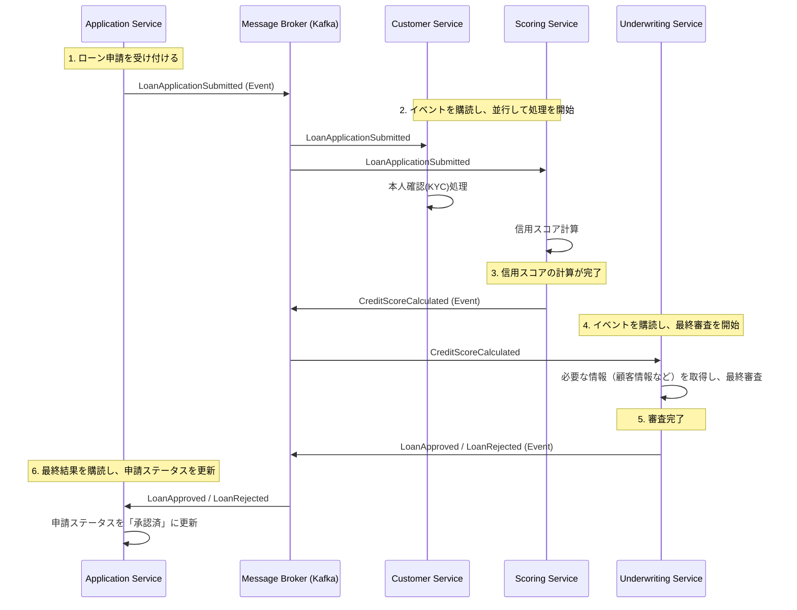

# Chapter 6: マイクロサービスとイベント駆動 - 自律的なコンポーネントの協調

Chapter 5で、私たちはドメインモデルを外部の懸念から保護するための堅固な城壁、すなわちクリーンアーキテクチャを築きました。しかし、現代の複雑なシステムは、単一の巨大な城（モノリス）ではなく、それぞれが自律的に機能する複数の砦（マイクロサービス）の連合体として構築されることが多くなっています。

この章では、戦略的設計の成果である「境界づけられたコンテキスト」を、どのようにして独立したマイクロサービスとして実装し、それらが「イベント」を通じてどのように協調し合うのかを探求します。

## 6.1. 境界づけられたコンテキストがマイクロサービスになる

思い出してください。戦略的設計の目的は、巨大で複雑なドメインを、一貫した言語とモデルを持つ、より小さく管理しやすい「境界づけられたコンテキスト」に分割することでした。

**この「境界づけられたコンテキスト」こそが、マイクロサービスを分割するための最も論理的で強力な境界線となります。**

`guide04`で設計したローン申請システムを例に見てみましょう。

この4つのコンテキストは、それぞれが異なる責務とライフサイクルを持ちます。これらをそのまま独立したマイクロサービスとして実装することで、各チームは他のサービスを気にすることなく、担当するドメインのビジネスロジック開発に集中できます。

-   **申請受付サービス (Application Service)**
-   **顧客管理サービス (Customer Service)**
-   **信用評価サービス (Scoring Service)**
-   **審査サービス (Underwriting Service)**

## 6.2. サービス間連携の選択：同期か、非同期か

サービスを分割した次に直面する課題は、「どうやってこれらのサービスを連携させるか？」です。連携方法には大きく2つのスタイルがあります。

| 特徴 | 同期連携 (Synchronous) | 非同期連携 (Asynchronous / Event-Driven) |
| :--- | :--- | :--- |
| **代表例** | REST API (HTTP), gRPC | メッセージング (Kafka, RabbitMQ) |
| **結合度** | **密結合** | **疎結合** |
| **耐障害性**| **低い**（呼び出し先がダウンすると、呼び出し元も影響を受ける：**連鎖障害**） | **高い**（ブローカーが生きていれば、他のサービスが停止していても影響を受けにくい） |
| **整合性** | 強い整合性 | **結果整合性 (Eventual Consistency)** |

**同期連携の罠**:
一見、直接APIを呼び出す同期連携はシンプルに見えます。しかし、サービスAがサービスBを待ち、サービスBがサービスCを待つ…といった依存関係の連鎖が生まれると、たった一つのサービスの遅延や障害がシステム全体に波及する、非常にもろいシステムが出来上がってしまいます。

**非同期連携の力**:
一方、非同期のイベント駆動アーキテクチャでは、サービスは互いに直接通信しません。代わりに、「ドメインイベント」をメッセージブローカー（Kafkaなど）に発行します。関心のある他のサービスは、そのイベントを好きなタイミングで受信し、処理を実行します。

**原則として、サービス間連携には疎結合で回復力の高い「非同期のイベント駆動アーキテクチャ」を第一候補として採用します。**

## 6.3. ドメインイベントによる連携の実践

ローン申請のプロセスが、イベントを通じてどのように進んでいくかを見てみましょう。

このアーキテクチャの美しさは、各サービスが**自律的**である点にあります。

-   `Scoring Service`は、`Application Service`や`Customer Service`が存在することを知る必要がありません。ただ`LoanApplicationSubmitted`イベントを待ち、処理が終わったら`CreditScoreCalculated`イベントを発行するだけです。
-   新しいサービス（例えば、不正検知サービス）を追加したくなった場合も、既存のサービスに一切変更を加えることなく、関連するイベントを購読するように実装するだけで済みます。

## 6.4. 結果整合性という考え方

非同期アーキテクチャを採用する上で、理解しておくべき重要な概念が「**結果整合性 (Eventual Consistency)**」です。

これは、システム全体の状態が、即座にではなく、「最終的に（eventually）」一貫性が取れた状態になるという考え方です。例えば、ローン申請の直後、一瞬だけ申請ステータスが「受付中」で、信用スコアがまだ計算されていない、という時間差が必ず発生します。

多くのビジネスプロセスでは、このミリ秒単位の遅延は全く問題になりません。しかし、銀行の残高照会のように、常に100%正確な最新の状態が求められる場合は、同期的なアプローチを検討する必要があります。

**アーキテクチャ設計とは、こうしたトレードオフを理解し、ビジネス要件に最も適した解決策を選択する行為なのです。**

---
これで、Part 2 設計編は完了です。私たちは、ドメインモデルを保護する城壁（クリーンアーキテクチャ）を築き、その城壁に囲まれた自律的な砦（マイクロサービス）が、イベントを通じて柔軟に連携する連合体を設計しました。

次のPart 3では、いよいよこれらの設計をJavaとSpringBootを使って実装に移す、実践的なコーディングの世界に飛び込みます。 