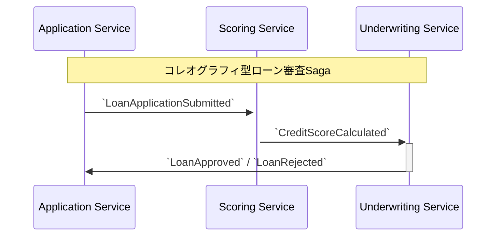
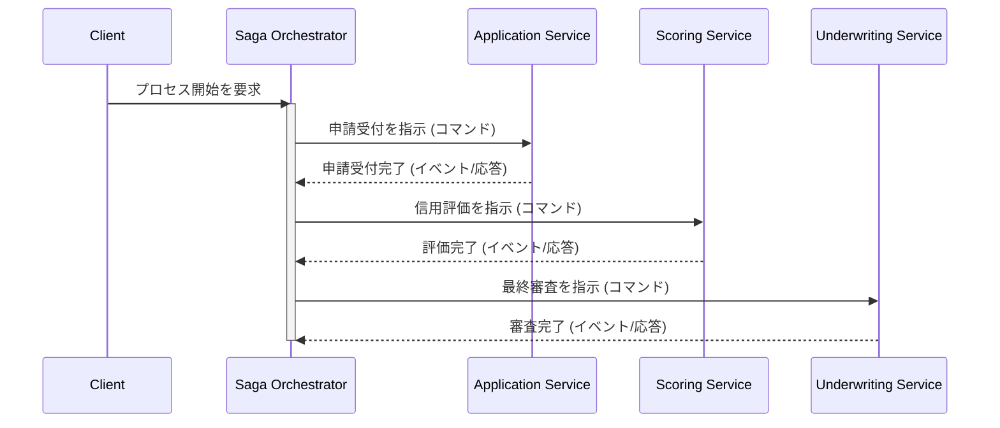

# Chapter 12: Sagaパターン - サービスをまたぐ長い旅の案内人

マイクロサービスアーキテクチャを採用すると、これまで単一のデータベーストランザクションで実現できていたビジネスプロセスが、複数のサービスにまたがってしまいます。例えば、「ローン申請から承認まで」のプロセスは、「申請受付」「信用評価」「審査」という異なるサービスのローカルトランザクションの連続です。

伝統的な分散トランザクション（2PC: 2フェーズコミット）は、サービス間の同期的なロックを必要とするため、現代の疎結合なマイクロサービスアーキテクチャには適していません。この課題を解決するのが**Sagaパターン**です。

## 12.1. Sagaパターンの基本

Sagaは、**一連のローカルトランザクションの連鎖**によって、長期にわたるビジネスプロセス全体の一貫性を管理するデザインパターンです。

Sagaの最も重要な特徴は、**補償トランザクション (Compensating Transaction)** の概念です。

-   **ローカルトランザクション**: Sagaの各ステップ。各サービスが自身のデータベースに対して行うアトミックな操作です。（例：「信用スコアを保存する」）
-   **補償トランザクション**: ローカルトランザクションを取り消すための操作。Sagaの途中でエラーが発生した場合、それまでに完了したステップを逆順にたどり、それぞれの補償トランザクションを実行することで、プロセス全体を矛盾のない状態に戻します。（例：「計算済みの信用スコアを無効にする」）

これにより、システム全体として「すべて成功」するか「すべて（実質的に）取り消される」かのどちらかの状態になり、データの一貫性が保たれます。

## 12.2. 実装方式: コレオグラフィ vs オーケストレーション

Sagaを実装するには、大きく分けて2つのアプローチがあります。

### 1. コレオグラフィ型 (Choreography)

イベントを通じて、各サービスが自律的に協調し合う方式です。中央の調整役は存在しません。



-   **仕組み**: あるサービスがローカルトランザクションを完了すると、次のサービスをトリガーするためのイベントを発行します。他のサービスはそのイベントを購読し、自身の処理を開始します。
-   **長所**:
    -   **シンプル**: 新しいサービスを追加する際、既存のサービスを変更する必要がない。
    -   **疎結合**: サービス間に直接の依存関係がない。
    -   **単一障害点がない**: 中央集権的なコンポーネントが存在しない。
-   **短所**:
    -   **プロセスの可視性**: ビジネスプロセス全体がどのようになっているのか、コードから追跡するのが難しい。
    -   **循環依存のリスク**: サービスAがBを呼び、BがCを呼び、CがAを呼ぶといった循環依存が発生する可能性がある。

### 2. オーケストレーション型 (Orchestration)

「Sagaオーケストレータ」と呼ばれる中央の調整役が、プロセス全体を制御する方式です。



-   **仕組み**: オーケストレータが、どのサービスをどの順序で、どのようなパラメータで呼び出すかを管理します。プロセスの現在の状態もオーケストレータが保持します。
-   **長所**:
    -   **プロセスの可視性と管理**: ビジネスロジックがオーケストレータに集約されているため、管理・変更が容易。
    -   **依存関係の単純化**: 各サービスはオーケストレータとだけ通信すればよい。
-   **短所**:
    -   **単一障害点**: オーケストレータがダウンすると、関連するすべてのプロセスが停止する。
    -   **密結合のリスク**: ビジネスロジックがオーケストレータに集中しすぎると、ただの「モノリス」になりかねない。

| 観点             | コレオグラフィ型           | オーケストレーション型     |
| ---------------- | -------------------------- | -------------------------- |
| **制御**         | 分散的 (各サービス)        | 中央集権的 (オーケストレータ) |
| **結合度**       | 疎                         | 密になりがち               |
| **プロセスの理解** | 難しい                     | 容易                       |
| **単純なプロセス** | **適している**             | 過剰設計になりがち         |
| **複雑なプロセス** | 管理が困難になる           | **適している**             |

## 12.3. コレオグラフィ型Sagaのテスト

複数の非同期コンポーネントが絡むSagaのテストは困難ですが、システムの信頼性を保証するために不可欠です。TestcontainersとDocker Composeを組み合わせることで、本番環境に極めて近いエンドツーエンドのテスト環境を構築できます。

`guide04`で見たテストコードは、このアプローチの優れた実践例です。

```java
// e2e-tests/src/test/java/com/example/saga/LoanApplicationSagaTest.java
@Testcontainers
class LoanApplicationSagaTest {

    // docker-compose.test.yml を使って全サービスとKafka, DBを起動
    @Container
    public static DockerComposeContainer<?> environment = 
        new DockerComposeContainer<>(new File(".../docker-compose.test.yml"))
            .withExposedService("application-service_1", 8080);

    @Test
    void shouldCompleteLoanApplicationSagaSuccessfully() {
        // 1. Sagaの起点となるAPI（申請受付サービス）を呼び出す
        String appServiceUrl = "http://" + environment.getServiceHost("application-service_1", 8080) + "...";
        // ... APIをコール ...

        // 2. 最終的な状態を検証する
        // Awaitilityを使い、非同期処理が完了し、DBの状態が「承認済み」になるのを待つ
        await().atMost(30, TimeUnit.SECONDS).untilAsserted(() -> {
            // ... 状態確認APIを呼び出すか、DBを直接検証する ...
            assertThat(getApplicationStatus(...)).isEqualTo("APPROVED");
        });
    }
}
```
このテストにより、イベントの送受信、各サービスの処理、データベースへの反映という、Saga全体の流れが正しく機能することを保証できます。

---
Sagaパターンは、マイクロサービスアーキテクチャにおける分散トランザクションの問題に対する、現実的で強力な解決策です。プロセスの複雑さに応じて適切な実装方式を選択し、堅牢なE2Eテストでその動作を保証することが、信頼性の高いシステムを構築する鍵となります。 