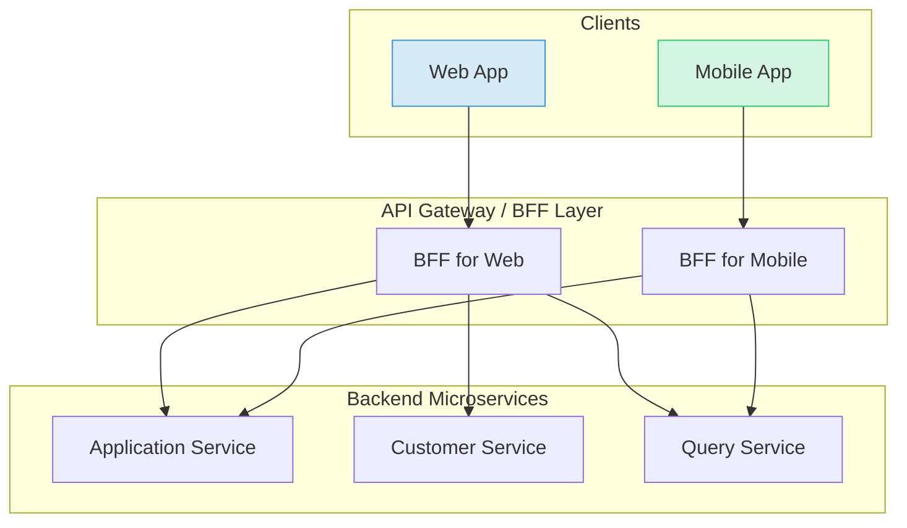

# Chapter 14: APIゲートウェイとBFF（Backend for Frontend）

マイクロサービスアーキテクチャでは、多数のサービスが独立して存在します。クライアントアプリケーション（Webフロントエンドやモバイルアプリなど）がこれらのサービスと直接通信するのは、複雑性が増し、セキュリティリスクも高まるため非効率的です。本章では、この問題に対する2つの重要なパターン、APIゲートウェイとBFF（Backend for Frontend）について解説します。

## 14.1. APIゲートウェイの役割

APIゲートウェイは、すべてのクライアントからのリクエストを受け付ける単一のエントリポイントです。これにより、マイクロサービス群を外部から隠蔽し、クライアントとの間に統一されたインターフェースを提供します。

### 主な機能

-   **リクエストルーティング**: `/applications/**` へのリクエストは申請受付サービスへ、`/customers/**` へのリクエストは顧客サービスへ、といったように、パスに基づいてリクエストを適切なマイクロサービスに動的に振り分けます。
-   **横断的関心事の集約 (Cross-Cutting Concerns)**:
    -   **認証・認可**: JWTの検証など、セキュリティ関連の処理をゲートウェイで一元化し、個々のマイクロサービスがビジネスロジックに集中できるようにします。
    -   **レート制限**: 特定のクライアントからの過剰なリクエストを防ぎ、システムの安定性を保ちます。
    -   **ロギング・メトリクス収集**: システム全体のリクエストに関する情報を集約し、監視と分析を容易にします。
-   **プロトコル変換**: 外部クライアントとの通信はREST(HTTP)、内部サービス間ではgRPCといったように、プロトコルを変換するブリッジの役割も担えます。

### Spring Cloud Gatewayによる実装例

Spring Cloud Gatewayは、宣言的な設定で高度なルーティングを簡単に実現できる強力なライブラリです。

```yaml
# api-gateway/src/main/resources/application.yml
spring:
  cloud:
    gateway:
      routes:
        - id: loan_application_service_route
          uri: lb://application-service  # Eureka等のサービスディスカバリと連携
          predicates:
            - Path=/api/applications/**
          filters:
            - StripPrefix=2 # /api/applications を取り除く

        - id: customer_service_route
          uri: lb://customer-service
          predicates:
            - Path=/api/customers/**
          filters:
            - StripPrefix=2
```
この設定により、`/api/applications/`で始まるリクエストは`application-service`に転送されます。

---

## 14.2. BFF (Backend for Frontend) パターン

APIゲートウェイはシステムへの入り口を統一しますが、クライアントの種類（Web、モバイル、デスクトップなど）が増えると、それぞれのUIが必要とするデータ形式や粒度が異なるという新たな課題が生まれます。BFFは、この課題を解決するためのパターンです。

### なぜBFFが必要か？

-   **クライアントごとの最適化**: Webアプリは詳細なデータを一度に取得したいかもしれませんが、モバイルアプリは通信量を抑えるために最小限のデータだけを必要とします。BFFは、各クライアントの要求に特化したAPIを提供します。
-   **通信の効率化**: 1つの画面を表示するために複数のAPIを呼び出す（チャッティな通信）のではなく、BFFがバックエンドで複数のマイクロサービスからデータを集約し、クライアントに1回のレスポンスで返すことができます。
-   **フロントエンドとバックエンドの分離**: UI固有のロジック（データの加工や集約）をバックエンドから切り離し、BFFに配置することで、各チームが独立して開発を進めやすくなります。

### APIゲートウェイが担うBFFの役割

多くの場合、APIゲートウェイがBFFの役割を兼務します。Spring Cloud Gatewayでは、特定のルートに対してカスタムフィルターやロジックを適用することで、BFFパターンを実装できます。



### 実装例：Web用とMobile用のBFF

例えば、ローン申請の詳細画面を考えます。

-   **Webアプリ用BFF (`/api/web/applications/{id}`)**: 顧客情報、申請内容、過去の審査履歴など、関連するすべての情報を一度に返すリッチなAPI。
-   **モバイルアプリ用BFF (`/api/mobile/applications/{id}`)**: 申請ステータスと基本情報のみを返す軽量なAPI。

Spring Cloud Gatewayでは、`GatewayFilter`を独自に実装することで、このようなデータの集約・加工処理を組み込むことができます。

```java
// GatewayBffFilter.java
@Component
public class WebBffGatewayFilterFactory extends AbstractGatewayFilterFactory<Object> {

    // WebClientを使って各マイクロサービスを呼び出す
    private final WebClient customerServiceClient;
    private final WebClient applicationServiceClient;

    @Override
    public GatewayFilter apply(Object config) {
        return (exchange, chain) -> {
            // パスから申請IDを取得
            String applicationId = ...; 

            // 各サービスからデータを非同期に取得
            Mono<Customer> customer = customerServiceClient.get()...
            Mono<Application> application = applicationServiceClient.get()...

            // データを集約して、クライアントに返す新しいレスポンスを生成
            return Mono.zip(customer, application)
                .flatMap(tuple -> {
                    // tuple.getT1() (Customer) と tuple.getT2() (Application) を
                    // Web用のリッチなレスポンスDTOにマッピングする
                    RichApplicationDetailsDTO dto = ...;
                    // ... レスポンスを書き換える処理 ...
                });
        };
    }
}
```

このように、APIゲートウェイとBFFパターンを組み合わせることで、多様なクライアントの要求に柔軟かつ効率的に応えることができる、スケーラブルなマイクロサービスアーキテクチャを構築することが可能になります。 