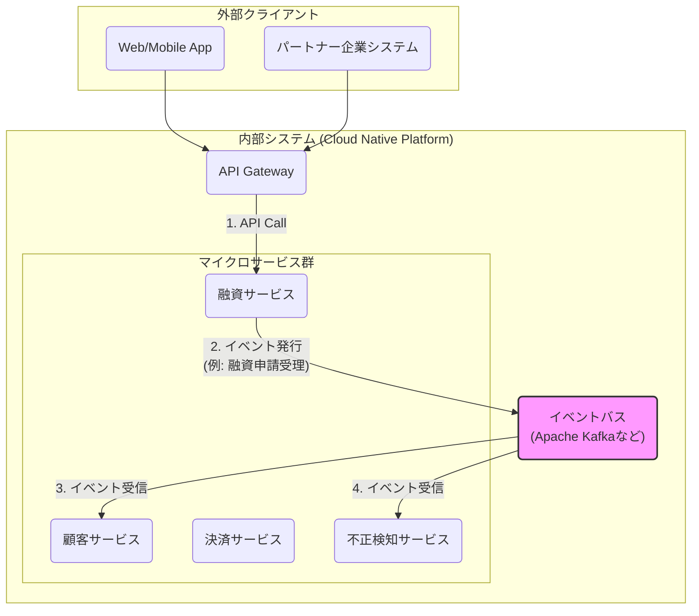

# Chapter 07: 連携のためのアーキテクチャパターン

## 1. はじめに：分割から連携へ

前章では、ドメイン駆動設計（DDD）を用いて、ビジネス価値に基づいたマイクロサービスの「境界線」を引く方法を学びました。しかし、分割されたサービスは、それ単体ではビジネス価値を生みません。顧客に一貫した体験を提供するためには、それらが協調し、**連携**する必要があります。

この連携をいかに設計するかが、システムの俊敏性、スケーラビリティ、回復力を左右する鍵となります。本章では、現代的な金融システムにおける連携のための「三位一体」アーキテクチャパターンを解説します。

## 2. 三位一体のパターン：マイクロサービス、EDA、APIゲートウェイ

これら3つの要素は、個別でも強力ですが、組み合わせることで真価を発揮します。

1.  **マイクロサービス (Microservices)**: DDDに基づき分割された、自律的なビジネス能力の単位。（**What**）
2.  **イベント駆動アーキテクチャ (Event-Driven Architecture: EDA)**: マイクロサービス間の「疎結合」な連携を実現する仕組み。（**How they communicate**）
3.  **APIゲートウェイ (API Gateway)**: 外部からのアクセスを集約し、認証やルーティングなどの共通処理を行う「玄関口」。（**How they are exposed**）

 

 

### ① イベント駆動アーキテクチャ (EDA) による疎結合な連携

マイクロサービス間の連携方法には、大きく分けて2種類あります。

-   **同期通信（リクエスト/レスポンス型）**: あるサービスが、別のサービスを直接APIで呼び出し、その処理が終わるのを「待つ」方式。シンプルですが、呼び出し先のサービスが停止していると、呼び出し元のサービスも影響を受ける（密結合）という弱点があります。
-   **非同期通信（イベント駆動型）**: あるサービスが、ビジネス上の出来事（＝**イベント**）を「発生した」という事実だけをイベントバス（例：Apache Kafka）に通知する方式。他のサービスは、そのイベントを好きなタイミングで受信して、自身の処理を行います。

EDAの最大の利点は**「疎結合（Loosely Coupled）」**です。

-   **回復力**: 「融資サービス」がイベントを発行した後、「不正検知サービス」が一時的に停止していても、「融資サービス」の処理は問題なく完了します。「不正検知サービス」は、復旧後に溜まっていたイベントを処理すればよいのです。
-   **拡張性**: 将来、「融資申請があった際に、マーケティング部門にも通知したい」という要求が生まれても、「融資サービス」のコードを一切変更する必要はありません。新しい「マーケティングサービス」が、同じイベントを受信するように設定するだけで対応できます。

このように、サービス同士が互いの存在を直接知ることなく連携できるため、システム全体の柔軟性と回復力が劇的に向上します。

### ② APIゲートウェイ：システムの統一された玄関口

マイクロサービスが多数存在する場合、外部のクライアント（Web/Mobileアプリやパートナー企業）が、どのサービスのどのAPIを叩けばよいのかを管理するのは非常に煩雑になります。

**APIゲートウェイ**は、この問題を解決します。すべての外部からのリクエストを一度ここで受け取り、リクエストの内容に応じて、適切なバックエンドのマイクロサービスに処理を振り分けます。

**APIゲートウェイの主な役割:**
-   **単一のエンドポイント**: クライアントは、ゲートウェイのアドレスさえ知っていればよく、内部の複雑なサービス構成を意識する必要がありません。
-   **認証・認可**: すべてのリクエストに対して、共通のセキュリティチェック（APIキーの検証など）を一元的に行います。
-   **ルーティング**: リクエストのパス（例：`/customers` や `/loans`）を見て、適切なサービスに転送します。
-   **プロトコル変換**: 外部向けのAPI（例：REST）と、内部の通信プロトコル（例：gRPC）が異なる場合に、その変換を行います。

## 3. 実践事例：MastercardのBaaS戦略

**Mastercard**は、自社の決済ネットワークやセキュリティ機能を、APIを通じて他の企業（銀行やFinTech企業）に提供する**Banking as a Service (BaaS)**戦略を推進しています。

この戦略の技術的な心臓部が、まさに**APIゲートウェイ**です。パートナー企業は、MastercardのAPIゲートウェイを介して、「カード発行」「不正利用スコアリング」といった強力な金融機能を、まるでレゴブロックのように自社のサービスに組み込むことができます。

Mastercardの事例は、APIゲートウェイが単なる技術的な部品ではなく、**ビジネスモデルそのものをプラットフォーム化し、エコシステムを形成するための戦略的な武器**となり得ることを示しています。

次章では、このAPIを外部に公開する上で、特に金融システムにおいて極めて重要となるセキュリティ基準について解説します。 